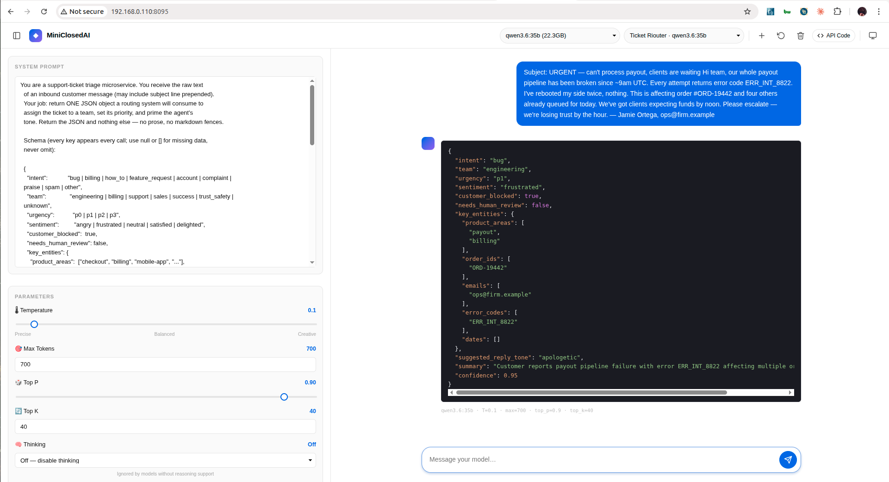

# MiniClosedAI

A tiny, 100%-local LLM playground. Chat with small Ollama models (1B–10B parameters), tweak sampling parameters live, and turn each saved chat into a callable API endpoint. **No cloud, no API keys, no costs.**

Built with **FastAPI** (3 Python deps), vanilla JS, and SQLite. Runs on a laptop.

<p align="center">
  
  <br><em>A saved bot. The sidebar is the full control panel; the chat is the live test.</em>
</p>

<p align="center">
  
  <br><em>Reasoning models stream their chain-of-thought into a collapsible block, separate from the final answer.</em>
</p>

<p align="center">
  
  <br><em>Every saved chat is a microservice. Copy the snippet as cURL, Python, or JavaScript — native or OpenAI-SDK-compatible.</em>
</p>

<p align="center">
  
  <br><em>The Support Ticket Router recipe in action. A real inbound ticket (top right) goes in; structured, pretty-printed, syntax-highlighted JSON comes out — ready for a downstream CRM, Linear, or Slack webhook to consume. Recipes for this and a sister <a href="#7-inbound-lead-qualifier--full-walkthrough">Lead Qualifier</a> bot are documented as standalone walkthroughs.</em>
</p>

  

> The defining idea: **each saved conversation is an addressable microservice.** You craft a system prompt + sampling params once in the UI, and that chat becomes a stable URL you can call from anything that speaks HTTP — including any OpenAI SDK.

---

## Table of contents

1. [What it is](#what-it-is)
2. [Requirements](#requirements)
3. [Install](#install)
4. [Run](#run)
5. [Your first bot — 60 seconds](#your-first-bot--60-seconds)
6. [UI guide](#ui-guide)
7. [Connecting LM Studio and other OpenAI-compatible endpoints](#connecting-lm-studio-and-other-openai-compatible-endpoints)
8. [The microservice pattern](#the-microservice-pattern)
9. [API reference — native endpoints](#api-reference--native-endpoints)
10. [OpenAI-compatible endpoint](#openai-compatible-endpoint)
11. [Recipes — common bot patterns](#recipes--common-bot-patterns)
12. [Getting good responses from small models](#getting-good-responses-from-small-models)
13. [LAN access](#lan-access)
14. [Troubleshooting](#troubleshooting)
15. [Testing](#testing)
16. [Project layout](#project-layout)
17. [Security](#security)
18. [License](#license)

---

## What it is

MiniClosedAI is a single-user, single-process web app that wraps **local** LLMs into a playground UI. Its feature list is short on purpose:

- 🧠 **100% local inference** — no data leaves your machine.
- 🔌 **Multi-endpoint, OpenWebUI-style** — register Ollama plus any number of OpenAI-compatible servers (LM Studio, vLLM, llama.cpp server, etc.). One grouped model dropdown lists everything; each saved chat picks one endpoint + model.
- 🎛️ **Live parameter sliders** — temperature, max tokens, top-p, top-k, thinking level, max thinking tokens. Every change auto-saves to the active conversation.
- 🔁 **Per-chat microservice endpoints** — each saved conversation is an addressable URL that replays your GUI-configured bot. Callers just send `{"message": "..."}`.
- 💭 **Reasoning-model aware** — `thinking` and `content` tokens from models like qwen3, deepseek-r1, and gpt-oss stream separately; "thoughts" appear in a collapsible block. `max_thinking_tokens` is a soft cap: visible reasoning is hidden but the model keeps running so the answer still arrives.
- ⏹ **Manual stop** — a Stop button in the composer aborts the stream cleanly.
- 🔁 **OpenAI-SDK-compatible server** — drop MiniClosedAI in place of `api.openai.com` with a one-line `base_url` change. Every bot appears as a "model" to the SDK; calls route to whichever backend that bot is pinned to.
- 🎨 **Polished UI** — left activity bar (Dashboard / Settings), Light / Dark / System theme, draggable splitters (sidebar width + system-prompt height), Gemini-style empty state, syntax-highlighted API-code modal with Streaming/Non-streaming and Native/OpenAI variants.
- 🗂️ **SQLite persistence** — one file, two tables (`backends`, `conversations`), JSON columns for messages. Delete to reset, copy to migrate.

**What it is not:** a production inference platform. No authentication, no rate limiting, no multi-user. Intended for localhost or a trusted LAN.

---

## Requirements

| Requirement | Version | Notes |
|---|---|---|
| Python | 3.10 or newer | `python3 --version` |
| At least one LLM backend | Ollama *or* LM Studio *or* any OpenAI-compatible server | Ollama is the built-in default |
| Ollama | any recent release | Optional if you only use OpenAI-compat backends. Default URL `http://localhost:11434` |
| LM Studio | any recent release with the *Local Server* feature | Optional. Serves `/v1` at (typically) `http://host:1234/v1` |
| At least one model | pulled (Ollama) or loaded (LM Studio) | see [recommended models](#recommended-models-1b10b) |
| RAM | ~2 GB for 1–3B models; 8+ GB for 7–9B | More for 20B+ |
| Disk | ~1–10 GB per model | Plus 200 MB for the app itself |

Three Python dependencies — `fastapi`, `uvicorn`, `httpx`. That's it.

---

## Install

### 1. Ollama

**macOS**
```bash
brew install ollama
brew services start ollama
# or download Ollama.app from https://ollama.com/download
```

**Linux**
```bash
curl -fsSL https://ollama.com/install.sh | sh
# Systemd installs automatically. To verify:
systemctl status ollama
curl http://localhost:11434/api/tags    # → {"models":[]}
```

**Windows**

Download and run `OllamaSetup.exe` from <https://ollama.com/download>. It installs as a background service. Verify with PowerShell:

```powershell
Invoke-RestMethod http://localhost:11434/api/tags
```

### 2. A model (pick one to start)

```bash
ollama pull llama3.2:3b       # great default, ~2 GB
# or
ollama pull qwen3:8b          # reasoning-capable, ~5 GB
# or
ollama pull gemma2:2b         # very fast, ~1.6 GB
```

Full list of recommended models is below.

### 3. MiniClosedAI

```bash
cd miniclosedai
python -m venv .venv
source .venv/bin/activate             # Windows: .venv\Scripts\activate
pip install -r requirements.txt
```

---

## Run

```bash
python app.py
# or:
uvicorn app:app --host 127.0.0.1 --port 8095
```

Open **http://localhost:8095**.

---

## Your first bot — 60 seconds

1. Open the UI. In the header, **Model** dropdown should already list your pulled models. Pick one (e.g. `qwen3:8b`).
2. Click **+ New Chat**. Name it `Summarizer`.
3. In the **System Prompt** panel on the left, paste:
   ```
   You are a concise summarizer. Respond with one sentence that captures the core point. No preamble, no quoting. Under 20 words.
   ```
4. In **Parameters**: drop Temperature to `0.2`, set Thinking to `Off` (for qwen3-family models) so you get the summary immediately.
5. In the composer, paste any paragraph of text and hit Enter. Your bot responds.
6. Click **API Code** in the header. Copy the cURL snippet. You now have a deterministic, local summarization microservice you can call from anything:

```bash
curl -N -X POST http://localhost:8095/api/conversations/1/chat/stream \
  -H "Content-Type: application/json" \
  -d '{"message": "Long text to summarize..."}'
```

That's the whole loop: **configure → save → call**.

---

## UI guide

### Activity bar (left edge)

Vertical nav with two icons — clicking swaps the main content area without navigating:

- **Dashboard** (top, grid icon) — the chat + sidebar you use for authoring and running bots. This is where you land.
- **Settings** (bottom, gear icon) — register and manage LLM endpoints (see [Connecting LM Studio and other endpoints](#connecting-lm-studio-and-other-openai-compatible-endpoints)).

Your selection persists across reloads. Streaming chats keep playing when you flip to Settings and back — the DOM is never unmounted.

### Header (Dashboard)

| Control | Purpose |
|---|---|
| ◆ logo + title | Branding |
| Sidebar toggle (panel-left icon) | Collapse/expand the sidebar. Preference persists. |
| **Model** `<select>` | **Grouped by endpoint.** Each registered backend contributes an `<optgroup>` with its available models. Picking a model from a different group switches the bot's backend too. |
| **Conversation** `<select>` | Switch between saved bots. Shows title + backend model. |
| **+ New Chat** | Prompts for a name, then creates a fresh bot with default params (model + backend inherited from current selection). |
| **↺ Clear** | Wipes messages in the current conversation, keeps the config. |
| **🗑 Delete** | Removes the current conversation entirely. |
| **API Code** | Opens the snippet modal (see below). |
| **Theme toggle** | Cycles System → Light → Dark → System. Respects `prefers-color-scheme` while on System. |

### Sidebar

Two panels, separated by a **horizontal splitter** you can drag to resize:

**System Prompt** — the bot's role. Auto-saved to the active conversation.

**Parameters**:

| Control | Range | What it does |
|---|---|---|
| Temperature | 0.0–2.0 | Randomness. 0.0 = deterministic. 0.7 = default. >1.0 = creative. |
| Max Tokens | 64–32 000 | Upper cap on response length. |
| Top P | 0.0–1.0 | Nucleus sampling. Usually leave at 0.9. |
| Top K | 1–500 | Keeps the top-K tokens at each step. |
| Thinking | Default / Off / On / Low / Medium / High | Controls reasoning for models that support it (qwen3/qwen3.5, deepseek-r1, gpt-oss). "Off" suppresses thinking output; "High" maximizes reasoning effort. |
| Max thinking tokens | blank or N | Auto-stop after N thinking tokens. Protects against runaway reasoning. |

**Reset defaults** snaps everything back to stock values.

**Status** at the bottom reports the reachable / total endpoint count plus a combined model count (green dot = at least one endpoint reachable; amber = some down; red = none reachable).

Also: a **vertical splitter** between sidebar and chat lets you widen the sidebar. Both splitters persist to localStorage; double-click either to reset.

### Chat

- Streaming responses. Blinking cursor during generation.
- Markdown + syntax-highlighted code blocks.
- Reasoning models emit a collapsible `💭 Thinking` block; it auto-collapses when the actual response begins streaming.
- Each assistant message shows a params badge (model · T · max · top_p · top_k) for reproducibility.
- **Stop button** (square icon) replaces **Send** (paper-plane icon) while streaming — click to abort.

### Empty state

Shows a greeting and four **suggestion chips** that pre-fill the composer. Handy for first-time use; disappears as soon as you send a message.

### API Code modal

Three independent toggles produce **12 snippet variants**:

- **Language**: cURL · Python · JavaScript
- **Mode**: Streaming · Non-streaming
- **Style**: Native · OpenAI-compat

Copy button works on both HTTPS/localhost (via `navigator.clipboard`) and plain-HTTP LAN (falls back to `document.execCommand("copy")`).

---

## Connecting LM Studio and other OpenAI-compatible endpoints

MiniClosedAI ships with **Ollama as a built-in endpoint** and lets you register any number of additional **OpenAI-compatible** servers alongside it: [LM Studio](https://lmstudio.ai), [vLLM](https://docs.vllm.ai), `llama.cpp`'s `server` binary, [Text Generation WebUI](https://github.com/oobabooga/text-generation-webui)'s OpenAI extension, or the real OpenAI API itself if you want.

Each saved conversation picks one endpoint + one model; the Dashboard's model dropdown groups everything into a single OpenWebUI-style `<optgroup>` picker so you can chat with a Qwen3.6 on LM Studio and a Llama3.2 on Ollama in separate tabs without swapping anything.

### Adding LM Studio — step by step

1. **In LM Studio**, open the *Developer* tab → turn on **Start Server** (port 1234 by default). Load at least one model from the chat sidebar so `/v1/models` has something to list.
2. *(Optional)* Decide whether to gate the endpoint with an API key. For localhost-only use, turn *Require API key* **off** — easier. For LAN use with a key, copy the token LM Studio shows you.
3. **In MiniClosedAI**, click the **Settings** icon (gear, bottom of the activity bar) → **+ Add endpoint**. Fill in:
   - **Name**: anything readable, e.g. `LM Studio`
   - **Kind**: *OpenAI-compatible*
   - **Base URL**: **`http://localhost:1234/v1`** (local) or `http://<lan-host>:1234/v1` (remote). **The `/v1` suffix is required** — without it, requests hit LM Studio's admin routes and return 0 models.
   - **API key**: paste the LM Studio token if you enabled auth, otherwise leave blank.
   - **Extra headers**: usually empty.
4. Click **Test connection** — should say *"✓ Reachable · N model(s)"*. If it says *"Reachable, but 0 models available"*, you're missing `/v1`.
5. **Save.** Return to the Dashboard. The model dropdown now has a second `<optgroup>` labeled with your endpoint name; its options are the models LM Studio has loaded.

### Using it

- **Pick any LM Studio model** from the dropdown and chat normally. The bot saves the `(model, backend_id)` pair so the next time you open that conversation it routes to LM Studio automatically.
- **API Code modal** emits snippets that call MiniClosedAI's `/api/conversations/{id}/chat` or `/v1/chat/completions`. Your downstream code talks to MiniClosedAI; MiniClosedAI relays to whichever endpoint the bot is pinned to.
- **Mix freely.** One bot on Ollama (local), another on LM Studio (different host on your LAN), a third on a custom vLLM endpoint — all callable from the same URL base.

### Reasoning models on LM Studio / vLLM

The **Thinking** sidebar control translates as follows when a conversation is bound to an OpenAI-compatible endpoint:

| Thinking value | What gets sent |
|---|---|
| Off | `chat_template_kwargs: {enable_thinking: false}` + `/no_think` appended to the last user message |
| On | `chat_template_kwargs: {enable_thinking: true}` + `/think` appended to the last user message |
| Low / Medium / High | `reasoning_effort: <value>` (gpt-oss family) |

Whether the *server* honors these signals depends on the build. Newer vLLM and LM Studio versions respect `enable_thinking`; older ones don't. **If your model keeps reasoning after you set Thinking: Off, your LM Studio build is ignoring the flag** — MiniClosedAI has already sent it three different ways. The practical workaround is simple:

- **Use a reasoning model for reasoning tasks** with Thinking: On and no `max_thinking_tokens` cap — Qwen3.x, DeepSeek-R1, gpt-oss.
- **Use a non-reasoning model for strict-output tasks** (JSON extractors, classifiers, one-word answers) — Gemma 4, Mistral, Llama 3.x, qwen2.5 variants.

`max_thinking_tokens` is a **soft cap**: when exceeded, MiniClosedAI hides further reasoning from the UI but keeps the stream open so the model can finish and emit its actual answer. The banner reads *"✂ Thinking hidden after N tokens. Model still finishing its reasoning; the answer will follow."* The hard kill switch is **Max Tokens**.

### Managing endpoints

From the Settings page:

- **Test connection** (on each card or in the Add/Edit modal) probes the endpoint *through the MiniClosedAI server* — avoids browser CORS blocks on cross-origin calls to LM Studio.
- **Edit** lets you change the name, URL, API key, or custom headers. `kind` is immutable once saved.
- **Delete** removes a non-built-in endpoint. If any conversation is still bound to it, you get a 409 listing the conversations — rebind them first, then retry.
- **The built-in Ollama endpoint** can be renamed or have its URL changed (useful if Ollama runs on a different port or host), but can't be deleted.

---

## The microservice pattern

Each conversation in the database is a **self-contained, addressable bot**:

```
model   = "qwen3:8b"
system  = "You are a JSON extractor..."
params  = {temperature: 0.1, max_tokens: 2048, top_p: 0.9, top_k: 40,
           think: false, max_thinking_tokens: 200}
```

That bundle lives behind two URLs:

```
POST /api/conversations/{id}/chat         → non-streaming
POST /api/conversations/{id}/chat/stream  → SSE streaming
```

**The caller never sends config.** Only the content:

```json
{ "message": "Hello!" }
```

Or, for multi-turn calls:

```json
{ "messages": [
    { "role": "user",      "content": "My favorite color is blue." },
    { "role": "assistant", "content": "Got it." },
    { "role": "user",      "content": "What is it?" }
  ]
}
```

**Config is locked to what the GUI saved.** Attempts to override `temperature`, `model`, `system_prompt`, `top_p`, etc. in the request body get rejected with a clean 422 (`extra_forbidden`). If you want different behavior, change it in the GUI.

### Why it works

The flow GUI → server is the same flow cURL → server. When you hit **Send** in the UI, the frontend calls `POST /api/conversations/{id}/chat/stream` with `{"message": text, "persist": true}` — byte-identical to your cURL snippet except for `persist: true` (which is a *storage* flag; it saves the turn to the chat's display history without affecting the model's output).

The model sees only: `(saved system_prompt, saved params, request messages)`. Conversation history from the DB is **never** replayed into the model. The chat log in the UI is purely a display artifact.

**Implication**: GUI and API produce identical responses given the same message and bot. No ambiguity, no silent history leaks.

### Persistence semantics

```
persist: false  (default) → stateless call. Turn is not saved.
persist: true             → saves the user turn + assistant reply to the
                             chat's display history. The next UI refresh
                             will show it.
```

The GUI always sets `persist: true`. API callers default to false (each call is an independent function invocation).

---

## API reference — native endpoints

Base URL: `http://<host>:8095`. All endpoints return JSON unless noted. Interactive OpenAPI docs at `/docs`.

### Models (aggregated)

```
GET /api/models
```

Returns every enabled backend and the models it reports, plus a legacy flat shape for back-compat with anything still expecting Ollama-only output.

```json
{
  "backends": [
    {
      "id": 1,
      "name": "Ollama (built-in)",
      "kind": "ollama",
      "base_url": "http://localhost:11434",
      "enabled": true,
      "is_builtin": true,
      "running": true,
      "models": [
        { "name": "llama3.2:3b", "size": 2019393189,
          "details": { "parameter_size": "3.2B" } }
      ]
    },
    {
      "id": 2,
      "name": "LM Studio",
      "kind": "openai",
      "base_url": "http://localhost:1234/v1",
      "enabled": true,
      "is_builtin": false,
      "running": true,
      "models": [ { "name": "qwen/qwen3.6-35b-a3b", "size": 0, "details": {} } ]
    }
  ],
  "ollama_running": true,
  "models": [ /* legacy flat list from backend id=1 only */ ]
}
```

### Backends (endpoint lifecycle)

```
GET    /api/backends              → list all (api_key scrubbed to api_key_set bool)
POST   /api/backends              → create. Strip trailing /, normalize URL.
PATCH  /api/backends/{id}         → update (kind is immutable)
DELETE /api/backends/{id}         → 403 on is_builtin, 409 if bound to chats
GET    /api/backends/{id}/models  → list that backend's models only
GET    /api/backends/{id}/status  → is it reachable?
POST   /api/backends/test         → probe a draft config without saving
```

**Create body:**

```bash
curl -X POST http://localhost:8095/api/backends \
  -H "Content-Type: application/json" \
  -d '{
    "name": "LM Studio",
    "kind": "openai",
    "base_url": "http://localhost:1234/v1",
    "api_key": "optional-bearer-token",
    "headers": {"X-Custom": "optional"}
  }'
```

**Valid `kind` values:** `"ollama"` · `"openai"`. The OpenAI kind speaks the `/v1/chat/completions` wire format and works with any compliant server.

**Delete guardrails:**

- `DELETE /api/backends/1` (or any row with `is_builtin=1`) → **403 Forbidden**.
- `DELETE /api/backends/<id>` when one or more conversations still point at it → **409 Conflict** with a `bound_conversations` list. Rebind those conversations first (change their saved model to one on a different backend), then retry the delete.

**Test endpoint** (draft probe — server-side, bypasses browser CORS):

```bash
curl -X POST http://localhost:8095/api/backends/test \
  -H "Content-Type: application/json" \
  -d '{"name":"draft","kind":"openai","base_url":"http://localhost:1234/v1"}'
# → {"running": true, "models_count": 7, "message": "Reachable · 7 model(s)"}
```

### Conversations (bot lifecycle)

```
GET    /api/conversations             → list all
POST   /api/conversations             → create
GET    /api/conversations/{id}        → get full conversation (config + messages)
PATCH  /api/conversations/{id}        → update any subset of fields
DELETE /api/conversations/{id}        → delete
POST   /api/conversations/{id}/clear  → wipe messages, keep config
```

**Create** — supply any subset of config fields. `backend_id` defaults to `1` (built-in Ollama); set it to pin the bot to an OpenAI-compatible endpoint you registered in Settings.

```bash
curl -X POST http://localhost:8095/api/conversations \
  -H "Content-Type: application/json" \
  -d '{
    "title": "Info extractor",
    "model": "qwen3:8b",
    "backend_id": 1,
    "system_prompt": "Return pure JSON. No prose.",
    "temperature": 0.1,
    "max_tokens": 1200,
    "think": false
  }'
```

**Get** — returns config + full message history:

```json
{
  "id": 3,
  "title": "Info extractor",
  "model": "qwen3:8b",
  "backend_id": 1,
  "system_prompt": "...",
  "messages": [ {"role":"user","content":"...","params":{...}}, ... ],
  "params": {"temperature": 0.1, "max_tokens": 1200, "top_p": 0.9,
             "top_k": 40, "think": false, "max_thinking_tokens": null},
  "created_at": "2026-04-21 01:23:45",
  "updated_at": "2026-04-21 01:24:10"
}
```

**PATCH backend switch** — change which endpoint a bot runs on:

```bash
curl -X PATCH http://localhost:8095/api/conversations/3 \
  -H "Content-Type: application/json" \
  -d '{"backend_id": 2, "model": "qwen/qwen3.6-35b-a3b"}'
```

**PATCH** — send only the fields you want to change. Sampling params merge into the saved JSON; other saved params are preserved.

### Chat

```
POST /api/conversations/{id}/chat          → non-streaming
POST /api/conversations/{id}/chat/stream   → SSE streaming
```

**Request body (only these fields accepted):**

| Field | Type | Default | Purpose |
|---|---|---|---|
| `message` | string | — | Single-turn content. Exactly one of `message` or `messages` must be set. |
| `messages` | array of `{role, content}` | — | Multi-turn content. |
| `persist` | bool | `false` | Save the turn to the bot's display history. |

Any other field — `model`, `system_prompt`, `temperature`, `max_tokens`, `top_p`, `top_k`, `think`, `max_thinking_tokens` — returns **422 Unprocessable Entity** with `extra_forbidden`. Config is locked to the GUI.

**Non-streaming response:**

```json
{
  "response": "Hello!",
  "conversation_id": 3,
  "model": "qwen3:8b",
  "persisted": false
}
```

**Streaming response** — SSE frames:

| Frame | When |
|---|---|
| `data: {"chunk": "text"}` | Each content token |
| `data: {"thinking": "text"}` | Each reasoning token (qwen3/qwen3.5, deepseek-r1, gpt-oss) |
| `data: {"thinking_truncated": true, "reason": "max_thinking_tokens", "limit": N}` | Server auto-stopped at the thinking cap |
| `data: {"error": "…"}` | Upstream failure (Ollama down, etc.) |
| `data: {"end": true, "truncated": false}` | Final frame. `truncated` is `true` when auto-stop fired. |

**Minimal cURL:**

```bash
curl -N -X POST http://localhost:8095/api/conversations/3/chat/stream \
  -H "Content-Type: application/json" \
  -d '{"message": "Hello!"}'
```

### Legacy generic chat

```
POST /api/chat
POST /api/chat/stream
```

These require the full config in the request body (model, system_prompt, all sampling params). Kept for advanced cases; prefer the per-conversation endpoints for everything else.

---

## OpenAI-compatible endpoint

MiniClosedAI also serves an OpenAI-shape API so any OpenAI SDK works against it with a one-line base-URL change.

```
POST /v1/chat/completions         → OpenAI request/response shape
GET  /v1/models                   → each conversation listed as a model
```

### How the SDK maps to the bot

- **`model` field** = the conversation's ID. Accepts `"12"`, `"conv-12"`, `"bot-12"`, or `"miniclosed/12"` — all resolve to conversation 12.
- **`system` message** (if any in the caller's `messages`) is dropped — the bot's GUI-saved system prompt wins.
- **Sampling params** in the request (temperature, top_p, presence_penalty, …) are tolerated but ignored. Bot config is the source of truth.

### Python (OpenAI SDK + streaming)

```python
from openai import OpenAI

client = OpenAI(base_url="http://localhost:8095/v1", api_key="not-required")

stream = client.chat.completions.create(
    model="3",                                    # conversation ID
    messages=[{"role": "user", "content": "Hello!"}],
    stream=True,
)
for chunk in stream:
    delta = chunk.choices[0].delta.content
    if delta:
        print(delta, end="", flush=True)
```

### JavaScript (OpenAI SDK + streaming)

```js
import OpenAI from "openai";

const client = new OpenAI({
  baseURL: "http://localhost:8095/v1",
  apiKey: "not-required",
});

const stream = await client.chat.completions.create({
  model: "3",
  messages: [{ role: "user", content: "Hello!" }],
  stream: true,
});

for await (const chunk of stream) {
  const delta = chunk.choices[0]?.delta?.content;
  if (delta) process.stdout.write(delta);
}
```

### cURL (raw HTTP, non-streaming)

```bash
curl -X POST http://localhost:8095/v1/chat/completions \
  -H "Content-Type: application/json" \
  -d '{
    "model": "3",
    "messages": [{"role":"user","content":"Hello!"}]
  }'
```

Response is standard OpenAI shape:

```json
{
  "id": "chatcmpl-mca-3-1776793724213",
  "object": "chat.completion",
  "created": 1776793724,
  "model": "qwen3:8b",
  "choices": [
    { "index": 0,
      "message": { "role": "assistant", "content": "Hello!" },
      "finish_reason": "stop" }
  ],
  "usage": { "prompt_tokens": 0, "completion_tokens": 0, "total_tokens": 0 }
}
```

### Migration story

If your code already uses the OpenAI API:

```python
# Before: cloud
client = OpenAI(api_key="sk-...")
client.chat.completions.create(model="gpt-4", ...)

# After: local MiniClosedAI
client = OpenAI(base_url="http://localhost:8095/v1", api_key="x")
client.chat.completions.create(model="3", ...)     # your bot's chat id
```

Streaming, async clients, multi-turn messages — all work unchanged.

---

## Recipes — common bot patterns

### 1. JSON extractor

**System prompt:**
```
You are an information-extraction microservice.

Input: any raw text from the user.
Output: a single JSON object matching this schema. No prose, no fences.

{
  "summary":   "one sentence",
  "entities":  [ { "name": "...", "type": "person|org|place|product" } ],
  "dates":     ["YYYY-MM-DD", ...],
  "numbers":   [ { "value": 0, "unit": "USD", "context": "..." } ],
  "sources":   ["https://..."],
  "confidence": 0.0
}

Rules:
- Every key appears every call; use null or [] when empty.
- ISO-8601 dates. Never invent missing data. Deduplicate.
```

**Settings:** model `qwen3:8b` (or `qwen2.5:7b`), temperature `0.1`, Thinking `Off`, max_thinking_tokens `50`.

**Use it:**
```bash
curl -X POST http://localhost:8095/api/conversations/3/chat \
  -d '{"message": "Any email, article, or OCR dump here."}'
```

### 2. Sentiment classifier

**System prompt:**
```
Classify the sentiment of the user's text as exactly one of:
positive, negative, neutral, mixed.
Return ONLY that word. No punctuation, no explanation.
```

**Settings:** temperature `0.0`, max_tokens `10`, Thinking `Off`.

### 3. SQL generator

**System prompt:**
```
You are a PostgreSQL expert. Given a natural-language question and
this schema:

TABLE users (id INT, email TEXT, created_at TIMESTAMP)
TABLE orders (id INT, user_id INT, total NUMERIC, placed_at TIMESTAMP)

Respond with ONLY the SQL query. No explanation. No markdown fences.
```

**Settings:** temperature `0.0`, Thinking `High` (on qwen3 or gpt-oss), max_tokens `500`.

### 4. Persona (Pikachu!)

**System prompt:**
```
You are Pikachu. Respond to every message with exactly the word "Pikachu!" —
nothing more, nothing less.
```

**Settings:** qwen3:8b, temperature `0.0`, Thinking `Off`. (llava:7b won't follow this without few-shot examples — see [Getting good responses](#getting-good-responses-from-small-models).)

### 5. Code reviewer

**System prompt:**
```
You are a senior code reviewer. Given a diff or a code block, respond
with exactly three bullet points:
  • issue #1: one-line summary
  • issue #2: one-line summary
  • issue #3: one-line summary

If fewer than three real issues exist, repeat the highest-severity one.
No preamble, no praise, no code quoting.
```

**Settings:** qwen3:8b, temperature `0.3`, Thinking `Medium`, max_tokens `400`.

---

### 6. Support ticket router — [full walkthrough](./Support%20Ticket%20Router.md)

Takes an inbound support message, returns a JSON blob that classifies `intent`, picks a `team`, assigns `urgency` (p0–p3), extracts `key_entities` (product areas, order IDs, error codes, dates), scores `sentiment`, and suggests a reply tone. Includes a `needs_human_review` escape hatch for low-confidence cases.

**Output shape (abridged):**
```json
{
  "intent": "bug | billing | how_to | feature_request | account | complaint | spam | ...",
  "team":   "engineering | billing | support | sales | success | trust_safety | unknown",
  "urgency":"p0 | p1 | p2 | p3",
  "sentiment":"angry | frustrated | neutral | satisfied | delighted",
  "customer_blocked": true,
  "needs_human_review": false,
  "key_entities": { "product_areas":[], "order_ids":[], "emails":[], "error_codes":[], "dates":[] },
  "suggested_reply_tone":"empathetic | apologetic | informative | celebratory | cautious",
  "summary":"...",
  "confidence": 0.0
}
```

**Settings:** `qwen3:8b`, temperature `0.1`, Thinking `Off`, max_tokens `700`.

**Archetype:** classify → route → extract → flag-for-human. The canonical LLM-as-decision-service pattern. Drop-in replacement for the rules-plus-regex ticket-triage scripts every support team has written three times. Full system prompt, example I/O, integration code, and variant ideas in **[`Support Ticket Router.md`](./Support%20Ticket%20Router.md)**.

---

### 7. Inbound lead qualifier — [full walkthrough](./Inbound%20Lead%20Qualifier.md)

B2B sibling of the ticket router. Takes an inbound prospect message (form-fill, email, chat), returns a JSON blob with a numeric `fit_score` (0–100), `intent`, `role_signal`, company-size and industry guesses, budget + timeline signals, and a routing decision that maps to CRM stages (`book_demo`, `send_pricing`, `escalate_to_AE`, etc.).

**Output shape (abridged):**
```json
{
  "fit_score": 0,                          // integer 0-100, rounded to nearest 5
  "fit_label": "cold | lukewarm | warm | hot | evangelist",
  "intent": "pricing | demo_request | trial | comparison | rfp | partner | spam | ...",
  "role_signal": "decision_maker | influencer | end_user | gatekeeper | unknown",
  "company_size_guess": "solopreneur | smb | midmarket | enterprise | unknown",
  "budget_signal": "none | low | mid | high | unstated",
  "timeline_signal": "now | month | quarter | year | unclear",
  "competitor_mentioned": null,
  "use_case_summary":"...",
  "next_action":"book_demo | send_pricing | nurture_email | escalate_to_AE | ...",
  "assigned_rep_hint":"AE | SDR | CSM | automation | trash",
  "key_entities": { ... },
  "red_flags": [],
  "needs_human_review": false,
  "confidence": 0.0
}
```

**Settings:** `qwen3:8b`, temperature `0.1`, Thinking `Off`, max_tokens `900`.

**Archetype:** adds a numeric scoring dimension on top of the ticket-router pattern, plus a first-match routing table stated in plain English. Great proof that an 8B local model is enough to replace a spreadsheet-and-two-contractors lead-triage process. Full system prompt, example I/O, `match`/`case` routing code, and four more schema variants (applicant screener, investor inbound, beta applicant, partnership inbound) in **[`Inbound Lead Qualifier.md`](./Inbound%20Lead%20Qualifier.md)**.

---

## Getting good responses from small models

Small local models are *capable* but *literal*. A few rules of thumb:

1. **Pick the right model for the task.** Vision models (llava) are weak at text-only instruction-following. Reasoning-tuned models (qwen3/qwen3.5, deepseek-r1) need Thinking configured thoughtfully. For strict behavioral prompts, reach for `qwen3:8b`, `qwen2.5:7b`, `mistral:7b`, or `gemma2:9b`.

2. **Use low temperature for structured output.** JSON, SQL, classification — `0.0`–`0.2`. Creative writing — `0.8`–`1.2`.

3. **Turn Thinking OFF by default.** Reasoning models default to thinking, which burns tokens and delays the actual answer. For most bots you want immediate output; set Thinking to `Off`. For hard reasoning tasks, use `Low`/`Medium`/`High` with a reasonable `max_thinking_tokens` cap.

4. **Be explicit about the output format.** "Respond with ONLY X, no preamble, no explanation." Models obey these instructions more reliably than you'd think.

5. **Include examples when behavior is strict.** Especially for small models. Add a `User: ... / Assistant: ...` pair or two in the system prompt — it's few-shot priming in disguise and dramatically improves adherence.

6. **Raise Max Tokens when responses get truncated.** But keep it reasonable; huge caps slow first-token latency on cold models.

7. **Test with the actual API, not just the UI.** Because the GUI and API now take exactly the same path (stateless, same endpoint, same body shape), if the UI works your API call will too. If the API disappoints but the UI looked fine, it's probably because the UI chat had accidental few-shot priming from prior turns — the stateless API won't. Add the examples to the system prompt.

### Recommended models (1B–10B)

| Model | Size | Pull | Best for |
|---|---|---|---|
| `llama3.2:1b` | ~1.3 GB | `ollama pull llama3.2:1b` | Fastest, any hardware |
| `llama3.2:3b` | ~2.0 GB | `ollama pull llama3.2:3b` | Great general default |
| `qwen2.5:3b` | ~1.9 GB | `ollama pull qwen2.5:3b` | Strong for its size |
| `qwen2.5:7b` | ~4.7 GB | `ollama pull qwen2.5:7b` | Sharp reasoning |
| `phi3:mini` | ~2.3 GB | `ollama pull phi3:mini` | Microsoft, 3.8B |
| `gemma2:2b` | ~1.6 GB | `ollama pull gemma2:2b` | Google, very snappy |
| `gemma2:9b` | ~5.4 GB | `ollama pull gemma2:9b` | Best quality under 10 GB |
| `mistral:7b` | ~4.4 GB | `ollama pull mistral:7b` | Classic 7B workhorse |
| `deepseek-r1:1.5b` | ~1.1 GB | `ollama pull deepseek-r1:1.5b` | Tiny reasoner |
| `qwen3:8b` | ~5.2 GB | `ollama pull qwen3:8b` | Reasoning + strong instruction-following |
| `gpt-oss:20b` | ~14 GB | `ollama pull gpt-oss:20b` | Largest listed; supports `think` effort levels (low/medium/high) |

The UI reads `ollama list` at startup and auto-populates the model dropdown. Cloud proxies and embedding-only models are filtered out.

---

## LAN access

To use MiniClosedAI from your phone, a tablet, or another machine on the same network:

```bash
uvicorn app:app --host 0.0.0.0 --port 8095
```

Then open `http://<host-machine-ip>:8095` from the other device. On Linux you might also need to open the port in the firewall:

```bash
sudo ufw allow 8095/tcp
```

**No authentication ships with the app.** Only do this on a trusted network. See [Security](#security).

Snippets generated by the **API Code** modal use `window.location.origin`, so LAN visitors get snippets with their real host in the URLs automatically.

---

## Troubleshooting

| Symptom | Fix |
|---|---|
| Sidebar status says *"Ollama is not running"* | Start it: `ollama serve` (Linux, foreground) or launch the Ollama app (macOS/Windows). Confirm with `curl http://localhost:11434/api/tags`. |
| Dropdown says *"no local chat models installed"* | Run `ollama pull llama3.2:3b` (or any from the table). Refresh the page. Cloud proxies and embedding-only models are filtered out on purpose. |
| First message is slow | Ollama loads the model into memory on first use (5–30 s depending on size). Subsequent messages are fast. |
| Responses truncate mid-sentence | Raise **Max Tokens** in the sidebar. |
| Response is just an empty JSON skeleton / non-responsive | Your model is probably weak for the task (e.g. llava on strict text-only prompts). Switch to a stronger instruction-follower — `qwen3:8b`, `qwen2.5:7b`, `mistral:7b`. |
| Thinking-only models never finish | They exhausted tokens on reasoning. Set **Thinking** to `Off`, raise **Max Tokens**, or set **Max thinking tokens** to force an early exit. |
| Out-of-memory errors | Pick a smaller model (`llama3.2:1b`, `gemma2:2b`, `tinyllama`). |
| Port 8095 already in use | `uvicorn app:app --port 8096` |
| Clipboard Copy does nothing on a LAN page | `navigator.clipboard` only works over HTTPS or localhost. The app falls back to `document.execCommand("copy")` on plain-HTTP — but some mobile browsers block both. Manually select and copy with Ctrl+C as a last resort. |
| Can't access from phone on the same WiFi | Bind to `0.0.0.0` (not `127.0.0.1`) and allow the port in your firewall. See [LAN access](#lan-access). |
| Sidebar settings don't apply to API calls | The sidebar auto-saves with a 350 ms debounce. The save also flushes automatically when you open **API Code** or send a message. If a one-off call still seems stale, verify with `curl http://localhost:8095/api/conversations/<id>` and look at `model`, `system_prompt`, `params`. |
| GUI answer different from API answer for the same message | Usually means the UI response was accidentally influenced by prior chat history that happened to include examples. The stateless API never replays history. Add the examples to the system prompt. |
| Add-endpoint **Test connection** says *"Reachable, but 0 models available"* | The base URL is missing `/v1` (LM Studio, vLLM, OpenAI all serve the API under `/v1/*`). Edit the endpoint and change `http://host:1234` → `http://host:1234/v1`. |
| Add-endpoint Test says **"Failed to fetch"** | Fixed. Older frontend ran the probe directly from the browser and got CORS-blocked. Hard-refresh the page — the modern Test button goes through the MiniClosedAI server. |
| LM Studio returns *"Invalid LM Studio API token"* (401) | Either paste a fresh key into the endpoint's **Edit → API key** field, or turn off *Require API key* in LM Studio's Developer tab for localhost use. |
| Qwen3/DeepSeek-R1 on LM Studio keeps reasoning with **Thinking: Off** | Your LM Studio build is ignoring both `chat_template_kwargs.enable_thinking: false` and the `/no_think` magic token. Workaround: leave Thinking on (or pick a non-reasoning model like Gemma 4 / Llama 3.2 / Mistral for strict-output tasks). The soft-truncate fix still ensures the answer arrives even when reasoning runs. |
| *"✂ Thinking hidden after N tokens. Model still finishing its reasoning; the answer will follow."* | Informational, not an error. The model exceeded your `max_thinking_tokens` soft cap; further reasoning is hidden from the UI but the stream stays open so content can still arrive. Raise the cap (or clear it) to see full thoughts; raise **Max Tokens** if the whole response gets cut off before the answer. |
| Deleting an endpoint returns 409 with `bound_conversations` | Can't delete an endpoint any bot still uses. Either rebind each listed conversation to a different endpoint (change its model from the grouped dropdown) or delete those conversations first, then retry. |

---

## Testing

MiniClosedAI ships a single-file end-to-end test suite. One command, no extra dependencies, doesn't touch your real database, and doesn't require Ollama or LM Studio to be running — upstream backends are faked in-process.

```bash
python test_e2e.py
```

Typical output: **28 tests, ~1.5 seconds, exits 0 on success** (1 on any failure, so it slots into CI or a pre-commit hook with no config).

### What it checks

The suite is designed so every time you add or change a feature, running it catches the regressions that cost an afternoon to debug:

- **Schema + migration** — additive `ALTER TABLE ADD COLUMN` is non-destructive, built-in Ollama is seeded at id=1, `init_db()` is idempotent.
- **Backends CRUD** — create, patch, delete with guardrails (403 for the built-in, 409 when conversations are still bound); `api_key` scrubbed from responses.
- **Probes** — `/api/backends/{id}/status`, `/models`, and the server-side `/api/backends/test` draft probe.
- **Aggregated `/api/models`** — new grouped shape plus back-compat legacy keys.
- **Conversations** — CRUD, clear, PATCH with `null` actually clearing a saved param (the "Reset defaults" fix), 400 on `backend_id: null`.
- **Config lock** — per-conv chat endpoint rejects `temperature`, `model`, `system_prompt` as extra fields (422).
- **Routing** — per-conv chat lands on the bot's specific backend for both Ollama and OpenAI-compat kinds; verified via captured fake-server payloads.
- **Streaming** — SSE frames carry `thinking` + `chunk` + terminal `end` events.
- **Soft-cap `max_thinking_tokens`** — content still arrives after the truncated-notice (guard against the old hard-kill behavior).
- **Thinking control translation** — Off → `chat_template_kwargs.enable_thinking=false` + `/no_think` in the user message; High → `reasoning_effort: "high"`.
- **OpenAI-compat endpoint** — `/v1/chat/completions` streams + non-streams correctly, routes per the bot's backend, rejects invalid `model` field with 400; `/v1/models` lists saved conversations.
- **Legacy endpoints** — `/api/chat` still works with explicit `backend_id`.
- **Static assets** — `/` serves the activity bar + page containers; `app.js` still contains critical symbols like `initActivityBar`, `loadBackends`, `prettifyJSONInMarkdown`, `_selectModelOption`, `flushPendingSave`.

### Deliberately out of scope

- **Browser UI behavior** — theme toggle, splitter drag, modal UX, pretty-print rendering, syntax highlighting. Would need Playwright or Selenium plus a real browser.
- **Real Ollama / LM Studio API drift** — the in-process fakes guarantee reproducibility but won't catch upstream schema changes. Worth a manual smoke-test against real servers once per release.
- **Load / concurrency** — single-threaded execution, no stress tests.

### How it's wired

- Uses FastAPI's built-in `TestClient` (ships with fastapi via starlette) — no real server port, nothing to kill between runs.
- Overrides `db.DB_PATH` to a `tempfile`-managed path before importing `app`, so your real `miniclosedai.db` is never touched. Temp DB is cleaned up on exit.
- Two in-process fake servers (`FakeOllama`, `FakeOpenAI`) thread-bound on random localhost ports. Each captures every request it receives so tests assert on *outgoing payloads*, not just responses — that's how we verify `/no_think` injection, `enable_thinking: false`, `reasoning_effort`, and model routing.
- A `@test("name")` decorator auto-registers runners into an ordered list. Add a function at the bottom of the file and it runs next time — no master list to maintain.

### Using it as a pre-commit hook

```bash
cat > .git/hooks/pre-commit <<'EOF'
#!/usr/bin/env bash
.venv/bin/python test_e2e.py || { echo "e2e failed, aborting commit"; exit 1; }
EOF
chmod +x .git/hooks/pre-commit
```

Now every commit runs the suite first and refuses to record if anything is red.

---

## Project layout

```
miniclosedai/
├── app.py                # FastAPI routes (native + OpenAI-compat, multi-backend)
├── llm.py                # Kind-dispatched client: Ollama + OpenAI-compat
├── db.py                 # SQLite schema + additive migrations (stdlib sqlite3)
├── requirements.txt      # fastapi, uvicorn, httpx  (that's all)
├── static/
│   ├── index.html        # Single-page UI (activity bar + Dashboard + Settings)
│   ├── style.css         # Design system (light + dark)
│   └── app.js            # Theme, splitters, chat, endpoint CRUD, grouped model dropdown
├── README.md             # This document
├── DOCUMENTATION.md      # Extra architecture detail (this README covers 95% of it)
├── INSTALL.md            # Per-OS Ollama install detail
├── Support Ticket Router.md      # Standalone bot recipe
├── Inbound Lead Qualifier.md     # Standalone bot recipe
├── test_e2e.py           # Single-file end-to-end regression suite (28 tests)
└── miniclosedai.db       # SQLite file (gitignored, runtime-generated)
```

**Backend:** ~900 LoC Python total. **Frontend:** ~1700 LoC JS + ~850 CSS + ~240 HTML.

---

## Security

**MiniClosedAI ships with no authentication.** Anyone who can reach the HTTP port can:

- Read, create, update, or delete any conversation.
- Invoke any bot's endpoint (uses your local CPU/GPU, generates any output the bot is configured to).
- Write to the SQLite file.

This is intentional — the target deployment is local-only on `127.0.0.1`, or on a trusted LAN.

If you need to expose MiniClosedAI beyond that, put it behind:

- A reverse proxy (nginx, Caddy) with basic auth or OAuth2-Proxy.
- A VPN (Tailscale, WireGuard).
- A firewall allow-list.

The app does **not** speak HTTPS directly. `navigator.clipboard` requires HTTPS or `localhost`; the app falls back to `document.execCommand("copy")` over plain-HTTP.

---

## License

MIT. See headers in each source file.
