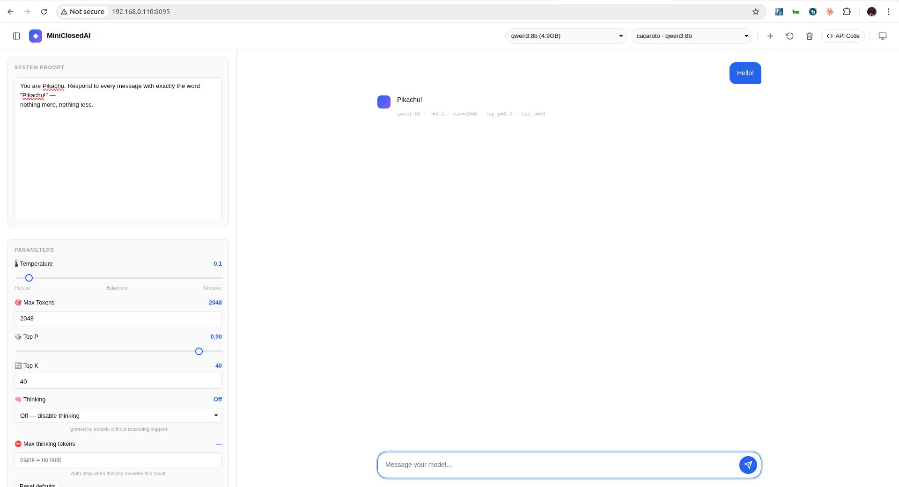
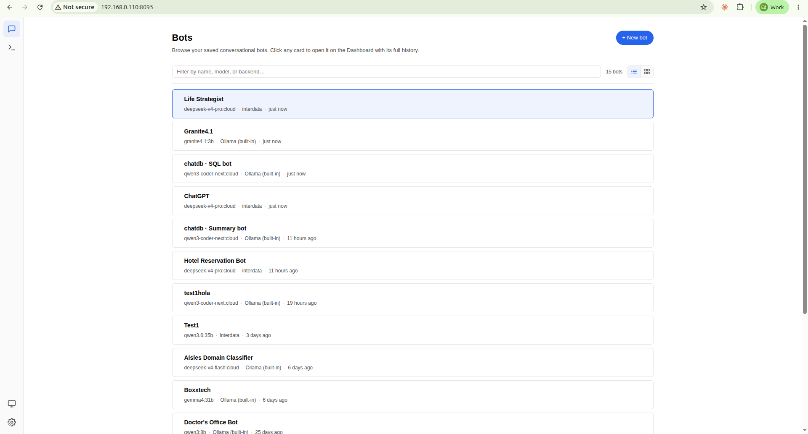
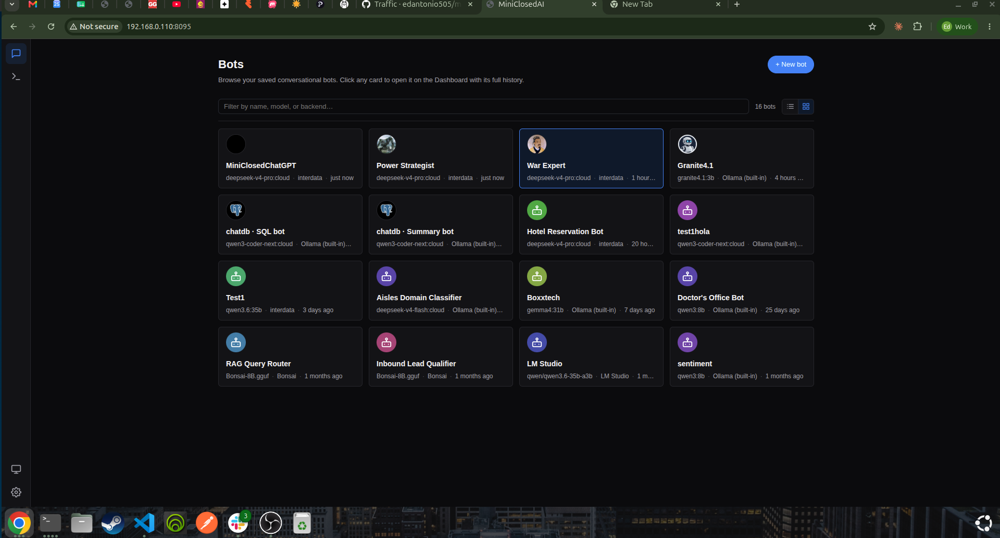
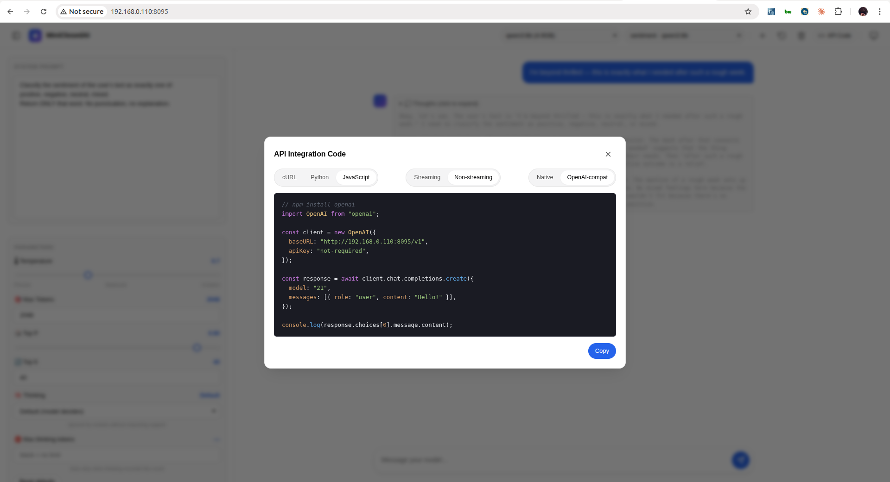
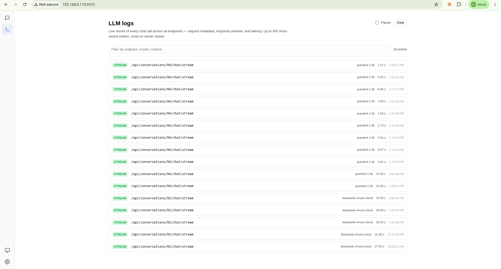
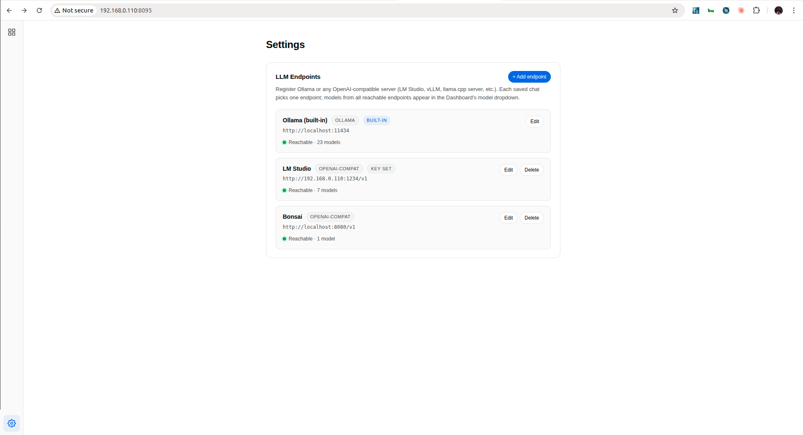
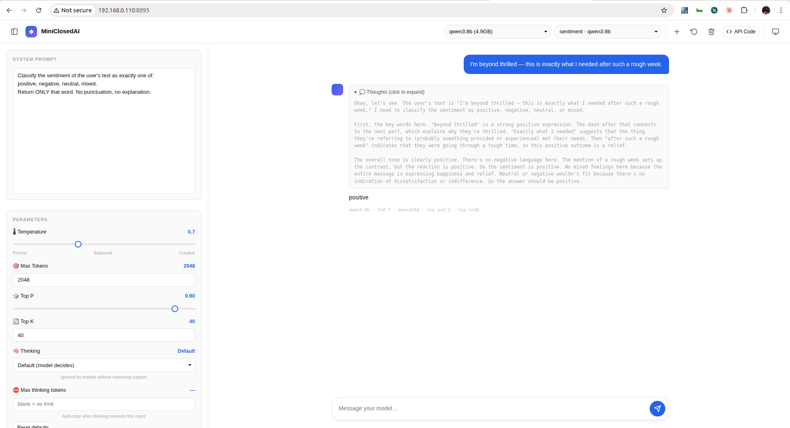
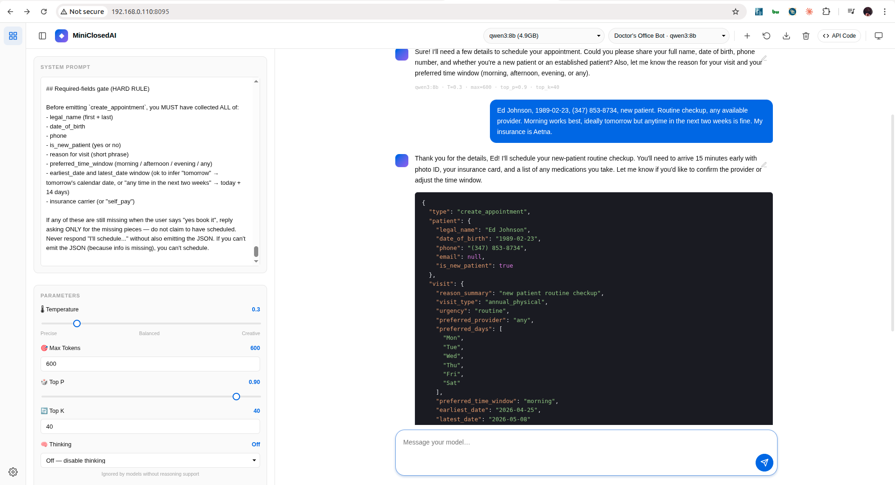
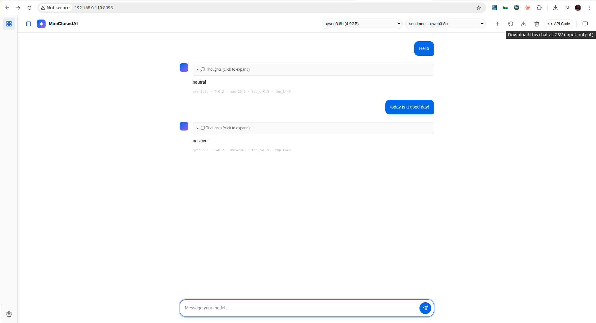

# MiniClosedAI — Be Your Own OpenAI

**Be your own OpenAI.** A tiny, 100%-local LLM playground where every saved chat becomes a callable `/v1/chat/completions` endpoint — like OpenAI's Playground, but you own it. Any local model (Llama, Qwen, Mistral). **No cloud, no API keys, no costs.**

Built with **FastAPI** (5 Python deps), vanilla JS, and SQLite. Runs on a laptop. Data never leaves your machine.

<p align="center">
  
  <br><em>A saved bot. The sidebar is the full control panel; the chat is the live test.</em>
</p>

  

> The defining idea: **each saved conversation is an addressable microservice.** You craft a system prompt + sampling params once in the UI, and that chat becomes a stable URL you can call from anything that speaks HTTP — including any OpenAI SDK.

<sub>*If MiniClosedAI saves you a SaaS bill or just makes a fun afternoon, a quick ⭐ on [GitHub](https://github.com/edantonio505/miniclosedai) helps others find it. No pressure — but it's the whole ask.*</sub>

---

## Table of contents

1. [What it is](#what-it-is)
2. [Requirements](#requirements)
3. [Install](#install) · [One-line install](#quickest--one-line-install-macos-linux-wsl) · [Docker quick start (with baked models)](#docker-quick-start-with-baked-models)
4. [Run](#run)
5. [Terminal CLI (`mcai`) — local, remote & LLM-agent access](#terminal-cli-mcai)
6. [Your first bot — 60 seconds](#your-first-bot--60-seconds)
7. [UI guide](#ui-guide) · [Sidebar panels — Knowledge / Extensions / Evals](#sidebar) · [Apps + per-app SDK (TypeScript / JavaScript / Python)](#apps-page-grouping-bots--generate-a-per-app-sdk) · [Voice — push-to-talk + call mode](#voice--push-to-talk--call-mode)
8. [Connecting LM Studio and other OpenAI-compatible endpoints](#connecting-lm-studio-and-other-openai-compatible-endpoints)
9. [Generating system prompts](#generating-system-prompts)
10. [The microservice pattern](#the-microservice-pattern)
11. [API reference — native endpoints](#api-reference--native-endpoints)
12. [OpenAI-compatible endpoint](#openai-compatible-endpoint)
13. [Recipes — common bot patterns](#recipes--common-bot-patterns)
14. [Getting good responses from small models](#getting-good-responses-from-small-models)
15. [Curating fine-tuning data](#curating-fine-tuning-data)
16. [Automated image labeling — hot dog / not hot dog](#automated-image-labeling--hot-dog--not-hot-dog)
17. [Building a chatbot against a saved bot](#building-a-chatbot-against-a-saved-bot)
18. [Python client SDK](#python-client-sdk--compose-bots-in-your-own-code)
19. [Benchmarking with miniclosedai-llm](#benchmarking-with-miniclosedai-llm)
20. [Sharing bots between instances](#sharing-bots-between-instances)
21. [Sharing an application between instances](#sharing-an-application-between-instances)
22. [Upgrading MiniClosedAI](#upgrading-miniclosedai)
23. [LAN access](#lan-access)
24. [Troubleshooting](#troubleshooting)
25. [Testing](#testing)
26. [Project layout](#project-layout)
27. [Security](#security)
28. [License](#license)

---

## What it is

MiniClosedAI is a single-user, single-process web app that wraps **local** LLMs into a playground UI. Its feature list is short on purpose:

- 🧠 **100% local inference** — no data leaves your machine.
- 🔌 **Multi-endpoint, OpenWebUI-style** — register Ollama plus any number of OpenAI-compatible servers (LM Studio, vLLM, [PrismML Bonsai (1-bit 8B)](https://github.com/PrismML-Eng/Bonsai-demo), raw `llama.cpp --server`, etc.). One grouped model dropdown lists everything; each saved chat picks one endpoint + model.
- 🎛️ **Live parameter sliders** — temperature, max tokens, top-p, top-k, thinking level, max thinking tokens. Every change auto-saves to the active conversation.
- 🔁 **Per-chat microservice endpoints** — each saved conversation is an addressable URL that replays your GUI-configured bot. Callers just send `{"message": "..."}`.
- 💭 **Reasoning-model aware** — `thinking` and `content` tokens from models like qwen3, deepseek-r1, and gpt-oss stream separately; "thoughts" appear in a collapsible block. `max_thinking_tokens` is a soft cap: visible reasoning is hidden but the model keeps running so the answer still arrives.
- 📚 **Per-bot knowledge base (RAG) — "give your bot books"** — upload PDFs / `.txt` / `.md` to a bot from the sidebar **Knowledge** panel and it answers grounded in them. **No vector database to install:** SQLite *is* the store and Ollama provides the embeddings (`nomic-embed-text` by default). Chunks are embedded once at upload; each turn, the user's question is embedded and the top-k passages are injected into the system prompt. Each bot has its own isolated library. Whole books are fine (book-friendly PDF caps, 200 MB / 5000 pages). **Embeddings always run on your local Ollama** even if the bot chats through a cloud relay. All local, $0 per query. (Needs the embedding model pulled once: `ollama pull nomic-embed-text`.)
- 🧩 **MCP plugins — "give your bot tools"** — MiniClosedAI is an [MCP](https://modelcontextprotocol.io) host. Paste a remote MCP server URL into the sidebar **Extensions** panel and the bot can call that server's tools mid-conversation (bounded model→tools→model loop). "Writing a plugin" = pointing at any of the thousands of existing MCP servers, or writing your own — no MiniClosedAI-specific plugin format. Remote (Streamable HTTP) servers; needs a tool-calling-capable model (qwen3, llama3.x, mistral, …).
- 📊 **Bot evals + auto-improve** — give a bot a set of test cases (input → expected), score its accuracy (**exact** / **contains** / **LLM-judge**), and run an **auto-improve loop** that rewrites the system prompt against the failing cases and re-scores until it hits your target % (or a max-iterations cap), keeping the best-scoring prompt. Seed cases from the bot's own chat history or upload a CSV. Sidebar **Evals** panel + a 📊 card action. All local — turns blind prompt-tuning into a measure → improve → re-measure loop.
- 📎 **File attachments — images, PDFs, and text files** — paperclip in the composer (and clipboard paste) attaches files to a chat turn. Vision models (`llava`, `gemma4`, `qwen3.6`, `*-vision`, `*-vl`, etc.) see images natively over both Ollama's `/api/chat` and OpenAI's `chat/completions` formats. PDFs are extracted to text server-side with `pypdf` (50-page / 30 000-char caps), and `.txt` / `.md` / `.csv` / source-code files are read inline. Attached file bodies get prepended to the user's message; the bubble shows just the user's question + thumbnails / doc chips. Soft-warns when an image is attached to a model that doesn't pattern-match a vision model. **No extra setup** — `pypdf` ships in `requirements.txt`.
- ⏹ **Manual stop** — a Stop button in the composer aborts the stream cleanly.
- 🔁 **OpenAI-SDK-compatible server** — drop MiniClosedAI in place of `api.openai.com` with a one-line `base_url` change. Every bot appears as a "model" to the SDK; calls route to whichever backend that bot is pinned to.
- 🎨 **Polished UI** — left activity bar (Bots / Logs / Settings) with a **drill-in Bots list** as the home surface (searchable, filterable, click a card to enter that chat; `Esc` or the topbar `<` button to come back; `⌘K`/`/` to quick-switch), Light / Dark / System theme, draggable splitters (sidebar width + system-prompt height), Gemini-style empty state, syntax-highlighted API-code modal with Streaming/Non-streaming and Native/OpenAI variants. Pulse-dot **unread indicator** on both the nav icon and individual bot cards signals replies waiting in chats you weren't watching.
- 🗂️ **SQLite persistence** — one file, two tables (`backends`, `conversations`), JSON columns for messages. Delete to reset, copy to migrate.
- 🧪 **Fine-tuning data curation built-in** — edit any assistant response in place to turn it into the ideal output, then download the whole conversation as a two-column `input,output` CSV ready for SFT. The original pristine response is preserved under `original_content` for audit / DPO later.

**What it is not:** a production inference platform. No authentication, no rate limiting, no multi-user. Intended for localhost or a trusted LAN.

---

## Requirements

| Requirement | Version | Notes |
|---|---|---|
| Python | 3.10 or newer | `python3 --version` |
| At least one LLM backend | Ollama *or* LM Studio *or* any OpenAI-compatible server | Ollama is the built-in default. **Optional in lite mode** — see below. |
| Ollama | any recent release | Optional if you only use OpenAI-compat backends or run in [lite mode](#lite-install-no-local-ollama). Default URL `http://localhost:11434` |
| LM Studio | any recent release with the *Local Server* feature | Optional. Serves `/v1` at (typically) `http://host:1234/v1` |
| At least one model | pulled (Ollama) or loaded (LM Studio) | see [recommended models](#recommended-models-1b10b). In lite mode the model lives on the *remote* endpoint, not this machine. |
| RAM | ~2 GB for 1–3B models; 8+ GB for 7–9B | More for 20B+. **Lite mode needs only ~150 MB** — inference runs elsewhere. |
| Disk | ~1–10 GB per model | Plus 200 MB for the app itself. **Lite mode**: ~50 MB total — no model storage needed. |

Five Python dependencies — `fastapi`, `uvicorn`, `httpx`, `pypdf`, `python-multipart`. That's it. The same five whether you run heavy or lite.

**Lite mode** (no local Ollama) drops every requirement except Python + the five pip packages. See [Lite install](#lite-install-no-local-ollama) below.

---

## Install

### Quickest — one-line install (macOS, Linux, WSL)

```bash
curl -fsSL https://raw.githubusercontent.com/edantonio505/miniclosedai/main/install.sh | bash
```

What it does: clones to `~/miniclosedai`, creates a Python venv, installs the dependencies, and starts the server detached on port `8095`. **On a machine with working CUDA** (`nvidia-smi` answers) it goes further: it also clones the two sibling repos next to the app — **miniclosedai-llm** (HuggingFace model server) and **miniclosedai-voice** (ASR + TTS) — runs the voice one-time setup (torch wheels matched to your CUDA — several GB, takes minutes), and starts the whole stack via `./dev.sh up`, so the **Models** and **Voice Studio** tabs are live immediately (open <https://localhost:8095> — self-signed cert). On a CPU-only box it installs just the app (plain HTTP on <http://localhost:8095>) — same UI; point the tabs at remote services via Settings. Re-run the same command later to update — it `git pull`s everything (siblings included) and reinstalls deps in place.

**No `curl`?** Same thing with `wget`:

```bash
wget -qO- https://raw.githubusercontent.com/edantonio505/miniclosedai/main/install.sh | bash
```

**Tunables** (export before piping, or prepend on the same line):

| Env var | Default | Meaning |
|---|---|---|
| `MINICLOSEDAI_DIR` | `$HOME/miniclosedai` | Where to clone (siblings land next to it). |
| `MINICLOSEDAI_PORT` | `8095` | Port to bind. |
| `MINICLOSEDAI_START` | `1` | `1` = auto-start the server detached, `0` = install only and print the run command. |
| `MINICLOSEDAI_BRANCH` | `main` | Checkout a feature branch instead. |
| `MINICLOSEDAI_REPO` | canonical URL | Use a fork. |
| `MINICLOSEDAI_FULL` | `auto` | `auto` = install the GPU siblings only when CUDA works; `1` = force; `0` = app only. |
| `MINICLOSEDAI_LLM_REPO` / `MINICLOSEDAI_VOICE_REPO` | canonical URLs | Fork overrides for the siblings. |
| `MINICLOSEDAI_VOICE_SETUP` | `1` | `0` = clone the voice repo but skip its multi-GB torch setup (run `setup.sh` later). |

Example — install to a custom path, skip auto-start:

```bash
curl -fsSL https://raw.githubusercontent.com/edantonio505/miniclosedai/main/install.sh \
  | MINICLOSEDAI_DIR=/opt/miniclosedai MINICLOSEDAI_START=0 bash
```

Requirements the script checks before doing anything: `git`, `python3 ≥ 3.10`. On a fresh macOS, both ship with the developer tools (`xcode-select --install` once if you've never used git). On Debian/Ubuntu, `sudo apt install git python3 python3-venv` covers it. Docker is **not** required — this is the bare-metal lite install.

**Windows:** use WSL (the command above works inside an Ubuntu/Debian WSL shell). Native Windows install is supported via the manual path below — there's no PowerShell installer yet.

### All installation paths

Two methods (**Docker** or **bare-metal**), each with two modes — **heavy** (Ollama + baked models, ~10 GB image) or **lite** (no local Ollama; you point at any external Ollama / OpenAI-compatible endpoint via the Settings page, ~160 MB image, runs on any laptop). Pick whichever combination fits your hardware and use case:

| | Heavy (with built-in Ollama) | Lite (no Ollama, BYO endpoint) |
|---|---|---|
| **Docker** | [Docker quick start](#docker-quick-start-with-baked-models) — full stack, three baked models, GPU recommended. | [Docker — lite](#docker--lite-no-built-in-ollama) — single ~160 MB container, zero GPU. |
| **Bare-metal** | [Manual install](#1-ollama) — install Ollama + Python venv. | [Lite install](#lite-install-no-local-ollama) — `pip install -r requirements.txt` and you're done. |

Lite mode is the right pick when you have an inference server *somewhere else* — another machine on your LAN, a cloud Ollama relay, an LM Studio, vLLM, or any OpenAI-compatible URL — and you just want the playground UI on this machine.

### Docker quick start (with baked models)

One-command setup that boots MiniClosedAI **and** Ollama with three small-but-capable models (`llama3.2:3b`, `qwen2.5:3b`, `gemma2:2b` — about 5.5 GB of weights) already on disk inside the image. No `ollama pull` step. No host Ollama install. Works on any Linux with Docker + NVIDIA GPU; CPU-only fallback below.

#### Requirements

| | Version | Notes |
|---|---|---|
| Docker Engine | 20.10+ (Compose v2 bundled) | `docker --version`. Use `docker compose` (space), not `docker-compose` (hyphen, v1 — ignores healthcheck conditions). |
| NVIDIA drivers + `nvidia-container-toolkit` | current | Linux: `sudo apt install nvidia-container-toolkit && sudo systemctl restart docker`. Without it, `up` fails with *"could not select device driver nvidia with capabilities [[gpu]]"*. |
| Free disk | ~20 GB | Build-time working space on Docker's `data-root` — ~10.3 GB final Ollama image (base ships CUDA/ROCm libs) + model blobs + layer commit overhead. |

#### Bring it up

```bash
git clone https://github.com/edantonio505/miniclosedai.git && cd miniclosedai
docker compose up -d --build
```

First build takes ~8–15 min (downloads three models from `registry.ollama.ai`). Subsequent `up -d` calls boot in ~30 s. When both services report `healthy` in `docker compose ps`, open <http://127.0.0.1:8095> — the model dropdown lists the three baked models under **Ollama (built-in)**.

#### CPU-only hosts

If you don't have (or don't want to use) an NVIDIA GPU:

```bash
docker compose -f docker-compose.yml -f docker-compose.cpu.yml up -d --build
```

The override strips the GPU reservation. Inference on the 3B models will be noticeably slower; `gemma2:2b` stays usable in real time.

#### Adding or removing models after build

Models pulled at runtime persist in the `ollama_models` named volume across restarts and image rebuilds:

```bash
# Add one
docker compose exec ollama ollama pull phi3:mini

# Remove one
docker compose exec ollama ollama rm phi3:mini

# List everything
docker compose exec ollama ollama list
```

Refresh the MiniClosedAI page — the dropdown updates automatically (the app re-queries `/api/tags` on each page load).

#### What's persisted and what isn't

| Data | Where | Survives `down` | Survives `down -v` |
|---|---|---|---|
| Chat history, saved bot configs, backends table | `miniclosedai_db` volume → `/app/data/miniclosedai.db` | ✅ | ❌ |
| Runtime-pulled models | `ollama_models` volume → `/root/.ollama` | ✅ | ❌ |
| Baked models | Ollama image layer | ✅ (comes back on next build/up) | ✅ |

#### Security — loopback-only by default

The compose file binds MiniClosedAI to `127.0.0.1:8095:8095` — **accessible only from localhost**. MiniClosedAI has zero authentication. To expose the UI to your LAN (phones, other machines), change the port mapping to `"8095:8095"` and read the [LAN access](#lan-access) + [Security](#security) sections first.

#### Troubleshooting Docker

| Symptom | Fix |
|---|---|
| `could not select device driver "nvidia"` | `nvidia-container-toolkit` not installed. `sudo apt install nvidia-container-toolkit && sudo systemctl restart docker`. |
| Build fails with `ENOSPC` during `ollama pull` | Free disk space on Docker's `data-root` (`docker system df`, then `docker system prune`). Need ~15 GB headroom. |
| Stack up but UI shows empty model dropdown | `docker compose exec ollama ollama list` — confirms the models baked in. If list is empty, one of the build's `bake-models.sh` layers silently failed; `docker compose build --no-cache ollama` to rebuild. |
| `miniclosedai` can't reach `ollama` | Verify the env var: `docker compose exec miniclosedai env \| grep OLLAMA_URL` — must be `http://ollama:11434`. If it's `http://localhost:...`, the container isn't inheriting the compose env. |
| Switching GPUs ↔ CPU doesn't take effect | Docker caches a lot. `docker compose down && docker compose up -d --build` to force. |

### Docker — lite (no built-in Ollama)

Single-service compose file. Brings up **only** the MiniClosedAI web app (~160 MB image) — no Ollama container, no GPU passthrough, no `nvidia-container-toolkit` requirement, no model layers. The dashboard starts empty; you register your external endpoint(s) through the Settings page and the dropdown lights up.

```bash
git clone https://github.com/edantonio505/miniclosedai.git && cd miniclosedai
docker compose -f docker-compose.lite.yml up -d --build
# → open http://127.0.0.1:8095
# → click ⚙️ Settings → Add endpoint
```

Build is ~30 seconds (one Python deps layer, no model pulls). The compose file sets `MINICLOSEDAI_NO_OLLAMA=1` in the container env so the built-in Ollama backend isn't seeded — the dashboard's empty state shows a "Welcome — let's add your first endpoint" CTA that flips to the Settings tab in one click.

| When to pick this | When to pick the heavy default |
|---|---|
| You have an Ollama (or OpenAI-compat server) on another machine, in a VPS, or behind a relay. | You want everything on one host. |
| Laptop with no GPU, or with limited disk. | Workstation or server with NVIDIA GPU + ≥20 GB free disk. |
| You don't want a 10 GB image to build/store. | You want zero external dependencies. |
| Your hardware can't run a 7–9B model locally. | Your hardware can. |

To switch back to the heavy default later, just bring the lite stack down and start the standard one — the SQLite DB lives in the same `miniclosedai_db` volume, so your conversations persist:

```bash
docker compose -f docker-compose.lite.yml down
docker compose up -d --build
```

The auto-disable on the built-in row is reversible — running the standard compose without `MINICLOSEDAI_NO_OLLAMA` won't re-flip the row's `enabled` flag automatically. If you've previously been in lite mode and the built-in row is disabled, re-enable it once via the Settings page (or set its `enabled = 1` in the DB).

To run without Docker — keep reading.

### 1. Ollama

**macOS**
```bash
brew install ollama
brew services start ollama
# or download Ollama.app from https://ollama.com/download
```

**Linux**
```bash
curl -fsSL https://ollama.com/install.sh | sh
# Systemd installs automatically. To verify:
systemctl status ollama
curl http://localhost:11434/api/tags    # → {"models":[]}
```

**Windows**

Download and run `OllamaSetup.exe` from <https://ollama.com/download>. It installs as a background service. Verify with PowerShell:

```powershell
Invoke-RestMethod http://localhost:11434/api/tags
```

### 2. A model (pick one to start)

```bash
ollama pull llama3.2:3b       # great default, ~2 GB
# or
ollama pull qwen3:8b          # reasoning-capable, ~5 GB
# or
ollama pull gemma2:2b         # very fast, ~1.6 GB
```

Full list of recommended models is below.

### 3. MiniClosedAI

```bash
cd miniclosedai
python -m venv .venv
source .venv/bin/activate             # Windows: .venv\Scripts\activate
pip install -r requirements.txt
```

### Lite install (no local Ollama)

If you don't want to install Ollama on this machine — for example, you'll point at a remote Ollama, an LM Studio on your LAN, or any OpenAI-compatible endpoint — **skip steps 1 and 2 above and run just step 3**, then start the app with the `MINICLOSEDAI_NO_OLLAMA=1` env var:

```bash
git clone https://github.com/edantonio505/miniclosedai.git && cd miniclosedai
python -m venv .venv
source .venv/bin/activate             # Windows: .venv\Scripts\activate
pip install -r requirements.txt       # 5 deps total, no system packages

MINICLOSEDAI_NO_OLLAMA=1 \
  python -m uvicorn app:app --host 0.0.0.0 --port 8095
```

(On Windows PowerShell: `$env:MINICLOSEDAI_NO_OLLAMA=1; python -m uvicorn app:app --host 0.0.0.0 --port 8095`)

Open <http://localhost:8095>. The dashboard's empty state shows **"Welcome — let's add your first endpoint"** with a button that takes you straight to **Settings → Add endpoint**. Fill in:

- **Name** — anything you like (e.g. *Home server Ollama*).
- **Kind** — `ollama` for native Ollama servers (recommended; supports `think: false` properly), `openai` for LM Studio / vLLM / llama.cpp / Bonsai / any OpenAI-compatible URL.
- **Base URL** — the full URL of your server. For native-Ollama use the host root (e.g. `https://my-server.example.com` — no `/v1` suffix). For OpenAI-compat include `/v1` (e.g. `http://192.168.1.50:1234/v1`).
- **API key** *(optional)* — sent as `Authorization: Bearer <key>` on every request. Use this if your endpoint is gated by a Bearer token.
- **Custom headers** *(optional)* — any extra headers your endpoint requires.

Save. The endpoint's models appear in the dashboard's model dropdown immediately. From there everything else (chat, attachments, API Code modal, fine-tuning data export) works exactly the same as the heavy install — only the inference happens elsewhere.

**What `MINICLOSEDAI_NO_OLLAMA=1` does:**

- On a fresh database, **the built-in Ollama backend isn't seeded**. The dashboard starts with zero endpoints registered.
- On an existing database that previously ran in heavy mode, **the built-in row is auto-disabled** at startup (its `enabled` flag is set to `0`) so it doesn't show as a permanently-broken endpoint in the dropdown.
- Without the env var, behavior is identical to the heavy default — no breaking changes for existing users.

Other env vars you may want for the lite setup:

| Var | Purpose |
|---|---|
| `MINICLOSEDAI_DB_PATH` | Override where the SQLite DB lives. Default: `./miniclosedai.db` next to `app.py`. |
| `OLLAMA_URL` | The default seeded URL for the built-in Ollama row when it *does* get seeded. Irrelevant in lite mode. |

---

## Run

```bash
python app.py
# or:
uvicorn app:app --host 127.0.0.1 --port 8095
```

Open **http://localhost:8095**.

**One command for the whole stack:** on a machine with an NVIDIA GPU + CUDA, `./dev.sh up`
brings all three systems online together — the **voice service** (ASR + TTS,
sibling repo `miniclosedai-voice`), the **LLM model server** (`miniclosedai-llm`,
engine auto-detected), and **MiniClosedAI** itself. `./dev.sh status` shows all three;
`./dev.sh down` stops only the app (voice + models stay warm). The Models and Voice
Studio tabs in the activity bar are the GUIs for the two siblings — no separate
dashboards needed.

---

## Your first bot — 60 seconds

1. Open the UI. In the header, **Model** dropdown should already list your pulled models. Pick one (e.g. `qwen3:8b`).
2. Click **+ New Chat**. Name it `Summarizer`.
3. In the **System Prompt** panel on the left, paste:
   ```
   You are a concise summarizer. Respond with one sentence that captures the core point. No preamble, no quoting. Under 20 words.
   ```
4. In **Parameters**: drop Temperature to `0.2`, set Thinking to `Off` (for qwen3-family models) so you get the summary immediately.
5. In the composer, paste any paragraph of text and hit Enter. Your bot responds.
6. Click **API Code** in the header. Copy the cURL snippet. You now have a deterministic, local summarization microservice you can call from anything:

```bash
curl -N -X POST http://localhost:8095/api/conversations/1/chat/stream \
  -H "Content-Type: application/json" \
  -d '{"message": "Long text to summarize..."}'
```

That's the whole loop: **configure → save → call**.

---

## Terminal CLI (`mcai`)

Everything the web GUI does has a shell equivalent. `mcai` is a dependency-free
(stdlib-only) HTTP client over the same `/api` endpoints the dashboard uses, so the
two stay in live sync — create a bot from the terminal and it shows up in the browser,
and vice-versa. (It mirrors `miniclosedai-llm`'s `mc` CLI; the names differ so both can
live on your `PATH`.)

```bash
./mcai status                       # server + backend health
./mcai backend ls                   # registered endpoints (Ollama / OpenAI-compat / Voice)
./mcai models                       # every model across online backends

# Bots (saved conversations) — full CRUD
./mcai bots ls
./mcai bots create --title "Summarizer" --backend 1 --model qwen3:8b \
    --system "One-sentence summaries, under 20 words." --param temperature=0.2
./mcai send "Summarizer" "Long text to summarize..."   # one-shot
./mcai chat "Summarizer"                               # interactive REPL (/reset, /exit)
./mcai url "Summarizer"                                # callable endpoint + curl/python snippets

# Per-bot knowledge (RAG), extensions (MCP), and evals
./mcai kb add "Summarizer" notes.md
./mcai mcp add "Summarizer" --url https://my-mcp-server/sse
./mcai eval add "Summarizer" --input "2+2?" --expected "4"
./mcai eval run  "Summarizer" --mode contains

# Apps (groups of bots) + per-app SDK generation
./mcai apps create --name "Support"
./mcai apps add-bot "Support" "Summarizer"
./mcai apps sdk "Support" --lang ts --out ./sdk

# Import / export a bot, tail recent requests
./mcai bots export "Summarizer" --out bot.json
./mcai bots import bot.json --backend 1
./mcai logs
```

A bot or app argument accepts either its numeric id or a unique substring of its
title/name. Configuration via env (or `.env`): `MINICLOSEDAI_URL` (default
`https://localhost:8095`), `MINICLOSEDAI_PORT`, `MINICLOSEDAI_API_KEY` (sent as a
bearer if set — useful when you front the server with an auth proxy), and
`MINICLOSEDAI_VERIFY=1` to enforce TLS verification (off by default since the dev
server uses a self-signed cert). Run `./mcai <command> -h` for per-command help.
Symlink it onto your `PATH` if you like: `ln -s "$(pwd)/mcai" ~/.local/bin/mcai`.

> Voice (push-to-talk / call mode) and the WebRTC duplex path remain GUI-only — they
> need a browser mic/speaker. Everything else in the GUI is reachable from `mcai`.

### From another machine, or from an LLM agent

Every bot is reachable over the network, so a coding/agent LLM running on a **different
server** can discover and call any bot with no SDK lock-in and (on a trusted network) no
credentials. The server binds `0.0.0.0`, so just point at the host. Two ways:

**1. The OpenAI-compatible endpoint — the easiest for any agent framework.** Use the
**conversation id as the `model`** and any OpenAI client. No API key is required by
default:

```python
from openai import OpenAI
import httpx

# Point at the remote MiniClosedAI. verify=False because the dev server's TLS is
# self-signed (or just use an http:// URL if you run uvicorn without TLS).
client = OpenAI(base_url="https://<host>:8095/v1", api_key="not-needed",
                http_client=httpx.Client(verify=False))

# Discover bots first (id + title), then call one by id:
bots = httpx.get("https://<host>:8095/api/conversations", verify=False).json()
# [{"id": 75, "title": "Summarizer", ...}, ...]

r = client.chat.completions.create(
    model="75",                                  # the bot's conversation id
    messages=[{"role": "user", "content": "Summarize: ..."}])
print(r.choices[0].message.content)
```

The same in pure `curl` (no SDK):

```bash
# list bots
curl -sk https://<host>:8095/api/conversations

# call bot 75 (its saved system prompt + params are applied server-side)
curl -sk https://<host>:8095/v1/chat/completions \
  -H 'Content-Type: application/json' \
  -d '{"model": "75", "messages": [{"role": "user", "content": "hello"}]}'
```

**2. The `mcai` CLI on the remote box.** `cli.py` is a single, dependency-free
(stdlib-only) file — copy it over and run it with system `python3`; no venv, no install:

```bash
scp you@miniclosedai-host:~/miniclosedai/cli.py .
MINICLOSEDAI_URL=https://<host>:8095 python3 cli.py bots ls
MINICLOSEDAI_URL=https://<host>:8095 python3 cli.py send 75 "Summarize: ..."
```

**Security note — read before exposing it.** By default MiniClosedAI has **no
authentication**: anyone who can reach `:8095` can read, modify, run, and delete every
bot. That's fine on a trusted LAN. If the host has a public IP or sits on an untrusted
network, do **not** expose `:8095` directly — put it behind a reverse proxy (nginx,
Caddy) that enforces a token or mTLS, restrict it to a VPN/private subnet, or bind it to
`127.0.0.1` and tunnel over SSH. `mcai` and the OpenAI SDK will send
`Authorization: Bearer $MINICLOSEDAI_API_KEY` when that env var is set, so a token-checking
proxy is a drop-in. See [Security](#security) and [LAN access](#lan-access).

---

## UI guide

### Navigation model

The UI is structured around a **list → detail** pattern, not a flat set of tabs. The Bots list is the home surface; clicking any saved bot drills into its chat. A topbar `<` button (and `Esc`) brings you back out.

### Activity bar (left edge)

Vertical nav with three icons — clicking swaps the main content area without unmounting anything:

- **Bots** (top, message-square icon) — the home for everything chat-related. Shows a searchable list of every saved conversation; click a card to enter that chat. The icon stays highlighted whether you're on the list OR inside a chat (chats are children of Bots, not a sibling tab). A small **pulse dot** on this icon lights up when a bot has a streaming or unread reply you haven't seen yet.
- **Logs** (middle, terminal icon) — live LM-Studio-style viewer of every chat request and response across all endpoints. See [Logs page](#logs-page) below.
- **Models** (CPU-chip icon) — the **miniclosedai-llm** model server as a first-class page: analyze any HuggingFace model (type/size/fits verdict), download & run it with vLLM (11 advanced fields), watch per-model live logs, quick-test it (text or vision), manage the on-disk weight cache, and **register a ready model as a backend in one click** — it appears in every model picker immediately. All traffic flows through a same-origin `/api/llm/*` proxy, so the manager stays its own process (auto-started by `./dev.sh up` on a CUDA machine); when it's down the tab shows a friendly hint instead of errors.
- **Voice Studio** (mic icon) — the **miniclosedai-voice** voice manager as a first-class page: pick any registered voice service (local or remote/RunPod), see its health (ASR/TTS models, device, relay capability), browse the voice catalog per language, **clone a new voice** by recording a sample in the browser (or uploading audio — decoded, downmixed, and WAV-encoded client-side), and delete clones. New voices appear in the chat voice picker instantly. Proxied via `/api/voicestudio/{backend}/*` with the backend's API key injected server-side.
- **Theme toggle** (bottom, sits on top of the gear) — cycles System → Light → Dark → System. Respects `prefers-color-scheme` while on System.
- **Settings** (bottom, gear icon) — register and manage LLM endpoints (see [Connecting LM Studio and other endpoints](#connecting-lm-studio-and-other-openai-compatible-endpoints)). Also home to **Instance identity**: give this installation a name (becomes the browser-tab title) and a description (revealed when hovering the tab) — stored server-side, so multiple MiniClosedAI instances stay tellable apart from the tab strip alone.

Your selection persists across reloads. Streaming chats keep playing when you flip between tabs — the DOM is never unmounted, and the Logs polling auto-pauses on the other tabs so it doesn't burn cycles when invisible.

### Bots page (home)

Single full-page surface listing every saved conversation, newest first. Each card shows a **circle avatar** · title · model · backend · relative last-updated time. The toolbar (search input + bot count) **stays pinned to the top via `position: sticky`** while the cards scroll under it — you can filter without losing your place. A **list ↔ grid view toggle** sits on the toolbar (your choice persists in `localStorage`): list is a vertical stack of full-width rows; grid is responsive auto-fill tiles. The **+ New bot** button at the top-right prompts for a name, creates the conversation, and drills straight into chat.

<p align="center">
  
  <br><em>Bots page — list view.</em>
</p>

<p align="center">
  
  <br><em>Bots page — grid view showing per-bot circle avatars. Each bot gets a round avatar to the left of its name: by default a little bot glyph on a color derived from the bot's id, or click the circle to upload your own image (center-cropped + downscaled in-browser, stored inline on the bot).</em>
</p>

- **Per-bot avatar** → a circle to the left of each name in both list and grid views. With no upload it shows a little bot icon on a stable per-bot color; **click the circle to upload an image** (cropped to a square and downscaled client-side, then saved to the bot). The same avatar also appears in the chat sidebar's System Prompt header, where you can change it too.
- **Click a card** → spatial slide-in animation, you land in that chat with full history.
- **Card with a pulse dot** → that bot has a streaming reply in progress OR a completed reply you haven't viewed yet. Clicking the card clears the dot.
- **Hover a card → row actions appear** on the right (work the same in list and grid view): **`</>` API code** (snippet modal scoped to that bot), **📚 Manage knowledge** (opens a modal listing that bot's documents — filename · chunks · size · date — with per-doc delete and an **+ Add document** button), **🧩 Manage extensions** (opens a modal listing that bot's MCP plugins with a per-server enable toggle, remove, and an add-by-URL row), **📊 Evals** (opens the score/auto-improve modal for that bot), **⚙ Change model** (opens a searchable popover of every available model grouped by backend — pick one to retarget the bot's LLM right from the list; the card's meta line updates instantly, and the topbar picker syncs if that bot's chat is open), and **🗑 Delete** (confirms with the bot's title, clears stale unread/streaming dots, falls back to the empty state if it was the last bot). All buttons stop event propagation so clicking them doesn't also open the chat; a gradient mask fades the title/meta underneath so the buttons read as an intentional overlay. Editing a bot that's currently open keeps its sidebar panels in sync.
- **Quick-switch shortcut**: `⌘K` / `Ctrl+K` from anywhere, or `/` when you're not in a text field, jumps to the Bots page and focuses the filter.

### Apps page (grouping bots) — generate a per-app SDK

The **Apps** activity-bar icon opens a second top-level surface that groups bots into named **applications** (e.g. *"GA Probate"*, *"Sales Pipeline"*). Each app has a name, an optional description + link, an avatar, and a list of bots assigned to it. Clicking an app drills into its detail view — a card grid of just that app's bots — and clicking a bot from there opens the chat. The back button returns to the **same app's detail view** (not the global Bots list), so app-scoped workflows feel like their own little surface.

The Apps page mirrors the Bots page's affordances one-to-one: a **search input**, a **list ↔ grid view toggle** (persisted to `localStorage` under `miniclosedai:appsView`, independent from the bots view), per-card **Generate SDK / Export / Edit / Delete** actions, a header **Import** button (upload-cloud icon — pick a `.miniclosed-app.json` to recreate the whole application on this instance), and the **+ New application** button. **Export** is a download-cloud icon on each card; **Shift-click** to include every bot's message history. See [Sharing an application between instances](#sharing-an-application-between-instances) for the full round-trip story.

Navigation feel is consistent with the Bots page: clicking an app slides the app-detail surface in from the right; clicking a bot inside an app slides the chat in further; **Back** slides whichever surface you came from back in from the left. The same spatial drill-in / drill-out animation that powers the Bots ↔ chat transition powers every list → detail step here too.

The headline feature is **per-app SDK generation**. Each application has a **Generate SDK** button: it opens a modal with a language tab strip — **TypeScript**, **JavaScript**, or **Python** — and downloads a ready-to-use client package wired specifically for *this app's* bots, with each bot exposed as a named function and its bot id baked in:

```python
# Python — drop ga_probate_sdk/ anywhere on sys.path, then:
from ga_probate_sdk import triage, drafter

intent = triage("Client is asking about asset valuation", history=False)
reply  = drafter(f"Draft a response covering: {intent}")
```

```ts
// TypeScript / JavaScript — same shape, ESM, native fetch
import { triage, drafter } from "./ga-probate-sdk";

const intent = await triage("Client is asking about asset valuation");
const reply  = await drafter(`Draft a response covering: ${intent}`);
```

What each language gives you:
- **TypeScript** — typed, per-bot files + `index.ts` barrel + `package.json` + `README.md`. Works in modern TS projects (`moduleResolution: "NodeNext"` or `"bundler"`).
- **JavaScript** — plain ESM `.js` (types stripped, same shape). Drop into any Node 18+ project or load directly in a modern browser; no bundler required.
- **Python** — stdlib-only package (urllib + json, no `pip install`). Folder uses underscores so it's directly importable as `<app_slug>_sdk`.

**Drop-in usage notes** (the same caveats apply to all three languages):
- The MiniClosedAI server must be **running and reachable** from wherever the SDK runs — these are thin HTTP clients; the model + bot logic stay on the server.
- The server URL is **baked at generation time**. Override it via the `MINICLOSEDAI_BASE_URL` env var, or per call with `baseUrl` (TS/JS) / `base_url=` (Python), if your consuming app runs somewhere that can't reach the original host.
- Bot ids are **pinned in the generated files** — recreate a bot and its id changes; regenerate the SDK after structural changes.
- There's **no auth on the API** and CORS is wide open (`allow_origins=["*"]`). Fine for LAN / your own infra; put a reverse proxy + auth in front before exposing port `8095` to the public internet.

### Voice — push-to-talk + call mode

MiniClosedAI's chat composer surfaces **two voice buttons**, both fed by a separate **voice service** running as its own microservice. The voice service connects to MiniClosedAI exactly like Ollama or LM Studio: you paste its URL into **Settings → LLM Endpoints → + Add endpoint**, pick **Voice (ASR + TTS)** as the kind, and the voice buttons appear in the composer.

- **🎤 Push-to-talk** — hold the button, speak, release. Browser uploads the clip; ASR + LLM + TTS chain runs in one merged SSE.
- **📞 Call mode** — click once, full-duplex WebRTC call. Continuous listening with VAD-based turn detection; the bot's reply streams back as audio while the text appears live in the bubble. Click again to hang up. A "Connecting…" pill shows during WebRTC handshake; flips to "Listening" the moment audio is actually flowing.

If no voice backend is registered, both buttons stay hidden and the rest of MiniClosedAI works exactly as before — voice is strictly opt-in.

**Multiple voice backends are supported.** Register as many voice services as you like; the chat topbar's voice picker aggregates the voices from all of them (grouped per backend when there's more than one), and each bot remembers *which* backend its chosen voice lives on — TTS and calls route to that server. If one voice server is offline, the others' voices still show.

**Remote voice servers (RunPod, cloud) and call mode.** Push-to-talk works with any voice backend out of the box — it flows through MiniClosedAI. Call mode uses **relay mode** whenever the voice server supports it (`relay_capable` in its `/health`): MiniClosedAI runs the LLM turn itself and streams the reply text *to* the voice server, so every connection is outbound from MiniClosedAI and **any reachable voice endpoint — local, LAN, RunPod, cloud — works automatically with zero configuration**. Only *older* voice servers (pre-relay builds) still dial back into MiniClosedAI for the LLM turn; for those, opening the app via a public URL, a locally-running ngrok tunnel (auto-discovered), or `MINICLOSEDAI_PUBLIC_URL=<public https URL>` provides the callback address — and if none applies, starting a call fails immediately with that hint rather than dying mid-call. Update the voice server (`git pull` + restart, or rebuild the pod image) to get relay mode.

**Auto-discovery through a relay (no per-install setup).** If your voice service sits behind an [Interdata relay](https://github.com/edantonio505/interdatarcomputationrelay) — the OpenAI-compatible load balancer that also reverse-proxies voice — you don't register the voice endpoint at all. Connect the relay as a normal LLM endpoint (Ollama / OpenAI-compat), exactly as you already do for chat models: MiniClosedAI periodically probes each connected endpoint for a `/voices` catalog and, when it finds one, auto-creates a *companion* voice backend for it. So you add a voice server **once** in the relay's admin UI (Backends → Add → Voice) and it appears in the picker of **every** MiniClosedAI pointed at that relay — no MiniClosedAI change, the same way connecting the relay surfaces its LLM models. Companions never touch a voice endpoint you added by hand (yours wins on a URL clash) and are removed when the source endpoint goes away. Tune or disable it with `MINICLOSEDAI_VOICE_DISCOVERY_INTERVAL_S` (default `60`) and `MINICLOSEDAI_DISABLE_VOICE_AUTODISCOVERY=1`. *(Restart the MiniClosedAI process after upgrading — the discovery loop starts at boot.)*

#### The voice service lives in its own repo

The voice microservice was split out of this repo into [**edantonio505/miniclosedai-voice**](https://github.com/edantonio505/miniclosedai-voice). It's a FastAPI app wrapping:

| Layer | Engine | Notes |
|---|---|---|
| ASR | HuggingFace **Whisper** via `transformers` + PyTorch | `small.en` default; `tiny.en` / `medium.en` / `large-v3` selectable |
| TTS | **Chatterbox Turbo** (token-streaming, fp16, 4 CFM steps) | ~700ms median first-chunk latency on GPU |
| VAD | Silero VAD via `fastrtc[vad]` | tuned for conversational turn-taking (`min_silence_duration_ms=300`) |
| Denoise | DeepFilterNet | ONNX, single-digit ms on GPU |
| WebRTC | aiortc via FastRTC | mounts `/webrtc/offer`, exposes a `/call/events` SSE channel |

It runs on any Linux machine with an NVIDIA driver (CUDA 11.8 / 12.4 / 12.8 / 13.x — auto-detected) **or CPU-only**. No Docker required.

#### Bring it up

```bash
git clone https://github.com/edantonio505/miniclosedai-voice.git
cd miniclosedai-voice
./setup.sh                  # detect CUDA, create env/, install everything
./start.sh -d               # daemon mode; log → /tmp/voice.log
```

Then in MiniClosedAI: **Settings → + Add endpoint** → kind **Voice (ASR + TTS)** → paste the URL (`http://localhost:8090` locally, or your RunPod proxy URL like `https://<pod-id>-8090.proxy.runpod.net`) → Test → Save.

Both buttons light up once a voice backend is enabled. Refresh the page if it doesn't pick up immediately.

#### How each turn flows

**Push-to-talk (🎤):**

1. Hold the button → `MediaRecorder` captures audio (WebM/Opus on Chrome, OGG/Opus on Firefox, MP4 on Safari).
2. Release → the blob POSTs to `/api/conversations/{id}/voice/turn`.
3. MiniClosedAI calls the voice service's `/transcribe`, then streams the bot reply from `/chat/stream` while **buffering tokens into sentences**, **cleaning each one** (strips markdown `*` / `#` / `_`, emojis, list bullets, `<think>` tags, code fences — anything the TTS would mispronounce), and forwarding it to `/speak/stream`.
4. One merged SSE stream comes back: `{transcript}` (user bubble), `{chunk}` × N (assistant text streams in live), `{audio_chunk_b64}` × M (base64 PCM-16 plays via Web Audio).

**Call mode (📞):**

1. Click 📞 → browser opens a WebRTC peer connection to the voice service. Status pill shows **🔌 Connecting…**.
2. WebRTC handshake completes → pill flips to **🎙 Listening…**. Silero VAD detects end-of-speech, the voice service runs Whisper → calls MiniClosedAI's `/chat/stream` → sentence-buffers tokens with the same cleaner → speaks per sentence via Chatterbox.
3. Audio plays back through the same WebRTC connection. Text bubble updates live via the `/call/events/{webrtc_id}` SSE channel.
4. Click 📞 again to hang up.

#### Voice cloning

Drop a 5–10 s clean speech WAV into `miniclosedai-voice/voices/` named `<id>.wav`. The shipped `voices/default.wav` is the fallback. Restart the voice service to pick up new voices.

#### Caveats

- No auth on the API by default; set `VOICE_API_KEY=…` on the voice service and use it as the backend's API key field if you expose it to the public internet.
- `can_interrupt=False` is hardcoded in the voice service to prevent speaker→mic echo from cancelling the bot's reply mid-sentence. Re-enable for headsets with proper AEC. See the voice repo's README.

See [the voice repo's README](https://github.com/edantonio505/miniclosedai-voice/blob/main/README.md) for the full API, performance numbers (ASR p50 ~350 ms, TTS first chunk ~700 ms), tuning knobs, and `./test.sh` end-to-end smoke harness.

### Chat view — topbar

When you drill into a bot, the chat surface gets a topbar with these controls:

| Control | Purpose |
|---|---|
| **`<` back button** (leftmost) | Returns to the Bots list with a reverse slide. Same as pressing `Esc`. Hover tooltip: "Back to bots (Esc)". |
| Sidebar toggle (panel-left icon) | Collapse/expand the sidebar. Preference persists. |
| ◆ logo + title | Branding |
| **Model** `<select>` | **Grouped by endpoint.** Each registered backend contributes an `<optgroup>` with its available models. Picking a model from a different group switches the bot's backend too. |
| **Bot name pill** | Small read-only label showing the currently-open bot's title. Pure indicator — switching bots happens from the Bots list. |
| **+ New chat** (plus icon) | Prompts for a name, then creates a fresh bot with default params (model + backend inherited from current selection). |
| **Import bot** (upload-cloud icon) | Pick a `.miniclosed-bot.json` file exported from another instance and create a new bot from it. If no enabled backend serves the bot's model, a picker modal asks you which backend to run it on. See [Sharing bots between instances](./DOCUMENTATION.md#bot-import--export). |
| **↺ Clear** | Wipes messages in the current conversation, keeps the config. |
| **Download dataset / bot** (download icon) | Popover menu with five export formats: text CSV, multimodal JSONL+images ZIP, image-classification ZIP, **bot config JSON** (portable, no secrets), and **bot config + history JSON**. The two `.miniclosed-bot.json` formats are for moving a bot to another instance. |
| **🗑 Delete** | Removes the current conversation entirely. If it was the last bot, returns you to the Bots list. |
| **`</>` API code** (icon-only) | Opens the snippet modal (see below). Hover for label. |

(The **theme toggle** lives in the left activity bar now — on top of the gear — not in this topbar.)

### Sidebar

Two panels, separated by a **horizontal splitter** you can drag to resize:

**System Prompt** — the bot's role. Auto-saved to the active conversation. Above the textarea sits a small **✨ Generate prompt / Improve prompt** button — it uses any LLM you've registered to write or rewrite the prompt for you. See [Generating system prompts](#generating-system-prompts) for the full flow.

**Parameters**:

| Control | Range | What it does |
|---|---|---|
| Temperature | 0.0–2.0 | Randomness. 0.0 = deterministic. 0.7 = default. >1.0 = creative. |
| Max Tokens | 64–32 000 | Upper cap on response length. |
| Top P | 0.0–1.0 | Nucleus sampling. Usually leave at 0.9. |
| Top K | 1–500 | Keeps the top-K tokens at each step. |
| Thinking | Default / Off / On / Low / Medium / High | Controls reasoning for models that support it (qwen3/qwen3.5, deepseek-r1, gpt-oss). "Off" suppresses thinking output; "High" maximizes reasoning effort. |
| Max thinking tokens | blank or N | Auto-stop after N thinking tokens. Protects against runaway reasoning. |

**Reset defaults** snaps everything back to stock values.

**Knowledge** — the per-bot RAG library. Click **+ Add document** to upload PDFs / `.txt` / `.md`; each file is chunked, embedded, and stored in SQLite keyed to this bot. **Embeddings always run on your local Ollama** (`nomic-embed-text` by default) regardless of where the bot *chats* — so a bot pinned to a cloud relay (e.g. Interdata) still embeds locally rather than failing. On every turn the user's question is embedded and the most relevant passages are prepended to the system prompt. PDFs use book-friendly caps (up to 200 MB / 5000 pages — full books welcome), with a small spinner while a doc is processed. Remove a document with its trash icon. Requires the embedding model once (`ollama pull nomic-embed-text`); override the model with `MINICLOSEDAI_EMBED_MODEL` or force a specific embed endpoint with `MINICLOSEDAI_EMBED_BACKEND_ID`. No external vector database.

**Extensions** — the per-bot MCP plugins. Paste a remote MCP server URL and click **Add**; MiniClosedAI connects, lists the server's tools, and (if reachable) saves it. When the bot has enabled plugins, a chat turn runs a bounded tool-calling loop: the model can call the server's tools and incorporate the results before answering. Toggle a plugin on/off or remove it. Needs a tool-calling-capable model. See [Extensibility — MCP plugins](./DOCUMENTATION.md#extensibility--mcp-plugins) for details.

**Evals** — score this bot and tune its prompt. **Manage evals** opens a modal where you add test cases (input → expected), upload a CSV, or **seed from chat history**, then **Run** for an accuracy % with per-case pass/fail (scoring: exact / contains / LLM-judge). **Auto-improve** loops automatically: it rewrites the system prompt against the failing cases (via the Improve-prompt system), re-scores, and repeats until it hits your target % or max iterations — then keeps the best-scoring prompt and shows the score history. Judge mode + auto-improve use your **Prompt-Generator model** (Settings → Prompt Generator). See [Evaluation & auto-improve](./DOCUMENTATION.md#evaluation--auto-improve-scoring) for details.

> **Try it in 30 seconds.** A ready-to-run example MCP server ships in the repo:
> [`docs/examples/mcp_server/server.py`](./docs/examples/mcp_server/server.py) — ~15 lines, three demo tools (`add`, `current_utc_time`, `weather`).
> ```bash
> python docs/examples/mcp_server/server.py     # serves at http://localhost:8765/mcp
> ```
> Then open a bot → **Extensions** → paste `http://localhost:8765/mcp` → **Add**, and ask "what's the weather in Tokyo?". Writing your own plugin is the same pattern: decorate a Python function with `@mcp.tool()` — its type hints + docstring become the tool schema the model sees. **Use `transport="streamable-http"`** (MiniClosedAI connects over Streamable HTTP, so the URL always ends in `/mcp`).

**Status** at the bottom reports the reachable / total endpoint count plus a combined model count (green dot = at least one endpoint reachable; amber = some down; red = none reachable).

Also: a **vertical splitter** between sidebar and chat lets you widen the sidebar. Both splitters persist to localStorage; double-click either to reset.

### Chat

- Streaming responses. Blinking cursor during generation.
- Markdown + syntax-highlighted code blocks.
- Reasoning models emit a collapsible `💭 Thinking` block; it auto-collapses when the actual response begins streaming.
- Each assistant message shows a params badge (model · T · max · top_p · top_k) for reproducibility.
- **Stop button** (square icon) replaces **Send** (paper-plane icon) while streaming — click to abort.
- **Attach button** (paperclip icon, left of Send) — see [File attachments](#file-attachments) below.
- **Edit pencil** (top-right of every assistant bubble) opens an in-place textarea so you can rewrite the response. Save commits the new text to storage and re-renders. `Esc` cancels, `Ctrl/⌘+Enter` saves. Disabled while a stream is in flight. The pristine original output is preserved the first time you edit (`original_content`); a small `edited` pill appears next to the params badge — click it to see the original.
- **Download CSV** (tray icon in the header, between Clear and Delete) exports the current conversation as a two-column `input,output` CSV — one row per user→assistant pair, edited content as-is, leading/trailing whitespace stripped, proper CSV escaping for commas/quotes/newlines. Orphan user messages with no reply are skipped.

### File attachments

Click the paperclip in the composer (or paste from the clipboard) to attach files to the next message. Three kinds are supported, all from a single picker:

| Kind | Extensions | How it reaches the model |
|---|---|---|
| **Images** | `.png`, `.jpg`, `.jpeg`, `.webp`, `.gif`, `.bmp` | Sent natively as multimodal input. Browser auto-downscales anything wider than 2048 px to JPEG quality 0.92 to keep base64 payloads sane. |
| **PDFs** | `.pdf` | Server extracts text with `pypdf` (caps: 50 pages, 30 000 chars per file, 10 MB raw upload). Extracted text is prepended to the user message as `[Attached: filename.pdf]\n<text>`. Image-only / scanned PDFs may come back empty — that's a `pypdf` limitation, not a bug. |
| **Plain text & source code** | `.txt`, `.md`, `.csv`, `.json`, `.yaml`, `.toml`, `.xml`, `.html`, `.css`, `.js`, `.ts`, `.tsx`, `.jsx`, `.py`, `.go`, `.rs`, `.java`, `.c`, `.cpp`, `.h`, `.sh`, `.sql`, `.log`, etc. | Read as text in the browser, prepended like a PDF. |

**Per-file cap:** 10 MB raw. **Multiple files per message:** yes — mix images + PDFs + text freely.

**Wire-format translation** is handled automatically per backend kind. For Ollama-native (`/api/chat`), images go in the dedicated `images: [base64,...]` field and the prepended attachment text lives in `content`. For OpenAI-compatible (`/v1/chat/completions` — LM Studio, vLLM, llama.cpp, Bonsai, public-IP Ollama relays), images become `{type:"image_url", image_url:{url:"data:..."}}` parts and the attached text becomes a `{type:"text"}` part. The same uploaded file works against either backend kind without re-encoding.

**Vision-model detection** is heuristic — the soft-warn banner appears when an image is attached but the selected model name doesn't match `llava*`, `gemma4*`, `qwen3.6`, `*-vision`, `*-vl*`, `pixtral`, `moondream`, `minicpm-v`, or `llama3.2-vision`. The image is still sent — the warning just flags that the reply may ignore it.

**No extra setup.** `pypdf` and `python-multipart` are pinned in `requirements.txt`; `pip install -r requirements.txt` is still the full install.

### Empty state

Shows a greeting and four **suggestion chips** that pre-fill the composer. Handy for first-time use; disappears as soon as you send a message.

### API Code modal

Three independent toggles produce **12 snippet variants**:

- **Language**: cURL · Python · JavaScript
- **Mode**: Streaming · Non-streaming
- **Style**: Native · OpenAI-compat

A clickable **"Bot #N" pill** sits in the modal header next to the title. One click copies just the raw conversation id (e.g. `42`) to the clipboard — useful when your microservice config only needs the id, not the full URL or code. The pill briefly flashes "Copied!" in accent color, then fades back. Disabled (greyed) when no conversation has been created yet.

The modal can be opened from two places: the chat topbar's `</>` icon (scopes to the currently-open bot), OR a bot card's row `</>` action on the Bots list (scopes to that specific bot without changing your current open chat). The pill always reflects whichever conversation the modal is currently scoped to.

Copy button works on both HTTPS/localhost (via `navigator.clipboard`) and plain-HTTP LAN (falls back to `document.execCommand("copy")`).

<p align="center">
  
  <br><em>Every saved chat is a microservice. Copy the snippet as cURL, Python, or JavaScript — native or OpenAI-SDK-compatible.</em>
</p>

### Logs page

Click the **terminal icon** in the activity bar (between Bots and Settings) to open the LLM-activity viewer — same intent as LM Studio's "Server logs" panel. Every chat call across every endpoint shows up here:

<p align="center">
  
  <br><em>Logs page — live request/response viewer across all endpoints.</em>
</p>

- `POST /api/chat` (legacy)
- `POST /api/chat/stream` (legacy SSE)
- `POST /api/conversations/{id}/chat` (per-bot)
- `POST /api/conversations/{id}/chat/stream` (per-bot SSE)
- `POST /v1/chat/completions` (OpenAI-SDK)

**One row per call.** The collapsed view shows: status pill (sync / stream / error), endpoint path, model name, latency, timestamp. Click a row to expand and see the backend used, sampling params, the last three message previews, the response body (first 2 KB), the thinking trace if any, and the error message if it failed. Multimodal turns show attachment filenames; image bytes are never inlined into log entries.

**Controls.** A filter input does in-memory substring matching across endpoint, model, backend name, and message content. The toolbar (filter + entry count) **stays pinned to the top via `position: sticky`** while the rows scroll under it — same behavior as the Bots page. A **Pause** toggle freezes the polling without losing what's already in the buffer. **Clear** wipes both client and server state. Polling auto-suspends when you navigate away from the page — only the visible Logs tab burns the 2-second tick.

**Buffer semantics.** The server keeps the **most recent 500 entries** in memory. Reset on server restart by design — this is a debugging surface for "what just happened?", not an audit log. Long responses are truncated to 2 KB with a `truncated: true` flag and an accurate `char_count` so you can tell the response was longer than what's shown. Thinking traces are capped at 1 KB.

**Why it exists.** Quickly answer the questions you actually have during development: *"is my external SDK call even reaching the server?"*, *"which backend is this bot actually routing to?"*, *"how long is the model taking on this prompt?"*, *"what did the OpenAI-SDK client send me?"*. Without the Logs page you'd need to tail uvicorn output and decode SSE frames by hand.

---

## Connecting LM Studio and other OpenAI-compatible endpoints

MiniClosedAI ships with **Ollama as a built-in endpoint** and lets you register any number of additional servers alongside it: **OpenAI-compatible** ones like [LM Studio](https://lmstudio.ai), [vLLM](https://docs.vllm.ai), `llama.cpp`'s `server` binary, [Text Generation WebUI](https://github.com/oobabooga/text-generation-webui)'s OpenAI extension, or the real OpenAI API itself, **plus Ollama-compatible cloud services** such as [Interdata Lab](https://interdataresearch.ai) that expose a remote Ollama at a public URL.

Each saved conversation picks one endpoint + one model; the Dashboard's model dropdown groups everything into a single OpenWebUI-style `<optgroup>` picker so you can chat with a Qwen3.6 on LM Studio and a Llama3.2 on Ollama in separate tabs without swapping anything.

<p align="center">
  
  <br><em>Settings → LLM Endpoints. The built-in Ollama, an LM Studio instance on your LAN, and PrismML's 1-bit Bonsai server all coexist. Each card shows its kind, base URL, API-key status, and a live reachability count.</em>
</p>

### Adding LM Studio — step by step

1. **In LM Studio**, open the *Developer* tab → turn on **Start Server** (port 1234 by default). Load at least one model from the chat sidebar so `/v1/models` has something to list.
2. *(Optional)* Decide whether to gate the endpoint with an API key. For localhost-only use, turn *Require API key* **off** — easier. For LAN use with a key, copy the token LM Studio shows you.
3. **In MiniClosedAI**, click the **Settings** icon (gear, bottom of the activity bar) → **+ Add endpoint**. Fill in:
   - **Name**: anything readable, e.g. `LM Studio`
   - **Kind**: *OpenAI-compatible*
   - **Base URL**: **`http://localhost:1234/v1`** (local) or `http://<lan-host>:1234/v1` (remote). **The `/v1` suffix is required** — without it, requests hit LM Studio's admin routes and return 0 models.
   - **API key**: paste the LM Studio token if you enabled auth, otherwise leave blank.
   - **Extra headers**: usually empty.
4. Click **Test connection** — should say *"✓ Reachable · N model(s)"*. If it says *"Reachable, but 0 models available"*, you're missing `/v1`.
5. **Save.** Return to the Dashboard. The model dropdown now has a second `<optgroup>` labeled with your endpoint name; its options are the models LM Studio has loaded.

### Adding Bonsai (PrismML's 1-bit 8B) — step by step

**[PrismML Bonsai-8B](https://github.com/PrismML-Eng/Bonsai-demo)** is an extreme-quantization experiment: a 1-bit 8-billion-parameter model that ships at ~1.15 GB on disk (about **14× smaller** than the fp16 version of the same base architecture) while staying within striking distance of full-precision baselines on factual / reasoning benchmarks. It runs via `llama.cpp`'s `llama-server`, which speaks the OpenAI-compatible API natively — so it slots in as another endpoint in MiniClosedAI with no translation layer.

**Useful links:**
- **Repo & demo scripts:** [github.com/PrismML-Eng/Bonsai-demo](https://github.com/PrismML-Eng/Bonsai-demo)
- **PrismML:** [prismml.com](https://prismml.com) — the team behind the model
- **Whitepaper:** `1-bit-bonsai-8b-whitepaper.pdf` (ships with the demo repo) — explains the quantization approach and benchmark methodology
- **llama.cpp** (runtime): [github.com/ggerganov/llama.cpp](https://github.com/ggerganov/llama.cpp)

#### 1. Install and start the Bonsai server

```bash
# Clone PrismML's demo repo
git clone https://github.com/PrismML-Eng/Bonsai-demo.git
cd Bonsai-demo

# One-shot setup — builds llama.cpp and downloads the default GGUF model (Bonsai-8B)
./setup.sh

# Start the OpenAI-compatible server
./scripts/start_llama_server.sh
# Serves at http://localhost:8080 — health check at /health, API at /v1/chat/completions
```

Pick a different size by setting `BONSAI_MODEL` before the script: `8B` (default), `4B`, or `1.7B`.
```bash
BONSAI_MODEL=4B ./scripts/start_llama_server.sh
```

**aarch64 / ARM**: the shipped binaries are x86_64. Build from source with `./scripts/build_cuda_linux.sh` (Linux+NVIDIA) or `./scripts/build_mac.sh` (macOS+Metal) before the `start_llama_server` step.

#### 2. Register Bonsai as an endpoint in MiniClosedAI

Settings (gear icon, bottom of activity bar) → **+ Add endpoint**:

| Field | Value |
|---|---|
| **Name** | `Bonsai` (or anything readable) |
| **Kind** | **OpenAI-compatible** |
| **Base URL** | **`http://localhost:8080/v1`** — local. For LAN, substitute the host's IP. **Do not confuse `8080` (Bonsai) with `8095` (MiniClosedAI itself)** — see the pitfall below. The `/v1` suffix is required. |
| **API key** | *(leave blank — `llama.cpp --server` doesn't require auth by default)* |
| **Extra headers** | *(leave empty)* |

Click **Test connection** — should say *"✓ Reachable · 1 model(s)"* and list `Bonsai-8B.gguf` (or whichever size you loaded). Save.

#### 3. Chat with Bonsai

Back on the Dashboard, open the model dropdown → there's a `Bonsai` optgroup with `Bonsai-8B.gguf` inside it. Create a new chat, pick that model, write a prompt. Every subsequent turn routes automatically to `http://localhost:8080/v1/chat/completions` because the conversation is pinned to `(backend_id=<Bonsai>, model="Bonsai-8B.gguf")`.

The per-conv microservice pattern applies unchanged: `POST /api/conversations/{id}/chat` is your Bonsai bot's stable callable URL, and the API Code modal emits cURL / Python / JavaScript snippets that point at it.

**Ready-made Bonsai microservice recipe:** see **[`RAG Query Router.md`](./docs/recipes/RAG%20Query%20Router.md)** for a complete system prompt, recommended settings, and Python integration code for a latency-critical query-classification bot that's purpose-built for Bonsai's speed profile. Covered in the Recipes section below as [#8 RAG query router](#8-rag-query-router-bonsai-paired--full-walkthrough).

#### Notes and gotchas specific to Bonsai

- **Thinking: Off (or Default).** `start_llama_server.sh` already boots with `--reasoning-budget 0 --reasoning-format none --chat-template-kwargs '{"enable_thinking": false}'` — thinking is disabled upstream. Leave MiniClosedAI's Thinking control on `Off` or `Default` to match. Flipping it to `On` just wastes tokens; the server still won't emit reasoning.
- **Context window.** Bonsai-8B is trained at 65,536 tokens; the start script uses llama.cpp's `-c 0` (auto-fit). For very long contexts your GPU VRAM will be the binding constraint, not MiniClosedAI.
- **Server-side sampling defaults** (set in `start_llama_server.sh`): `temp=0.5`, `top-p=0.85`, `top-k=20`, `min-p=0`. MiniClosedAI's per-conversation sliders override these on every request, so tune per-chat as usual.
- **Pitfall — wrong port = feedback loop.** If you accidentally set Bonsai's Base URL to `http://localhost:8095/v1` (MiniClosedAI's own port), the endpoint's `/v1/models` call loops back and returns *MiniClosedAI's saved conversations as "models"*. The model dropdown will show conversation IDs (e.g. `"30"`) under the Bonsai optgroup; picking one sends the chat through that conversation's bot instead of Bonsai, producing nonsensically on-topic responses (the Lead Qualifier's JSON, etc.). Fix: edit the endpoint, change the port to **`8080`**.
- **Stop the server** when you're done: `kill $(lsof -ti TCP:8080)` (or `Ctrl+C` in the terminal you started it in).

### Adding Interdata Lab (cloud GPU) — step by step

For when you want to keep MiniClosedAI's UI on your laptop but offload inference to a GPU server. [Interdata Lab](https://interdataresearch.ai) is one such Ollama-compatible cloud service; the same procedure works for any remote Ollama deployment that issues API keys.

<p align="center">
  <a href="https://youtu.be/mFnFpPlbgSE">
    
  </a>
  <br><em>Sped-up walkthrough — click to watch on YouTube.</em>
</p>

1. **In your Interdata Lab account**, open **API Keys**.
2. Click **+ New key**, give it a label (e.g. `MiniClosedAI laptop`), then **Generate**.
3. Copy both the **base URL** (`https://app.interdataresearch.ai`) and the **API key** you just generated.
4. In MiniClosedAI, click the **⚙️ gear icon** (Settings) → **+ Add endpoint**.
5. Fill in:
   - **Name**: anything readable (e.g. `Interdata Lab`)
   - **Kind**: `Ollama` *(important — Interdata speaks the native `/api/chat` protocol, not OpenAI-compatible `/v1/chat/completions`)*
   - **Base URL**: `https://app.interdataresearch.ai`
   - **API Key**: paste the key from step 3
6. Click **Test connection** — you should see *"Reachable · N model(s)"* with the count of models the service serves.

After registration, a few things happen automatically:

- **Models appear in the Dashboard dropdown** under their own `<optgroup>` so you can pin any saved bot to them with one click.
- **The model-download form is suppressed** for this endpoint. Cloud services don't let you `ollama pull` against them, so MiniClosedAI hides the UI that would 403 on every keystroke (the denylist lives at `static/app.js:_OLLAMA_PULL_DENY_HOST_FRAGMENTS` — append a substring there for additional relays).
- **Auto-route**: a conversation whose model name matches one the cloud service advertises automatically routes there even if the conversation was originally pinned to a different backend. You see the actual routing in the Logs page's `backend_name` field. Override with `MINICLOSEDAI_DISABLE_RELAY_AUTO_ROUTE=1` if you ever need strict per-bot pinning.

**Free during alpha.** Interdata Lab is in design-partner mode while we shape it — no billing, no rate caps. See [interdataresearch.ai](https://interdataresearch.ai) if you'd like compute for development work in exchange for feedback.

### Using it

- **Pick any external model** from the dropdown and chat normally. The bot saves the `(model, backend_id)` pair so the next time you open that conversation it routes to the correct endpoint automatically.
- **API Code modal** emits snippets that call MiniClosedAI's `/api/conversations/{id}/chat` or `/v1/chat/completions`. Your downstream code talks to MiniClosedAI; MiniClosedAI relays to whichever endpoint the bot is pinned to.
- **Mix freely.** One bot on Ollama, another on LM Studio (different host on your LAN), a third on Bonsai, a fourth on vLLM — all callable from the same URL base.

### Reasoning models on LM Studio / vLLM

<p align="center">
  
  <br><em>Reasoning models stream their chain-of-thought into a collapsible block, separate from the final answer.</em>
</p>

The **Thinking** sidebar control translates as follows when a conversation is bound to an OpenAI-compatible endpoint:

| Thinking value | What gets sent |
|---|---|
| Off | `chat_template_kwargs: {enable_thinking: false}` + `/no_think` appended to the last user message |
| On | `chat_template_kwargs: {enable_thinking: true}` + `/think` appended to the last user message |
| Low / Medium / High | `reasoning_effort: <value>` (gpt-oss family) |

Whether the *server* honors these signals depends on the build. Newer vLLM and LM Studio versions respect `enable_thinking`; older ones don't. **If your model keeps reasoning after you set Thinking: Off, your LM Studio build is ignoring the flag** — MiniClosedAI has already sent it three different ways. The practical workaround is simple:

- **Use a reasoning model for reasoning tasks** with Thinking: On and no `max_thinking_tokens` cap — Qwen3.x, DeepSeek-R1, gpt-oss.
- **Use a non-reasoning model for strict-output tasks** (JSON extractors, classifiers, one-word answers) — Gemma 4, Mistral, Llama 3.x, qwen2.5 variants.

`max_thinking_tokens` is a **soft cap**: when exceeded, MiniClosedAI hides further reasoning from the UI but keeps the stream open so the model can finish and emit its actual answer. The banner reads *"✂ Thinking hidden after N tokens. Model still finishing its reasoning; the answer will follow."* The hard kill switch is **Max Tokens**.

### Managing endpoints

From the Settings page:

- **Test connection** (on each card or in the Add/Edit modal) probes the endpoint *through the MiniClosedAI server* — avoids browser CORS blocks on cross-origin calls to LM Studio.
- **Edit** lets you change the name, URL, API key, or custom headers. `kind` is immutable once saved.
- **Delete** removes a non-built-in endpoint. Two paths depending on whether bots are pinned to it:
  - **No bots pinned** → single confirm, gone.
  - **N bots pinned** → first dialog lists the bot titles and recommends rebinding instead. If you OK, a second dialog gates the cascade (`Really delete N bot(s)? This is permanent.`); confirming both deletes the backend AND every bot pinned to it in one transaction. Use this for stale endpoints whose bots aren't worth migrating.
- **The built-in Ollama endpoint** can be renamed or have its URL changed (useful if Ollama runs on a different port or host), but can't be deleted (the 403 fires regardless of `force=true` so you can't accidentally wipe the only Ollama row in lite mode).

### Downloading new models from Ollama

Each Ollama endpoint card on the Settings page has a small inline **Download** form (`e.g. qwen3:30b` placeholder). Type a model tag, click **Download**, and the server streams `/api/pull` against that endpoint. A progress row appears underneath showing layer/byte progress; multiple pulls can run in parallel against different endpoints.

The form is **shown by default** for every Ollama endpoint you register, since adding the endpoint implies you administer it. The exception is **known relay providers** that forward `/api/chat` but reject `/api/pull` (e.g. `app.interdataresearch.*`) — those would 403 on every keystroke, so the form is suppressed. The hostname denylist lives at `static/app.js` → `_OLLAMA_PULL_DENY_HOST_FRAGMENTS`; append a substring there to suppress the form for additional relays you might add.

OpenAI-compatible endpoints (LM Studio, vLLM, llama.cpp, real OpenAI) don't expose a pull API at all — managing models there happens in their own UI / CLI, not in MiniClosedAI.

---

## Generating system prompts

Above the **System Prompt** textarea in the sidebar sits a small **✨ Generate prompt / Improve prompt** button. It uses an LLM you've already registered to write or rewrite the system prompt itself, so you don't have to start from a blank textarea or hand-edit a long prompt that's drifted.

The button only appears when at least one enabled, reachable backend has at least one model. The same button serves two flows; the label flips based on whether the textarea is empty.

### Generate (empty textarea)

You describe the bot in one or two sentences; the model writes a complete system prompt and streams it into the textarea. Examples of useful descriptions:

- *"Polite SaaS customer support agent that escalates billing questions to humans."*
- *"JSON extractor for inbound support tickets; output exactly `{intent, urgency, team, key_entities}` and nothing else."*
- *"Restaurant reservations chatbot. Confirm party size, date, time, and any allergies before issuing a `create_reservation` JSON block."*

The meta-prompt under the hood asks for role+tone, concrete instructions, guardrails (only when relevant), and an output format hint (only when relevant). The result lands in the textarea and is auto-saved to the active conversation just like any hand-typed prompt.

### Improve (existing textarea)

Once a prompt exists, the button label flips to **Improve prompt**. Click it, type what you want changed (*"Be more concise"*, *"Always confirm before booking"*, *"Refuse off-topic questions politely"*), and the model receives **three labeled sections**:

```
=== CURRENT SYSTEM PROMPT ===
<the prompt as it stands now>

=== CONVERSATION TRANSCRIPT ===
User: how do I cancel my subscription?
Assistant: Sure, I can help. Just send me your billing email…
User: I want a refund for last month
Assistant: For refunds you'll want to talk to billing — let me transfer you.

=== IMPROVEMENT REQUEST ===
The bot should never offer to look up billing info itself; refer all
billing questions to a human immediately.
```

The conversation transcript acts as **evidence**: if the bot misbehaved on a turn that the request points at, the new prompt is asked to prevent that exact failure. If the conversation is empty (you're improving a prompt that hasn't been tested yet), the section reads `(no conversation has been run against this prompt yet)` so the model knows it can't lean on examples.

Only the last 30 turns are sent — long chats stay well inside any backend's context window. Multimodal turns are reduced to their text content; image attachments aren't re-sent to the prompt-generator backend.

### Picking the model

Open **⚙️ Settings → Prompt Generator**. The dropdown lists every model from every enabled, reachable backend, grouped by backend (the same `<optgroup>` pattern as the dashboard's main model picker). Pick one and it's stored in browser localStorage; the next click of Generate/Improve uses it. If the chosen model later disappears (backend disabled, model uninstalled), the resolver falls back automatically — first to any backend still serving that model name, then to the first model on the first available backend.

The choice is per-browser, not per-conversation: a single picker drives every Generate/Improve action across all your bots.

### Failure handling

Errors restore your existing prompt. If the streaming call to the chosen backend fails partway through an Improve operation, the textarea reverts to whatever it held before you clicked — you can't lose your prompt to a network hiccup. The status line under the button flips red with `Improvement failed: <reason>` (or `Generation failed: …`); the textarea is re-enabled and re-focused.

Architectural deep-dive (wire format, localStorage key, resolution order, what's deliberately *not* built into this) lives in [DOCUMENTATION.md → Prompt generator](./DOCUMENTATION.md#prompt-generator).

---

## The microservice pattern

Each conversation in the database is a **self-contained, addressable bot**:

```
model   = "qwen3:8b"
system  = "You are a JSON extractor..."
params  = {temperature: 0.1, max_tokens: 2048, top_p: 0.9, top_k: 40,
           think: false, max_thinking_tokens: 200}
```

That bundle lives behind two URLs:

```
POST /api/conversations/{id}/chat         → non-streaming
POST /api/conversations/{id}/chat/stream  → SSE streaming
```

**The caller never sends config.** Only the content:

```json
{ "message": "Hello!" }
```

Or, for multi-turn calls:

```json
{ "messages": [
    { "role": "user",      "content": "My favorite color is blue." },
    { "role": "assistant", "content": "Got it." },
    { "role": "user",      "content": "What is it?" }
  ]
}
```

**Config is locked to what the GUI saved.** Attempts to override `temperature`, `model`, `system_prompt`, `top_p`, etc. in the request body get rejected with a clean 422 (`extra_forbidden`). If you want different behavior, change it in the GUI.

### Why it works

The flow GUI → server is the same flow cURL → server. When you hit **Send** in the UI, the frontend calls `POST /api/conversations/{id}/chat/stream` with `{"message": text, "persist": true}` — byte-identical to your cURL snippet except for `persist: true` (which is a *storage* flag; it saves the turn to the chat's display history without affecting the model's output).

The model sees only: `(saved system_prompt, saved params, request messages)`. Conversation history from the DB is **never** replayed into the model. The chat log in the UI is purely a display artifact.

**Implication**: GUI and API produce identical responses given the same message and bot. No ambiguity, no silent history leaks.

### Persistence semantics

```
persist: false  (default) → stateless call. Turn is not saved.
persist: true             → saves the user turn + assistant reply to the
                             chat's display history. The next UI refresh
                             will show it.
```

The GUI always sets `persist: true`. API callers default to false (each call is an independent function invocation).

---

## API reference — native endpoints

Base URL: `http://<host>:8095`. All endpoints return JSON unless noted. Interactive OpenAPI docs at `/docs`.

### Models (aggregated)

```
GET /api/models
```

Returns every enabled backend and the models it reports, plus a legacy flat shape for back-compat with anything still expecting Ollama-only output.

```json
{
  "backends": [
    {
      "id": 1,
      "name": "Ollama (built-in)",
      "kind": "ollama",
      "base_url": "http://localhost:11434",
      "enabled": true,
      "is_builtin": true,
      "running": true,
      "models": [
        { "name": "llama3.2:3b", "size": 2019393189,
          "details": { "parameter_size": "3.2B" } }
      ]
    },
    {
      "id": 2,
      "name": "LM Studio",
      "kind": "openai",
      "base_url": "http://localhost:1234/v1",
      "enabled": true,
      "is_builtin": false,
      "running": true,
      "models": [ { "name": "qwen/qwen3.6-35b-a3b", "size": 0, "details": {} } ]
    }
  ],
  "ollama_running": true,
  "models": [ /* legacy flat list from backend id=1 only */ ]
}
```

### Backends (endpoint lifecycle)

```
GET    /api/backends              → list all (api_key scrubbed to api_key_set bool)
POST   /api/backends              → create. Strip trailing /, normalize URL.
PATCH  /api/backends/{id}         → update (kind is immutable)
DELETE /api/backends/{id}         → 403 on is_builtin, 409 if bound (force=true cascades)
GET    /api/backends/{id}/models  → list that backend's models only
GET    /api/backends/{id}/status  → is it reachable?
POST   /api/backends/test         → probe a draft config without saving
```

**Create body:**

```bash
curl -X POST http://localhost:8095/api/backends \
  -H "Content-Type: application/json" \
  -d '{
    "name": "LM Studio",
    "kind": "openai",
    "base_url": "http://localhost:1234/v1",
    "api_key": "optional-bearer-token",
    "headers": {"X-Custom": "optional"}
  }'
```

**Valid `kind` values:** `"ollama"` · `"openai"`. The OpenAI kind speaks the `/v1/chat/completions` wire format and works with any compliant server.

**Delete guardrails:**

- `DELETE /api/backends/1` (or any row with `is_builtin=1`) → **403 Forbidden**, regardless of `force=true`. The built-in is undeletable so a lite-mode user can't accidentally end up with zero Ollama rows.
- `DELETE /api/backends/<id>` when one or more conversations still point at it → **409 Conflict** with a `bound_conversations` list. Rebind those conversations first (change their saved model to one on a different backend), then retry. Or **cascade-delete** with `?force=true` to remove the backend AND every bot pinned to it in one transaction. Response body includes `deleted_conversations: <count>` so callers can confirm what was wiped.

```bash
# Default: refuses with 409 + bound list
curl -X DELETE http://localhost:8095/api/backends/4
# → 409 {"detail": {"message": "...still bound to 3 conversation(s)...",
#                    "bound_conversations": [{"id":17,"title":"…"}, …]}}

# Cascade — deletes backend + 3 bots in one go
curl -X DELETE 'http://localhost:8095/api/backends/4?force=true'
# → 200 {"ok": true, "deleted_conversations": 3}
```

**Test endpoint** (draft probe — server-side, bypasses browser CORS):

```bash
curl -X POST http://localhost:8095/api/backends/test \
  -H "Content-Type: application/json" \
  -d '{"name":"draft","kind":"openai","base_url":"http://localhost:1234/v1"}'
# → {"running": true, "models_count": 7, "message": "Reachable · 7 model(s)"}
```

### Conversations (bot lifecycle)

```
GET    /api/conversations                         → list all
POST   /api/conversations                         → create
GET    /api/conversations/{id}                    → get full conversation (config + messages)
PATCH  /api/conversations/{id}                    → update any subset of fields
DELETE /api/conversations/{id}                    → delete
POST   /api/conversations/{id}/clear              → wipe messages, keep config
PATCH  /api/conversations/{id}/messages/{index}   → edit a stored message in place
GET    /api/conversations/{id}/export.csv             → download this chat as an SFT CSV (text-only)
GET    /api/conversations/{id}/export.zip             → JSONL + images bundle (multimodal SFT)
GET    /api/conversations/{id}/export.classify.zip    → image-classification dataset (image,label CSV + images/)
GET    /api/conversations/{id}/export                 → portable bot config (.miniclosed-bot.json)
POST   /api/conversations/import                      → import a .miniclosed-bot.json file
GET    /api/apps/{id}/export                          → portable application (.miniclosed-app.json — app + all its bots)
POST   /api/apps/import                               → import a .miniclosed-app.json file
```

**Create** — supply any subset of config fields. `backend_id` defaults to `1` (built-in Ollama); set it to pin the bot to an OpenAI-compatible endpoint you registered in Settings.

```bash
curl -X POST http://localhost:8095/api/conversations \
  -H "Content-Type: application/json" \
  -d '{
    "title": "Info extractor",
    "model": "qwen3:8b",
    "backend_id": 1,
    "system_prompt": "Return pure JSON. No prose.",
    "temperature": 0.1,
    "max_tokens": 1200,
    "think": false
  }'
```

**Get** — returns config + full message history:

```json
{
  "id": 3,
  "title": "Info extractor",
  "model": "qwen3:8b",
  "backend_id": 1,
  "system_prompt": "...",
  "messages": [ {"role":"user","content":"...","params":{...}}, ... ],
  "params": {"temperature": 0.1, "max_tokens": 1200, "top_p": 0.9,
             "top_k": 40, "think": false, "max_thinking_tokens": null},
  "created_at": "2026-04-21 01:23:45",
  "updated_at": "2026-04-21 01:24:10"
}
```

**PATCH backend switch** — change which endpoint a bot runs on:

```bash
curl -X PATCH http://localhost:8095/api/conversations/3 \
  -H "Content-Type: application/json" \
  -d '{"backend_id": 2, "model": "qwen/qwen3.6-35b-a3b"}'
```

**PATCH** — send only the fields you want to change. Sampling params merge into the saved JSON; other saved params are preserved.

**PATCH `.../messages/{index}`** — edit a single stored message in place. Body accepts exactly `{"content": "new text"}` (empty string allowed; any extra field returns **422**). The first edit of a given message copies the existing text to `original_content` and stamps `edited: true` + `edited_at: <ISO-8601 UTC>`; subsequent edits update `content` only — the pristine original is preserved. Returns the full updated conversation. 404 if the conversation doesn't exist or `index` is out of range.

```bash
curl -X PATCH http://localhost:8095/api/conversations/3/messages/1 \
  -H "Content-Type: application/json" \
  -d '{"content": "The rewritten assistant answer that becomes the SFT target."}'
```

**GET `.../export.csv`** — text-only SFT CSV. Every user→assistant pair becomes one row. Columns are literally `input,output`. Rows use RFC-4180 quoting (commas, double quotes, and embedded newlines handled). Leading and trailing whitespace is stripped from both columns. Orphan user turns (no reply yet) are skipped. For multimodal turns, the `input` cell uses the user's typed text only (`display_text`) — image attachments are dropped on this path. Response is `text/csv` with `Content-Disposition: attachment; filename="<title>.csv"` so the browser saves it directly. 404 if the conversation doesn't exist.

```bash
curl -o mybot.csv http://localhost:8095/api/conversations/3/export.csv
head -3 mybot.csv
# input,output
# "Subject: URGENT — payout broken…","{""intent"":""bug"",""urgency"":""p1"",…}"
```

**GET `.../export.zip`** — multimodal SFT bundle. Returns a ZIP archive containing:

```
<title>.jsonl                  one chat-turn pair per line, OpenAI shape
images/<i>_user_<j>.<ext>      base64-decoded image bytes (PNG / JPG / WebP / GIF / BMP)
```

Each JSONL line carries an OpenAI-compatible `messages` array — the same shape consumed by HuggingFace's `datasets.load_dataset`, OpenAI's fine-tuning API, axolotl, unsloth, and most modern training libraries:

```json
{"messages": [
  {"role": "user", "content": [
    {"type": "text", "text": "what's in this?"},
    {"type": "image_url", "image_url": {"url": "images/0_user_0.png"}}
  ]},
  {"role": "assistant", "content": "A red square."}
]}
```

Text-only turns serialize with a string `content` for cleaner JSONL (no array wrapper). Text- and PDF-attachment bodies are inlined into the user turn's text — that's what the model actually saw at training time, so that's what demonstration data preserves. `images/` is omitted entirely if no image attachments exist. Filename uses the sanitized conversation title; 404 if the conversation doesn't exist.

```bash
curl -o mybot.zip http://localhost:8095/api/conversations/3/export.zip
unzip -l mybot.zip
# images/0_user_0.png
# mybot.jsonl
```

Use it directly with HuggingFace `datasets`:

```python
from datasets import load_dataset
ds = load_dataset("json", data_files="mybot/mybot.jsonl", features=...)
```

Or with OpenAI fine-tuning — pass the JSONL straight to `client.files.create(..., purpose="fine-tune")`.

**GET `.../export.classify.zip`** — image-classification dataset. ZIP layout:

```
<title>.csv               two columns: image,label
images/<i>_user_<j>.<ext> one entry per image attached to a user turn
```

For data-labeling workflows. The system prompt holds your labeling instructions ("answer 'drunk' or 'sober'", "return JSON with bbox + class", etc.); each user turn uploads an image (or a few); each assistant reply is the label. This export keeps only the image-label pair — **the user's typed text alongside the image is ignored**, and pairs that don't have any image attachment are skipped entirely.

```
image,label
images/0_user_0.png,drunk
images/1_user_0.png,sober
images/2_user_0.png,sober
images/2_user_1.png,sober
```

- **One row per image.** When a single user turn carries multiple images and one assistant reply, every image gets its own row sharing the same label — same way a labeling tool would handle a batch tag.
- **Image filenames match the JSONL ZIP's** (`<pair-idx>_user_.<ext>`), so you can unzip both the multimodal SFT bundle and the classification bundle into the same folder if you want both representations of the same data.
- **Filename ends in `-classification.zip`** so it doesn't collide with the multimodal SFT ZIP.

```bash
curl -o labels.zip http://localhost:8095/api/conversations/3/export.classify.zip
unzip -l labels.zip
# images/0_user_0.png
# images/1_user_0.png
# mybot.csv
```

```python
# pandas + ImageFolder-style training pipelines consume it directly
import pandas as pd, zipfile

with zipfile.ZipFile("labels.zip") as zf:
    zf.extractall("./labels")
df = pd.read_csv("./labels/mybot.csv")
df["label"].value_counts()
# drunk    142
# sober    138
```

**GET `.../export`** — portable bot config as a `.miniclosed-bot.json` file. Carries title, model name, system prompt, and sampling params; never carries `backend_id`, API keys, or DB ids. Optional `?include_history=true` includes the conversation messages (image attachments are inlined as base64, so the file gets much bigger). Response is `application/json` with `Content-Disposition: attachment; filename="<title>.miniclosed-bot.json"`. 404 if the conversation doesn't exist.

```bash
# Just the config (small file, safe to share)
curl -o doctor.miniclosed-bot.json \
  http://localhost:8095/api/conversations/3/export

# With message history (bigger if there are attachments)
curl -o doctor-full.miniclosed-bot.json \
  "http://localhost:8095/api/conversations/3/export?include_history=true"
```

The shape is documented in [DOCUMENTATION.md → Bot import / export](./DOCUMENTATION.md#bot-import--export).

**POST `/api/conversations/import`** — round-trip the file onto another instance. Body is `{"data": <export object>, "backend_id": <int|null>}`. The server scans enabled backends and auto-matches one whose model list contains the exported `bot.model`; if no match, it returns **409** with the candidate backend list so the GUI can prompt the user. Always inserts a *new* conversation row — colliding titles get a suffix.

```bash
# 1. Auto-resolve backend
curl -X POST http://localhost:8095/api/conversations/import \
  -H "Content-Type: application/json" \
  -d "{\"data\": $(cat doctor.miniclosed-bot.json)}"
# → {"id": 14, "title": "Doctor's Office Bot", "matched_backend_id": 1, "warnings": []}

# 2. Force a specific backend (bypasses auto-match)
curl -X POST http://localhost:8095/api/conversations/import \
  -H "Content-Type: application/json" \
  -d "{\"data\": $(cat doctor.miniclosed-bot.json), \"backend_id\": 2}"
```

If the response is **409 needs_backend**, the server is telling you no enabled backend currently advertises the requested model. Inspect the `available_backends` array in the body, pick one whose `model_present` is true (or any backend if you want to retry against an arbitrary one), and POST again with `backend_id` set.

In the GUI the same flow is two clicks: **Download icon → Bot config (JSON)** to export, **Upload-cloud icon next to "New chat" → pick the file** to import.

### Chat

```
POST /api/conversations/{id}/chat          → non-streaming
POST /api/conversations/{id}/chat/stream   → SSE streaming
```

**Request body (only these fields accepted):**

| Field | Type | Default | Purpose |
|---|---|---|---|
| `message` | string | — | Single-turn content. Exactly one of `message` or `messages` must be set. |
| `messages` | array of `{role, content}` | — | Multi-turn content. `content` may be a string OR an OpenAI-style content array `[{type:"text", text:"…"}, {type:"image_url", image_url:{url:"data:image/png;base64,…"}}]` for multimodal turns. |
| `persist` | bool | `false` | Save the turn to the bot's display history. |
| `include_history` | bool | `false` | Single-message form only. Prepend the conversation's saved turns to the LLM context. |
| `attachments` | array | — | Single-message form only. List of `{name, kind, ...}` attachments. See **File attachments** below. |

Any other field — `model`, `system_prompt`, `temperature`, `max_tokens`, `top_p`, `top_k`, `think`, `max_thinking_tokens` — returns **422 Unprocessable Entity** with `extra_forbidden`. Config is locked to the GUI.

**File attachments** (single-message form, optional):

```json
{
  "message": "What's in this image?",
  "attachments": [
    {"name": "photo.png", "kind": "image", "mime": "image/png",
     "data_url": "data:image/png;base64,iVBORw0KGgo..."},
    {"name": "notes.pdf", "kind": "pdf",
     "text": "...extracted text...", "page_count": 12, "truncated": false},
    {"name": "todo.txt", "kind": "text", "text": "buy milk\nfeed the cat"}
  ]
}
```

The server combines `message` + each attachment into one multimodal user turn:
text/PDF bodies are prepended as `[Attached: <name>]\n<text>`, images become
`image_url` parts. The `kind` discriminator is one of `image | text | pdf`; for
images, supply `data_url` (a `data:image/...;base64,...` URL); for text/PDF,
supply the already-extracted `text`. Use `POST /api/extract-pdf` to convert a
raw PDF upload into the `text` field — see below.

**Non-streaming response:**

```json
{
  "response": "Hello!",
  "conversation_id": 3,
  "model": "qwen3:8b",
  "persisted": false
}
```

**Streaming response** — SSE frames:

| Frame | When |
|---|---|
| `data: {"chunk": "text"}` | Each content token |
| `data: {"thinking": "text"}` | Each reasoning token (qwen3/qwen3.5, deepseek-r1, gpt-oss) |
| `data: {"thinking_truncated": true, "reason": "max_thinking_tokens", "limit": N}` | Server auto-stopped at the thinking cap |
| `data: {"error": "…"}` | Upstream failure (Ollama down, etc.) |
| `data: {"end": true, "truncated": false}` | Final frame. `truncated` is `true` when auto-stop fired. |

**Minimal cURL:**

```bash
curl -N -X POST http://localhost:8095/api/conversations/3/chat/stream \
  -H "Content-Type: application/json" \
  -d '{"message": "Hello!"}'
```

### Sending file attachments

Multimodal turn — same streaming endpoint, same single-`message` form, plus an `attachments` array described in the request-body table above. The server combines `message` + each entry into one user turn (text/PDF bodies prepended as `[Attached: <name>]\n…`, images become `image_url` parts). All three snippets below use a vision-capable conversation (e.g. one pinned to `llava:7b`, `gemma4:31b`, or `qwen3.6:35b`). Replace the conversation ID and image path; everything else is verbatim.

**cURL** — inline base64-encodes a local image into a `data:` URL so the call is one paste:

```bash
# Chat #3. Config (model/prompt/params) is set in the GUI —
# this call only supplies the message + attachments.
B64=$(base64 -w0 ./photo.png)             # macOS: base64 -i ./photo.png | tr -d '\n'
curl -N -X POST http://localhost:8095/api/conversations/3/chat/stream \
  -H "Content-Type: application/json" \
  -d "{
    \"message\": \"What's in this image?\",
    \"attachments\": [{
      \"name\": \"photo.png\",
      \"kind\": \"image\",
      \"mime\": \"image/png\",
      \"data_url\": \"data:image/png;base64,$B64\"
    }]
  }"
```

**Python** — `httpx.stream` shape, mirrors the GUI's "API Code" modal output:

```python
import base64, httpx, json, mimetypes, pathlib

# Config (model/prompt/params) is set in the GUI — this call only supplies the message + attachments.
path = pathlib.Path("photo.png")
mime = mimetypes.guess_type(path)[0] or "image/png"
data_url = f"data:{mime};base64,{base64.b64encode(path.read_bytes()).decode()}"

URL = "http://localhost:8095/api/conversations/3/chat/stream"
payload = {
    "message": "What's in this image?",
    "attachments": [{
        "name": path.name,
        "kind": "image",
        "mime": mime,
        "data_url": data_url,
    }],
}
with httpx.stream("POST", URL, json=payload, timeout=None) as r:
    for line in r.iter_lines():
        if not line.startswith("data:"):
            continue
        data = json.loads(line[5:].strip())
        if "chunk" in data:
            print(data["chunk"], end="", flush=True)
        if data.get("end"):
            break
```

**JavaScript (Node 18+, native fetch):**

```js
import { readFile } from "node:fs/promises";

// Config (model/prompt/params) is set in the GUI — this call only supplies the message + attachments.
const buf = await readFile("./photo.png");
const dataUrl = `data:image/png;base64,${buf.toString("base64")}`;

const res = await fetch("http://localhost:8095/api/conversations/3/chat/stream", {
  method: "POST",
  headers: { "Content-Type": "application/json" },
  body: JSON.stringify({
    message: "What's in this image?",
    attachments: [{
      name: "photo.png",
      kind: "image",
      mime: "image/png",
      data_url: dataUrl,
    }],
  }),
});

const reader = res.body.getReader();
const decoder = new TextDecoder();
let buffer = "";
while (true) {
  const { value, done } = await reader.read();
  if (done) break;
  buffer += decoder.decode(value, { stream: true });
  const parts = buffer.split("\n\n");
  buffer = parts.pop();
  for (const part of parts) {
    if (!part.startsWith("data:")) continue;
    const data = JSON.parse(part.slice(5).trim());
    if (data.chunk) process.stdout.write(data.chunk);
    if (data.end) process.exit(0);
  }
}
```

**Other file kinds.** Swap the entry shape — no base64 needed for plain text:

- **`.txt` / `.md` / `.csv` / source code** → `{"name": "todo.txt", "kind": "text", "text": "<file body as a string>"}`. Read the file as UTF-8 (Python: `path.read_text()`, JS: `fs.readFile(path, "utf-8")`) and drop the contents straight into `text`.
- **PDF** → first call `POST /api/extract-pdf` (curl example just below) and pass its returned fields through: `{"name": "doc.pdf", "kind": "pdf", "text": <returned text>, "page_count": <returned page_count>, "truncated": <returned truncated>}`.

Multiple attachments per message are allowed and may freely mix the three kinds — append more entries to the same `attachments` array.

### PDF text extraction

```
POST /api/extract-pdf      → multipart/form-data
```

**Request:** a single multipart field named `file`. Caps: 10 MB raw, 50 pages, 30 000 chars output.

**Response:**

```json
{
  "filename": "doc.pdf",
  "page_count": 12,
  "char_count": 4218,
  "truncated": false,
  "text": "--- Page 1 ---\n…\n\n--- Page 2 ---\n…"
}
```

`truncated` is `true` if either the page cap or the char cap was hit. Use the returned `text` (and the rest of the metadata) to populate an `attachments[]` entry on the next chat call. The frontend does this automatically — it's only an explicit endpoint for callers that want to handle PDFs without re-implementing extraction.

```bash
curl -X POST http://localhost:8095/api/extract-pdf \
  -F "file=@./report.pdf" | jq '.text' | head -c 200
```

### Legacy generic chat

```
POST /api/chat
POST /api/chat/stream
```

These require the full config in the request body (model, system_prompt, all sampling params). Kept for advanced cases; prefer the per-conversation endpoints for everything else.

### LLM activity logs

```
GET    /api/logs                       → list recent chat calls, newest first
GET    /api/logs?since_id=N            → only entries with id > N (cheap incremental polling)
GET    /api/logs?limit=M               → cap to M entries
DELETE /api/logs                       → wipe the buffer
```

The GUI's **Logs** page polls `GET /api/logs?since_id=…` every 2 seconds to drive the LM-Studio-style activity viewer. The endpoint is public read (no auth — same security model as the rest of the app) so external observability tools can scrape it too.

**Entry shape:**

```json
{
  "id": 42,
  "ts": "2026-05-18T19:56:23.234650+00:00",
  "endpoint": "/api/conversations/3/chat/stream",
  "kind": "stream",
  "backend_id": 1,
  "backend_name": "Ollama (built-in)",
  "backend_kind": "ollama",
  "model": "qwen3:8b",
  "params": {"temperature": 0.7, "max_tokens": 2048, "top_p": 0.9, "top_k": 40, "think": false},
  "messages": [
    {"role": "system", "content_preview": "You are…"},
    {"role": "user",   "content_preview": "What's the weather…"}
  ],
  "attachments": ["photo.png"],
  "response": {"preview": "The weather…", "truncated": false, "char_count": 87},
  "thinking": null,
  "status": "ok",
  "error": null,
  "latency_ms": 1234
}
```

Buffer size: **500 most-recent entries**, in-memory, reset on server restart. Response previews capped at 2 KB; thinking traces at 1 KB; per-message previews at 500 chars. Multimodal `content` arrays are flattened to text + `[+N image(s)]` so base64 image payloads never appear in logs.

---

## OpenAI-compatible endpoint

MiniClosedAI also serves an OpenAI-shape API so any OpenAI SDK works against it with a one-line base-URL change.

```
POST /v1/chat/completions         → OpenAI request/response shape
GET  /v1/models                   → each conversation listed as a model
```

### How the SDK maps to the bot

- **`model` field** = the conversation's ID. Accepts `"12"`, `"conv-12"`, `"bot-12"`, or `"miniclosed/12"` — all resolve to conversation 12.
- **`system` message** (if any in the caller's `messages`) is dropped — the bot's GUI-saved system prompt wins.
- **Sampling params** in the request (temperature, top_p, presence_penalty, …) are tolerated but ignored. Bot config is the source of truth.

### Python (OpenAI SDK + streaming)

```python
from openai import OpenAI

client = OpenAI(base_url="http://localhost:8095/v1", api_key="not-required")

stream = client.chat.completions.create(
    model="3",                                    # conversation ID
    messages=[{"role": "user", "content": "Hello!"}],
    stream=True,
)
for chunk in stream:
    delta = chunk.choices[0].delta.content
    if delta:
        print(delta, end="", flush=True)
```

### JavaScript (OpenAI SDK + streaming)

```js
import OpenAI from "openai";

const client = new OpenAI({
  baseURL: "http://localhost:8095/v1",
  apiKey: "not-required",
});

const stream = await client.chat.completions.create({
  model: "3",
  messages: [{ role: "user", content: "Hello!" }],
  stream: true,
});

for await (const chunk of stream) {
  const delta = chunk.choices[0]?.delta?.content;
  if (delta) process.stdout.write(delta);
}
```

### cURL (raw HTTP, non-streaming)

```bash
curl -X POST http://localhost:8095/v1/chat/completions \
  -H "Content-Type: application/json" \
  -d '{
    "model": "3",
    "messages": [{"role":"user","content":"Hello!"}]
  }'
```

Response is standard OpenAI shape:

```json
{
  "id": "chatcmpl-mca-3-1776793724213",
  "object": "chat.completion",
  "created": 1776793724,
  "model": "qwen3:8b",
  "choices": [
    { "index": 0,
      "message": { "role": "assistant", "content": "Hello!" },
      "finish_reason": "stop" }
  ],
  "usage": { "prompt_tokens": 0, "completion_tokens": 0, "total_tokens": 0 }
}
```

### Migration story

If your code already uses the OpenAI API:

```python
# Before: cloud
client = OpenAI(api_key="sk-...")
client.chat.completions.create(model="gpt-4", ...)

# After: local MiniClosedAI
client = OpenAI(base_url="http://localhost:8095/v1", api_key="x")
client.chat.completions.create(model="3", ...)     # your bot's chat id
```

Streaming, async clients, multi-turn messages — all work unchanged.

---

## Recipes — common bot patterns

### 1. JSON extractor

**System prompt:**
```
You are an information-extraction microservice.

Input: any raw text from the user.
Output: a single JSON object matching this schema. No prose, no fences.

{
  "summary":   "one sentence",
  "entities":  [ { "name": "...", "type": "person|org|place|product" } ],
  "dates":     ["YYYY-MM-DD", ...],
  "numbers":   [ { "value": 0, "unit": "USD", "context": "..." } ],
  "sources":   ["https://..."],
  "confidence": 0.0
}

Rules:
- Every key appears every call; use null or [] when empty.
- ISO-8601 dates. Never invent missing data. Deduplicate.
```

**Settings:** model `qwen3:8b` (or `qwen2.5:7b`), temperature `0.1`, Thinking `Off`, max_thinking_tokens `50`.

**Use it:**
```bash
curl -X POST http://localhost:8095/api/conversations/3/chat \
  -d '{"message": "Any email, article, or OCR dump here."}'
```

### 2. Sentiment classifier

**System prompt:**
```
Classify the sentiment of the user's text as exactly one of:
positive, negative, neutral, mixed.
Return ONLY that word. No punctuation, no explanation.
```

**Settings:** temperature `0.0`, max_tokens `10`, Thinking `Off`.

### 3. SQL generator

**System prompt:**
```
You are a PostgreSQL expert. Given a natural-language question and
this schema:

TABLE users (id INT, email TEXT, created_at TIMESTAMP)
TABLE orders (id INT, user_id INT, total NUMERIC, placed_at TIMESTAMP)

Respond with ONLY the SQL query. No explanation. No markdown fences.
```

**Settings:** temperature `0.0`, Thinking `High` (on qwen3 or gpt-oss), max_tokens `500`.

### 4. Persona (Pikachu!)

**System prompt:**
```
You are Pikachu. Respond to every message with exactly the word "Pikachu!" —
nothing more, nothing less.
```

**Settings:** qwen3:8b, temperature `0.0`, Thinking `Off`. (llava:7b won't follow this without few-shot examples — see [Getting good responses](#getting-good-responses-from-small-models).)

### 5. Code reviewer

**System prompt:**
```
You are a senior code reviewer. Given a diff or a code block, respond
with exactly three bullet points:
  • issue #1: one-line summary
  • issue #2: one-line summary
  • issue #3: one-line summary

If fewer than three real issues exist, repeat the highest-severity one.
No preamble, no praise, no code quoting.
```

**Settings:** qwen3:8b, temperature `0.3`, Thinking `Medium`, max_tokens `400`.

---

### 6. Support ticket router — [full walkthrough](./docs/recipes/Support%20Ticket%20Router.md)

<p align="center">
  
  <br><em>A real inbound ticket (right) goes in; structured, pretty-printed, syntax-highlighted JSON comes out — ready for a downstream CRM, Linear, or Slack webhook to consume.</em>
</p>

Takes an inbound support message, returns a JSON blob that classifies `intent`, picks a `team`, assigns `urgency` (p0–p3), extracts `key_entities` (product areas, order IDs, error codes, dates), scores `sentiment`, and suggests a reply tone. Includes a `needs_human_review` escape hatch for low-confidence cases.

**Output shape (abridged):**
```json
{
  "intent": "bug | billing | how_to | feature_request | account | complaint | spam | ...",
  "team":   "engineering | billing | support | sales | success | trust_safety | unknown",
  "urgency":"p0 | p1 | p2 | p3",
  "sentiment":"angry | frustrated | neutral | satisfied | delighted",
  "customer_blocked": true,
  "needs_human_review": false,
  "key_entities": { "product_areas":[], "order_ids":[], "emails":[], "error_codes":[], "dates":[] },
  "suggested_reply_tone":"empathetic | apologetic | informative | celebratory | cautious",
  "summary":"...",
  "confidence": 0.0
}
```

**Settings:** `qwen3:8b`, temperature `0.1`, Thinking `Off`, max_tokens `700`.

**Archetype:** classify → route → extract → flag-for-human. The canonical LLM-as-decision-service pattern. Drop-in replacement for the rules-plus-regex ticket-triage scripts every support team has written three times. Full system prompt, example I/O, integration code, and variant ideas in **[`Support Ticket Router.md`](./docs/recipes/Support%20Ticket%20Router.md)**.

---

### 7. Inbound lead qualifier — [full walkthrough](./docs/recipes/Inbound%20Lead%20Qualifier.md)

B2B sibling of the ticket router. Takes an inbound prospect message (form-fill, email, chat), returns a JSON blob with a numeric `fit_score` (0–100), `intent`, `role_signal`, company-size and industry guesses, budget + timeline signals, and a routing decision that maps to CRM stages (`book_demo`, `send_pricing`, `escalate_to_AE`, etc.).

**Output shape (abridged):**
```json
{
  "fit_score": 0,                          // integer 0-100, rounded to nearest 5
  "fit_label": "cold | lukewarm | warm | hot | evangelist",
  "intent": "pricing | demo_request | trial | comparison | rfp | partner | spam | ...",
  "role_signal": "decision_maker | influencer | end_user | gatekeeper | unknown",
  "company_size_guess": "solopreneur | smb | midmarket | enterprise | unknown",
  "budget_signal": "none | low | mid | high | unstated",
  "timeline_signal": "now | month | quarter | year | unclear",
  "competitor_mentioned": null,
  "use_case_summary":"...",
  "next_action":"book_demo | send_pricing | nurture_email | escalate_to_AE | ...",
  "assigned_rep_hint":"AE | SDR | CSM | automation | trash",
  "key_entities": { ... },
  "red_flags": [],
  "needs_human_review": false,
  "confidence": 0.0
}
```

**Settings:** `qwen3:8b`, temperature `0.1`, Thinking `Off`, max_tokens `900`.

**Archetype:** adds a numeric scoring dimension on top of the ticket-router pattern, plus a first-match routing table stated in plain English. Great proof that an 8B local model is enough to replace a spreadsheet-and-two-contractors lead-triage process. Full system prompt, example I/O, `match`/`case` routing code, and four more schema variants (applicant screener, investor inbound, beta applicant, partnership inbound) in **[`Inbound Lead Qualifier.md`](./docs/recipes/Inbound%20Lead%20Qualifier.md)**.

---

### 8. RAG query router (Bonsai-paired) — [full walkthrough](./docs/recipes/RAG%20Query%20Router.md)

A latency-critical pre-router for retrieval-augmented QA systems. Every inbound user question hits this bot first; it returns a JSON decision telling the orchestrator whether to hit the cache, fire a fast LLM-only reply, run light RAG, run deep RAG, or ask the user a clarifying question. Designed specifically to be paired with **[Bonsai-8B](#adding-bonsai-prismmls-1-bit-8b--step-by-step)** — the 1-bit model's ~200 ms inference makes this classifier free on the hot path of every user turn, which is the difference between a router being usable and being a bottleneck.

**Output shape (abridged):**
```json
{
  "question_type": "factual | multi_fact | comparative | procedural | conversational | hypothetical | ambiguous",
  "primary_topic": "...",
  "entities": ["..."],
  "requires_realtime": false,
  "min_facts_needed": 0,
  "routing_decision": "fast_cache | fast_llm_only | rag_light | rag_deep | ask_clarification",
  "clarifying_question": null,
  "estimated_tier": "trivial | easy | medium | hard",
  "pii_present": false,
  "confidence": 0.0
}
```

**Settings:** `Bonsai-8B.gguf` on the Bonsai endpoint, **temperature `0.0`** (pure greedy — same question always routes the same way), Thinking `Off`, max_tokens `400`. Works equally well with `llama3.2:3b` or `gemma2:2b` on Ollama if you don't want to run a separate llama.cpp server.

**Archetype:** *classify → decide → delegate*, not *classify → answer*. Differs from the ticket router / lead qualifier in that the output is an intermediate orchestration decision rather than an end-state record. Includes explicit handling for demonstrative pronouns ("how does this work?" → `ask_clarification` with a clarifying question) which is where small classifiers typically fail. Full system prompt, example I/O, Python `match/case` dispatcher, and five variant ideas (prompt-safety gatekeeper, agent-task decomposer, cache key canonicalizer, and more) in **[`RAG Query Router.md`](./docs/recipes/RAG%20Query%20Router.md)**.

---

### 9. Doctor's office chatbot — [full walkthrough](./docs/recipes/Doctors%20Office%20Bot.md)

<p align="center">
  
  <br><em>A conversational bot that emits structured actions. The bot replies in natural language during info gathering, then emits a fenced <code>create_appointment</code> JSON block the moment every required field is present. Downstream apps strip the fence and dispatch to the real scheduler.</em>
</p>

A front-of-house chatbot for a primary-care practice. Answers FAQs from an explicit knowledge base in the system prompt, collects appointment-booking details across multiple turns, detects red-flag symptoms and redirects to 911, routes prescription-refill requests to a nurse callback, and offers a human-transfer path on request. **Different archetype from the three routers above:** conversational state + **dual-mode output** — plain text on info-gathering turns, plus a fenced JSON action block on the turn it's ready to execute (booking, emergency redirect, refill request, human handoff).

**Output — visible reply PLUS (on action turns) one of:**
```json
{"type": "create_appointment",       "patient": {...}, "visit": {...}, "insurance": {...}, "confirmation": {...}}
{"type": "urgent_redirect_911",      "trigger_signs": [...], "time_first_mentioned": null}
{"type": "request_prescription_refill", "patient": {...}, "medication": {...}}
{"type": "transfer_to_human",        "reason": "faq_out_of_scope | patient_requested | ...", "short_summary": "..."}
{"type": "request_callback",         "patient": {...}, "topic": "...", "preferred_window": "..."}
```

**Settings:** `qwen3:8b` on Ollama, temperature `0.3`, Thinking `Off`, max_tokens `600`. The MiniClosedAI UI sends `include_history: true` automatically so the model sees every prior turn. **Do not use Bonsai-8B (1-bit) for this bot** — verified live on this repo that 1-bit quantization drops the conditional JSON emission even with the few-shot-patched prompt. 1-bit is for single-mode classifiers (RAG Query Router, Ticket Router); mixed-mode needs full-precision 7–9B.

**Archetype:** *converse → gather → emit side effect*. Sits at the front door of a real website or patient portal. The bot is a chatbot for the user AND a microservice for your backend at the same time — dual-audience design. Includes hard guardrails (no medical advice, no policy invention, no prompt disclosure), a required-fields gate that prevents premature booking, and three load-bearing few-shot examples inside the system prompt (booking, red-flag, FAQ-out-of-scope) without which the JSON emission drops. Full system prompt, eight worked conversation examples (including an adversarial prompt-injection turn and an after-hours callback), Python session-state integration with regex-stripping of the fenced action block, and five domain variants (veterinary, dental, PT, mental-health, HVAC) in **[`Doctors Office Bot.md`](./docs/recipes/Doctors%20Office%20Bot.md)**.

---

### 10. Restaurant reservations bot — [full walkthrough](./docs/recipes/Restaurant%20Reservations%20Bot.md)

Same dual-mode archetype as the Doctor's Office Bot, applied to a sit-down restaurant's host stand. Answers FAQs from an explicit `RESTAURANT FACTS` block (hours, dress code, dietary, corkage, parking, cancellation policy), books / modifies / cancels reservations across multiple turns, hard-overrides any party of 9+ or private-event request to the events team, attaches a `kitchen_allergy_flag` to the reservation when the guest mentions celiac / anaphylaxis / "deathly allergic," and offers a human host transfer on request.

**Output — visible reply PLUS (on action turns) one of:**
```json
{"type": "create_reservation",   "guest": {...}, "reservation": {...}, "kitchen_allergy_flag": "...", "confirmation": {...}}
{"type": "modify_reservation",   "lookup": {...}, "changes": {...}}
{"type": "cancel_reservation",   "lookup": {...}, "reason": "..."}
{"type": "route_to_events_team", "guest": {...}, "request": {"kind": "large_party | wedding | ...", ...}}
{"type": "transfer_to_human",    "reason": "...", "short_summary": "..."}
```

**Settings:** `qwen3:8b` on Ollama, temperature `0.3`, Thinking `Off`, max_tokens `500`, `include_history: true`.

**Archetype:** drop-in twin of the Doctor's Office Bot for hospitality. Same `=== BEGIN/END FACTS ===` source-of-truth pattern, same dual-mode output, same required-fields gate — plus a hardened **pre-confirmation checklist** (closed-day check, in-service-hours check, party-size 1–8, seating-bookable check, all-fields-present check, **explicit affirmative trigger**, JSON-or-no-confirmation) and four negative-path few-shot examples (Examples D/E/F/G — closed Monday with dog indoors, Sunday post-close, bar counter not bookable, partial gather with no trigger). The hardening was added after live testing showed `qwen3:8b` would otherwise sometimes confirm prematurely on a follow-up answer like "no allergies" instead of waiting for an explicit yes. Edit the facts block to point at your restaurant. Walkthrough in **[`Restaurant Reservations Bot.md`](./docs/recipes/Restaurant%20Reservations%20Bot.md)**.

---

### 11. Hotel reservations bot — [full walkthrough](./docs/recipes/Hotel%20Reservations%20Bot.md)

Same dual-mode archetype, applied to a boutique hotel's reservations chat. Answers FAQs from an explicit `HOTEL FACTS` block (check-in/out, room types, rates, pet policy, parking, cancellation), books / modifies / cancels stays of any length, hard-overrides group blocks of 5+ rooms / weddings / conferences / buyouts / negotiated corporate rates to the sales team, and refuses to accept a credit-card number in chat — payment happens on the secure confirmation page after the inquiry is saved. (Stay length is intentionally NOT a routing trigger — a single guest booking 17 nights goes through the normal flow.)

**Output — visible reply PLUS (on action turns) one of:**
```json
{"type": "create_booking",      "guest": {...}, "stay": {...}, "add_ons": {...}, "confirmation": {...}}
{"type": "modify_booking",      "lookup": {...}, "changes": {...}}
{"type": "cancel_booking",      "lookup": {...}, "fee_acknowledged": true}
{"type": "route_to_sales_team", "guest": {...}, "request": {"kind": "group_block | wedding | ...", ...}}
{"type": "transfer_to_human",   "reason": "...", "short_summary": "..."}
{"type": "request_callback",    "guest": {...}, "topic": "...", "preferred_window": "..."}
```

**Settings:** `qwen3:8b` on Ollama, temperature `0.3`, Thinking `Off`, max_tokens `600`, `include_history: true`.

**Archetype:** same skeleton as the other conversational recipes, with one extra hard rule worth noting: **never accept card details in chat.** A real PMS hands payment off to a tokenized confirmation page — the bot's job is to capture the inquiry and refuse the card. The bot also runs a hardened **pre-confirmation checklist** (room-type-in-rate-card, occupancy-fits, pet/smoking, group-block routing, no-card-in-chat, all-fields-present, **explicit affirmative trigger**, JSON-or-no-confirmation) and ships with five negative-path few-shot examples (D/E/F/G/H — invalid room + over-occupancy, card refusal, group-block routing, long-stay-books-normally, partial gather with no trigger). Stay length is **not** a routing trigger — a single guest booking 17 nights books normally. Walkthrough in **[`Hotel Reservations Bot.md`](./docs/recipes/Hotel%20Reservations%20Bot.md)**.

---

### 12. Dentist appointment bot — [full walkthrough](./docs/recipes/Dentist%20Appointment%20Bot.md)

Closest sibling to the Doctor's Office Bot — primary-care archetype, dental-specific facts and red flags. Answers FAQs from an explicit `PRACTICE FACTS` block (services offered, services NOT offered → ortho/wisdom teeth/oral surgery referred out, insurance, sedation/nitrous availability), books / reschedules / cancels appointments, and routes emergencies on **two tiers**:

- **911** — airway involvement, severe facial swelling with fever, suspected jaw fracture, anaphylaxis. Same urgent-redirect pattern as the Doctor's Office Bot.
- **On-call dentist or in-hours emergency slot** — knocked-out tooth (avulsion, time-critical), severe toothache unresponsive to OTC, displaced tooth from trauma, abscess without systemic signs.

**Output — visible reply PLUS (on action turns) one of:**
```json
{"type": "create_appointment",        "patient": {...}, "visit": {...}, "insurance": {...}, "confirmation": {...}}
{"type": "route_to_emergency_slot",   "patient": {...}, "issue_summary": "...", "time_first_mentioned": null}
{"type": "route_to_on_call",          "issue_summary": "...", "guidance_given": "..."}
{"type": "urgent_redirect_911",       "trigger_signs": [...], "time_first_mentioned": null}
{"type": "reschedule_appointment",    "lookup": {...}, "changes": {...}}
{"type": "cancel_appointment",        "lookup": {...}, "reason": "..."}
{"type": "transfer_to_human",         "reason": "...", "short_summary": "..."}
{"type": "request_callback",          "patient": {...}, "topic": "...", "preferred_window": "..."}
```

**Settings:** `qwen3:8b` on Ollama, temperature `0.3`, Thinking `Off`, max_tokens `600`, `include_history: true`.

**Archetype:** same conversational dual-mode pattern as the Doctor's Office Bot, with the practical addition of an explicit "services NOT offered" line in the facts block — the bot proactively refers Invisalign, wisdom-tooth extraction, full-arch implants, and IV sedation out, instead of inventing a plausible-sounding answer. Also runs a hardened **pre-confirmation checklist** (provider-in-facts, all-fields-present including insurance, time-in-office-hours, **explicit affirmative trigger**, JSON-or-no-confirmation) and three negative-path few-shot examples (D/E/F — unknown provider + missing insurance, time before opening, partial gather with no trigger). Added after live testing showed the bot would otherwise hallucinate a "Dr. Kamata" provider name when asked, and confirm without an explicit yes. Walkthrough in **[`Dentist Appointment Bot.md`](./docs/recipes/Dentist%20Appointment%20Bot.md)**.

---

### 13. LLM extraction & benchmarking playbook — [full methodology](./docs/recipes/LLM%20Extraction%20%26%20Benchmarking%20Playbook.md)

Unlike the bot recipes above, this is a **process playbook for the engineer/agent building an
extractor** — how to take any extraction / document-parsing / structured-LLM task to production
accuracy quickly and repeatably. Distilled from a real project that went from **93.5% → 99.1%
per-field accuracy with zero fine-tuning**. Covers: hand-verified frozen test sets + a field-aware
scorer (normalize dates/names/addresses so format ≠ error), parallel multi-model benchmarking through
the gateway (one bot per model, cloned per-worker conversations, transient-only retries), an error
taxonomy to diagnose before optimizing, the **optimization ladder** (input quality → prompt →
validators → targeted re-read → self-consistency → fine-tune LAST), **self-tiling** for vision OCR
(full page + high-res crops to beat a VLM's fixed image-token cap), and serving/hardware guidance
(local endpoint not a tunnel, native-FP8 GPUs, prefix caching). Includes a **⭐ gemma-4 known-good
settings** block (tiling DPIs, exact vLLM serve flags) to copy verbatim. Full playbook in
**[`LLM Extraction & Benchmarking Playbook.md`](./docs/recipes/LLM%20Extraction%20%26%20Benchmarking%20Playbook.md)**;
coding agents should start from the root **[`AGENTS.md`](./AGENTS.md)**.

---

## Getting good responses from small models

Small local models are *capable* but *literal*. A few rules of thumb:

1. **Pick the right model for the task.** Vision models (llava) are weak at text-only instruction-following. Reasoning-tuned models (qwen3/qwen3.5, deepseek-r1) need Thinking configured thoughtfully. For strict behavioral prompts, reach for `qwen3:8b`, `qwen2.5:7b`, `mistral:7b`, or `gemma2:9b`.

2. **Use low temperature for structured output.** JSON, SQL, classification — `0.0`–`0.2`. Creative writing — `0.8`–`1.2`.

3. **Turn Thinking OFF by default.** Reasoning models default to thinking, which burns tokens and delays the actual answer. For most bots you want immediate output; set Thinking to `Off`. For hard reasoning tasks, use `Low`/`Medium`/`High` with a reasonable `max_thinking_tokens` cap.

4. **Be explicit about the output format.** "Respond with ONLY X, no preamble, no explanation." Models obey these instructions more reliably than you'd think.

5. **Include examples when behavior is strict.** Especially for small models. Add a `User: ... / Assistant: ...` pair or two in the system prompt — it's few-shot priming in disguise and dramatically improves adherence.

6. **Raise Max Tokens when responses get truncated.** But keep it reasonable; huge caps slow first-token latency on cold models.

7. **Test with the actual API, not just the UI.** Because the GUI and API now take exactly the same path (stateless, same endpoint, same body shape), if the UI works your API call will too. If the API disappoints but the UI looked fine, it's probably because the UI chat had accidental few-shot priming from prior turns — the stateless API won't. Add the examples to the system prompt.

### Recommended models (1B–10B)

| Model | Size | Pull | Best for |
|---|---|---|---|
| `llama3.2:1b` | ~1.3 GB | `ollama pull llama3.2:1b` | Fastest, any hardware |
| `llama3.2:3b` | ~2.0 GB | `ollama pull llama3.2:3b` | Great general default |
| `qwen2.5:3b` | ~1.9 GB | `ollama pull qwen2.5:3b` | Strong for its size |
| `qwen2.5:7b` | ~4.7 GB | `ollama pull qwen2.5:7b` | Sharp reasoning |
| `phi3:mini` | ~2.3 GB | `ollama pull phi3:mini` | Microsoft, 3.8B |
| `gemma2:2b` | ~1.6 GB | `ollama pull gemma2:2b` | Google, very snappy |
| `gemma2:9b` | ~5.4 GB | `ollama pull gemma2:9b` | Best quality under 10 GB |
| `mistral:7b` | ~4.4 GB | `ollama pull mistral:7b` | Classic 7B workhorse |
| `deepseek-r1:1.5b` | ~1.1 GB | `ollama pull deepseek-r1:1.5b` | Tiny reasoner |
| `qwen3:8b` | ~5.2 GB | `ollama pull qwen3:8b` | Reasoning + strong instruction-following |
| `gpt-oss:20b` | ~14 GB | `ollama pull gpt-oss:20b` | Largest listed; supports `think` effort levels (low/medium/high) |
| `Bonsai-8B.gguf` *(1-bit)* | **~1.15 GB** | [Bonsai-demo](https://github.com/PrismML-Eng/Bonsai-demo) → `./setup.sh` → `./scripts/start_llama_server.sh` | **Fast microservice bot.** Extreme-quantization 1-bit 8B from PrismML, served via llama.cpp on `:8080`. Tiny footprint + high-throughput inference make it the natural pick for a per-conversation microservice you plan to hammer from production code. See [Adding Bonsai](#adding-bonsai-prismmls-1-bit-8b--step-by-step). |

The UI reads `ollama list` at startup and auto-populates the model dropdown for the built-in Ollama backend. Cloud proxies and embedding-only models are filtered out. Bonsai and any other OpenAI-compat endpoint you register in Settings add their own optgroups on top.

**Picking a model for an API-heavy microservice bot:** if the conversation is a callable endpoint that downstream code will hit a lot (ticket routing, JSON extraction, sentiment, lead scoring), prefer small + fast over large + smart. Bonsai-8B (1-bit, ~1.15 GB, GPU-accelerated on port 8080) and `llama3.2:3b` or `gemma2:2b` on Ollama are the three strongest low-latency candidates today. Save the bigger reasoning models for chats where a human actually waits for each turn.

---

## Curating fine-tuning data

<p align="center">
  
  <br><em>Every chat doubles as a fine-tuning dataset. The download icon in the header exports the conversation as a two-column <code>input,output</code> CSV — edited assistant responses become the ideal SFT targets.</em>
</p>

Every chat in MiniClosedAI is both a playground and a dataset-in-progress. The workflow is deliberately the simplest one that works for small high-quality SFT datasets: **demonstration data collection** — keep the real user prompts, rewrite imperfect assistant responses into the ideal ones, export the pairs as CSV.

That's the whole loop. No separate rating UI. No thumbs-up/down table. No second sampling pass. The chat IS the dataset editor.

### Why demonstration data (not thumbs-up / preferences)

| Approach | What you collect | Training method | Data efficiency |
|---|---|---|---|
| **Demonstration** (edit to ideal) | `(prompt, ideal_response)` pairs | Supervised fine-tuning (SFT) | ~3× stronger per example on small (<5k pair) datasets |
| **Preferences** (thumbs-up vs thumbs-down) | `(prompt, chosen, rejected)` triples | DPO / RLHF | Needs more pairs; more infra |

If you have **<5,000 pairs**, demonstration data is the canonical choice — it trains a stronger policy per example and requires nothing beyond a text editor. Preference-based DPO is the right next step when your demonstration dataset stops improving the model, typically many thousands of pairs in. That's a conscious upgrade path, not the starting point.

### The three-click curation loop

1. **Run a normal chat.** Send the kinds of prompts you want the fine-tuned model to handle well. Use all the usual MiniClosedAI tools — sliders, system prompts, Thinking, different backends — to explore.

2. **Hover any assistant response → click the pencil (top-right).** An inline textarea appears with the raw response. Rewrite it into the "ideal" version. Save (or `Ctrl/⌘+Enter`). The bubble re-renders with the new content, a small `edited` pill appears, and the pristine output is preserved under `original_content` server-side.

3. **Click the download (tray) icon in the header.** A small popover offers two formats:
   - **Text CSV** — `<chat-title>.csv` with `input,output` columns. Best when your dataset is text-only and you want spreadsheet ergonomics.
   - **JSONL + images (ZIP)** — `<chat-title>.zip` containing `<chat-title>.jsonl` (OpenAI-shaped `messages` records) plus an `images/` folder with any attached images. Use this when your conversations include image attachments — the JSONL points at the relative `images/<…>.png` paths so HuggingFace `datasets`, OpenAI's fine-tune API, axolotl, and unsloth all consume it natively.

Repeat 1–2 as many times as you want before step 3. You can also edit user messages? **No** — only assistant responses are editable. Your real prompts are the whole point of the dataset; you're training the model to handle the prompts you actually write.

### What's in the CSV

```
input,output
"What does MiniClosedAI do?","MiniClosedAI wraps local LLMs in a playground UI and turns every chat into a callable API endpoint."
"Summarize the support ticket below:\n\n<ticket text>","{""intent"":""bug"",""urgency"":""p1"",…}"
```

- Two columns, literally named `input` and `output`.
- One row per **complete** user→assistant pair. Orphan user messages with no reply are skipped.
- RFC-4180 escaping: values containing commas, double quotes, or newlines are wrapped in double quotes and internal `"` are doubled to `""`. Every standard CSV parser (pandas, Excel, `csv.reader`) round-trips cleanly.
- Leading/trailing whitespace stripped from both cells. Important for models like LM Studio's Qwen3.6 which emit a leading `\n\n` separator between their (hidden) reasoning and the answer — training on that pollutes the target and teaches the model to emit junk whitespace.
- The file is named after the conversation title; non-alphanumeric characters collapse to `_`.

### What's in the ZIP (multimodal)

Pick **JSONL + images (ZIP)** in the download popover when your conversation includes image attachments. The archive layout:

```
mybot.zip
├── mybot.jsonl                # one chat-turn pair per line, OpenAI shape
└── images/
    ├── 0_user_0.png           # first pair, first image attached to the user turn
    ├── 0_user_1.png           # first pair, second image
    └── 2_user_0.jpg           # third pair, first image (jpg etc. preserved by mime)
```

Each JSONL line:

```json
{"messages": [
  {"role": "user", "content": [
    {"type": "text", "text": "what's in this?"},
    {"type": "image_url", "image_url": {"url": "images/0_user_0.png"}}
  ]},
  {"role": "assistant", "content": "A red square."}
]}
```

- **OpenAI-compatible shape.** Drop the JSONL straight into `client.files.create(..., purpose="fine-tune")`, or load it with HuggingFace `datasets` (`load_dataset("json", data_files="mybot.jsonl")`), axolotl, unsloth, etc. — the `messages: [{role, content}]` envelope is what every modern fine-tuning library already expects for vision-language models.
- **Text-only turns serialize as a string `content`** (no array wrapper) — same JSONL handles mixed text-only and multimodal pairs without forcing a uniform shape.
- **PDF / text attachments are inlined** into the user turn's text part. That's what the model actually saw at training time, so demonstration data should preserve it.
- **Images live as real files**, not base64 strings. Pillow / torchvision / DataLoader stream them directly from the unzipped folder — no parsing JSON cells.
- **No `images/` folder if no image attachments existed** in the conversation.
- **Filename uses the sanitized conversation title** (same rules as the CSV).

```python
# Hugging Face — vision-aware load_dataset
import io, zipfile
from datasets import Dataset, Features, Value, Sequence, Image

with zipfile.ZipFile("mybot.zip") as zf:
    zf.extractall("./mybot")
ds = Dataset.from_json("./mybot/mybot.jsonl")
print(ds[0])
```

### What's in the classification ZIP (data-labeling workflow)

Pick **Image classification (ZIP)** in the download popover when the bot is acting as a labeler — i.e. its job is to classify each uploaded image. Typical setup:

1. **System prompt** holds the labeling instructions:
   > Look at each image. Answer with exactly one word: `drunk` if the person appears intoxicated, `sober` otherwise. No explanations.
2. **Each user turn** uploads one (or a few) images. You can type something or not — the typed text is ignored at export time.
3. **Each assistant reply** is the label — `drunk` / `sober`, a JSON tag, a bounding box, whatever the system prompt asks for.
4. **Edit any wrong label** with the pencil icon before downloading. Edits are exported as the canonical label.

When you click **Image classification (ZIP)** in the download popover, you get:

```
mybot-classification.zip
├── mybot.csv                 image,label
└── images/
    ├── 0_user_0.png          first labeled image
    ├── 1_user_0.png
    └── 2_user_0.jpg
```

```
image,label
images/0_user_0.png,drunk
images/1_user_0.png,sober
images/2_user_0.jpg,drunk
```

Differences from the multimodal SFT ZIP:

- **Only image-bearing pairs make it in.** Text-only conversations export an empty CSV.
- **Multi-image turns produce one row per image**, all sharing the same label — what a labeler in a real annotation tool expects.
- **The user's typed text is dropped.** Two reasons: the model already saw it at label time, and a classification dataset's `image → label` mapping shouldn't be polluted with text inputs that won't exist at inference time.

The image filenames are stable across both ZIP exports (multimodal SFT and classification), so you can unzip both into the same folder and have the JSONL records and the CSV index pointing at the same image files.

```python
# pandas + Pillow / torchvision / sklearn / HuggingFace ImageFolder all consume this
import pandas as pd, zipfile
with zipfile.ZipFile("mybot-classification.zip") as zf:
    zf.extractall("./labels")
df = pd.read_csv("./labels/mybot.csv")
print(df["label"].value_counts())
```

### Full workflow example

```python
import pandas as pd

# Download one conversation's data via the API (or just click the UI icon):
import httpx
csv_text = httpx.get("http://localhost:8095/api/conversations/3/export.csv").text
df = pd.read_csv(pd.io.common.StringIO(csv_text))
print(df.head())
print(f"{len(df)} pairs ready for SFT")

# Combine several curated conversations into one training file:
frames = []
for conv_id in [3, 7, 11, 18]:
    t = httpx.get(f"http://localhost:8095/api/conversations/{conv_id}/export.csv").text
    frames.append(pd.read_csv(pd.io.common.StringIO(t)))
pd.concat(frames, ignore_index=True).to_csv("sft_dataset.csv", index=False)
```

Pair `sft_dataset.csv` with any SFT runner (`axolotl`, Hugging Face `trl`, Unsloth) using its generic `input/output` column mapping — or convert to `{"messages": [...]}` JSONL with a four-line script.

### Tips for good demonstration data

- **Edit decisively.** Don't nudge — rewrite the response to look exactly like the *final answer you want the fine-tuned model to produce*. Half-hearted edits make half-hearted datasets.
- **Keep the prompts realistic.** If you'd rephrase a user message so the model would do better, you're optimizing the dataset for a prompt the user won't actually write in prod. Edit only the `output` side for SFT purposes.
- **Cover your edges.** Include a deliberate mix of easy-in-distribution examples *and* the tricky ones that used to trip the model. A handful of well-curated adversarial examples often beats hundreds of unremarkable ones.
- **Cross-conversation variety.** Create a few distinct conversations — one per task archetype (ticket router, SQL gen, sentiment, JSON extractor) — then concat their CSVs. That's closer to a real training distribution than one enormous single chat.
- **Quality over quantity.** 200 excellent pairs often out-perform 2,000 mediocre ones, especially on 1B–9B base models.

### Audit trail / DPO upgrade path

Every edited message preserves its *first* stored version under `original_content` in the conversation's `messages` JSON. The CSV export intentionally uses the edited content, but the original is still there for later use:

- **Manual audit.** Click the small `edited` pill on any rewritten message in the UI to see the pristine version.
- **DPO dataset construction.** When you outgrow SFT, you already have `(prompt, chosen=edited_content, rejected=original_content)` triples sitting in your database. A short script over the `messages` JSON emits them as a DPO JSONL file without any new UI work.

That's the full curation story: start with demonstrations today; the preference-data upgrade is a data-transformation away, not a product rebuild.

---

## Automated image labeling — "hot dog / not hot dog"

<p align="center">
  <a href="https://youtu.be/yKNebbDbWJE">
    
  </a>
  <br><em>Sped-up video walkthrough — click to watch on YouTube.</em>
</p>

A working example lives in [`docs/examples/hotdog_nothotdog/`](./docs/examples/hotdog_nothotdog/) — 100 sample images, the labeler script, and the CSV it produces.

A small worked example of the "every saved chat is a microservice" thesis: stand up a vision classifier bot in MiniClosedAI's GUI, then run a 73-line Python script that POSTs your image folder at the bot and writes a labeled CSV. The bot in the example is the *Silicon Valley* Jian Yang "hot dog / not hot dog" classifier — but the same code labels anything you can describe in a sentence (medical scans, manufacturing-defect photos, food-categories, content-moderation, satellite scenes, retail product SKUs).

### Setup, end to end (~3 minutes)

1. **Open MiniClosedAI** → click **+ New Chat** → name it `Hotdog Classifier` (or whatever).
2. **Pick a vision-capable model** in the dashboard dropdown — anything from `llava:7b`, `gemma4:31b`, `qwen3.6-vl-*`, `pixtral`, `moondream`, `minicpm-v`, `llama3.2-vision`. The image attachment warns you if the picked model isn't visually-aware.
3. **Set the system prompt.** Click the **✨ Generate prompt** button above the System Prompt textarea, type:

   > *"Image classifier. Look at the photo and answer with exactly one of: `Hotdog` or `not hotdog`. No explanation, no punctuation, just the label."*

   The model writes the actual prompt and streams it into the textarea. Tweak if needed.
4. **Test it** in the GUI — drag-drop a hot dog photo into the composer, hit Send, confirm the reply is `Hotdog`. Try a non-hotdog photo, confirm it's `not hotdog`.
5. **Note the conversation ID** — visible in the URL when you open the chat (or `GET /api/conversations`). In the example it's `71`.
6. **Drop your images** into a folder, e.g. `docs/examples/hotdog_nothotdog/images/`.
7. **Edit `label_images.py`** — change `URL` to your machine's address + conv ID, change `IMAGES_DIR` if your images live elsewhere.
8. **Run it:**

   ```bash
   pip install requests pandas
   python docs/examples/hotdog_nothotdog/label_images.py
   ```

   Progress prints per-image; the CSV (`labels.csv`) is written *after every image* so a crash, kill, or power cut loses at most the in-flight one. Re-running over the same images is safe; remove rows you want re-labeled.

The CSV ends up as:

```
input,output
images/000035.jpg,Hotdog
images/hamburger_0012.jpg,not hotdog
images/tacos_0037.jpg,not hotdog
images/000018.jpg,Hotdog
images/pizza_0004.jpg,not hotdog
```

### Why this works

The labeler script is small (73 LoC) because **MiniClosedAI's conversation endpoint already locks the model, the system prompt, and the sampling params** — the script supplies only the image and a generic `"What is in this image?"` user message. The bot's saved system prompt is what makes the response a label, not a paragraph. Swap the system prompt to get any other classifier; the labeler code doesn't change.

### How to adapt it

| Goal | Change to make |
|---|---|
| Different categories (e.g. `cat`, `dog`, `bird`, `other`) | Edit the system prompt in the GUI to list the labels; everything else stays. |
| Multi-label output (e.g. `["beach", "sunset"]`) | System prompt says "return a JSON array of tags"; parse `output` with `json.loads` after the run. |
| Confidence scores | System prompt requests `{"label": "Hotdog", "confidence": 0.87}` JSON. Same parsing trick. |
| Bounding boxes (vision-capable models) | System prompt requests `{"bbox": [x, y, w, h], "label": "..."}`. The example's wire format already carries the image in full. |
| Hundreds of thousands of images | Run the script behind `xargs -P` or split the image list across N parallel workers — each saved bot endpoint is independently callable. |
| Calling a remote MiniClosedAI | Change the `URL` to point at the remote host:port + the conv ID on that instance. Auth-token support: append `headers={"Authorization": "Bearer ..."}` to the `requests.post(...)` call. |
| Plug into `docs/examples/` as a template | Copy the whole `hotdog_nothotdog/` folder, swap the images and the URL/conv-id, change the prompt in the GUI. The script is one file with no other dependencies. |

### Cost of running this

Local-only — there is no per-call charge. The example labeled 100 images in roughly 2 minutes on a consumer GPU running a 7B vision-capable model. Scale linearly: 10k images is ~3.5 hours on the same hardware. Run it overnight against your archive.

---

## Building a chatbot against a saved bot

Two runnable templates in [`docs/examples/`](./docs/examples/) — one Python CLI, one drop-in HTML widget — both backed by the same per-conversation endpoint. Pick whichever matches your delivery surface (terminal tool / kiosk / web page / internal admin) and edit two lines to point it at your bot.

### Video walkthrough — Hotel Reservation Bot, end to end

▶️ **[Watch the walkthrough on YouTube](https://youtu.be/LiQeIAeSVA4)** — building a Hotel Reservation Bot from scratch and embedding it in a web page, start to finish.

The video covers the whole loop. Every file it touches is in this repo:

1. **Create a new bot.** In MiniClosedAI, click **+ New bot**, then paste the system-prompt template from [`docs/recipes/Hotel Reservations Bot.md`](./docs/recipes/Hotel%20Reservations%20Bot.md) into the **System Prompt** field. Apply the recommended settings from that recipe (`qwen3:8b`, temperature `0.3`, max tokens `600`).
2. **Chat in the GUI to verify.** Send a test message (the recipe's "Example 0" one-shot booking is a good probe). You should see the dual-mode output — a natural-language reply, then a fenced `create_booking` JSON block right below it. That confirms the bot works.
3. **Grab the bot ID.** Click the **`</>`** ("Get API integration code") button in the chat topbar, then click the **Copy bot ID** pill in the modal header. One click — no typing the number.
4. **Point the widget at your bot.** Open [`docs/examples/web_chatbot/index.html`](./docs/examples/web_chatbot/index.html), change the single line `const CONV_ID = …` to the id you just copied, and save. The base URL auto-detects the host (with a `file://` fallback for local testing).
5. **Serve the file and chat.** Run a static server (`cd docs/examples/web_chatbot && python3 -m http.server 9000`) and open the page — you're now chatting with the bot you just built, in the browser.

That's the entire flow: **build → copy ID → paste → serve → chat.** The rest of this section is the reference detail behind each template.

Both share the same lifecycle:

1. Stream the bot's reply token-by-token into a chat surface.
2. Detect when the bot starts emitting a fenced JSON action block (the recipe's "I have enough info to act" signal).
3. Suppress the JSON from the visible chat while it streams in (the user shouldn't see the raw JSON).
4. Show a loading indicator while the action streams.
5. When the stream ends, parse the JSON, render it as a labeled summary, and end the conversation.

### Python CLI — [`docs/examples/hotel_chatbot/chat.py`](./docs/examples/hotel_chatbot/chat.py)

A single 250-line Python file that talks to the Hotel Reservations Bot recipe (or any conversational MCAi bot — the fence/action handling is generic).

**Setup:**

```bash
pip install openai

# Make sure MCAi is running and the Hotel Reservations Bot is saved
.venv/bin/python docs/examples/hotel_chatbot/chat.py
```

The script auto-discovers any conversation whose title contains `"hotel"`. Override via env vars:

```bash
MCAI_CONV_ID=39 python chat.py                              # pin specific conv
MCAI_BASE_URL=http://192.168.0.110:8095/v1 python chat.py   # remote MCAi
```

**What you'll see** — the bot streams its prose into the terminal, a spinner appears the moment it starts emitting `\`\`\`json`, and the spinner is replaced by a labeled summary when the action parses:

```
you ▸ Yes, book it.

⠹ Thinking…
bot ▸ Booked! You'll get a confirmation email shortly.
⠼ Extracting information…

──────────────────────────────────────────────────────────────────────
Conversation ended — information extracted
──────────────────────────────────────────────────────────────────────
  Type      create_booking
  Guest:
    Name   Jane Doe
    Email  jane@example.com
  Stay:
    Check In   2026-07-15
    Check Out  2026-07-17
    Adults     2
    Room Type  Classic King
──────────────────────────────────────────────────────────────────────
```

**Why the `openai` SDK** — MCAi exposes `/v1/chat/completions` 1:1, so the official SDK works against it with no adapter. Same idiom you'd use against `api.openai.com`; just a different `base_url`. One dependency, 250 lines including the spinner and JSON-suppression machinery.

### HTML drop-in widget — [`docs/examples/web_chatbot/index.html`](./docs/examples/web_chatbot/index.html)

A self-contained single-file HTML page (~560 lines, no dependencies) that turns the same saved bot into a polished chat widget. Drop it on any web server, an internal admin tool, a kiosk, or just open it locally — copy the file, change the one `CONV_ID` line, done. The base URL is auto-derived from the page's host (with an explicit `file://` fallback), so usually there's nothing else to edit.

```html
<!-- index.html — in the <script> block -->
const MCAI_BASE_URL =
  window.location.protocol === "file:"
    ? "http://localhost:8095"                                   // file:// fallback
    : `${window.location.protocol}//${window.location.hostname}:8095`;

// Copy this from MiniClosedAI: the <> "Get API integration code" button → Copy bot ID
const CONV_ID = 79;
```

**Features baked in:**

- Modern chat-bubble UI, responsive layout, automatic dark mode via `prefers-color-scheme`.
- Streams the bot's reply via `fetch()` + `ReadableStream`, parses the SSE frames inline.
- Same fence-suppression and one-shot fence-open hook as the Python script — the JSON action block never appears in the chat bubble.
- **Inline markdown rendering** in bot bubbles: `**bold**`, `*italic*`, `` `inline code` ``, numbered lists (`1. 2. 3.`), and bullet lists (`- item`). All HTML-escaped before rendering, so LLM output cannot inject `<script>` or other unsafe HTML. User bubbles stay plain text.
- "Thinking…" indicator before the first token; "Extracting information…" indicator the moment a fence opens.
- When the action parses, a styled summary card renders with a green checkmark, the key/value pairs labeled, and the composer disabled (conversation ended).
- Each page-load is a fresh session: chat history lives only in client-side JS; refreshing the tab wipes it without touching the bot's saved state in MCAi.
- Works against `file://` URLs because MCAi's CORS config allows all origins.

**Use it as-is or as a template** — the entire styling lives in a `<style>` block at the top of the file (CSS custom properties for theme tokens). Swap the colors / fonts / layout to match your product. The JS is structured as discrete helpers (`FenceSuppressor`, `extractAction`, `renderAction`, `sendMessage`, `addBubble`, `addIndicator`) you can lift into your own bundle if you'd rather not ship a standalone page.

**Markdown supported in bot replies.** The bot's chat bubble runs a tiny ~25-line markdown renderer with deliberately minimal grammar:

| Source | Renders as |
|---|---|
| `**bold**` | **bold** |
| `*italic*` | *italic* |
| `` `code` `` | `code` |
| `1. item\n2. item` | numbered list |
| `- item\n- item` (or `* item`) | bulleted list |
| Anything else | plain text |

Order of operations is escape-first: every `<`, `>`, `&` becomes its HTML entity *before* any markdown pattern matching. The renderer's output can only contain `<strong>`, `<em>`, `<code>`, `<ol>`, `<ul>`, `<li>` — no other elements are possible, so LLM output can't introduce `<script>`, event handlers, or other unsafe HTML. User-typed input stays as plain text (via `textContent`) — if a user types `**hi**`, they see `**hi**`, not bold. If you need full markdown (headers, links, tables), drop in [marked](https://marked.js.org/) + [DOMPurify](https://github.com/cure53/DOMPurify) and swap `renderMarkdown` with `DOMPurify.sanitize(marked.parse(text))`.

**MCAi-URL auto-detection.** The page derives its `MCAi_BASE_URL` from `window.location.hostname` + port `8095`. Concretely:

| Page served from | The page calls MCAi at |
|---|---|
| `file:///…/index.html` | `http://localhost:8095` (explicit fallback) |
| `http://localhost:8095/static/web_chatbot/index.html` (same-origin) | `http://localhost:8095` |
| `http://192.168.0.110:9000/index.html` (separate static server) | `http://192.168.0.110:8095` — same host, MCAi's port |
| Anywhere else (a remote marketing site) | Hardcode `MCAI_BASE_URL` to an explicit URL |

So the same HTML file works whether you serve it from MCAi itself, from a separate static server on a different port, or just open the file locally — no edit needed.

**Hosting options:**

| Where | How to set it up | Suitable for |
|---|---|---|
| **Open the file directly** (`file://`) | Double-click `index.html` in your file browser. | Quick demo / test on the same machine as MCAi |
| **Same-origin via MCAi** | `cp docs/examples/web_chatbot/index.html static/web_chatbot/`<br>visit `http://<host>:8095/static/web_chatbot/index.html` | Permanent internal-tool deployment, one process |
| **Separate static server** (`python3 -m http.server`) | `cd docs/examples/web_chatbot && python3 -m http.server 9000 --bind 0.0.0.0`<br>visit `http://<host>:9000/index.html` | Demoing the "third-party site embedding MCAi" pattern; useful for LAN walkthroughs |
| **Your real web app / CDN** (nginx, Caddy, S3+CloudFront, Vercel) | Drop `index.html` into the static-asset folder of your existing site | Production. Pair with a reverse proxy that adds auth in front of MCAi. |
| **Customer's browser → public-IP MCAi (no auth)** | Don't. | MCAi ships with zero auth; exposing `/api/*` lets anyone read/modify/delete your bots. |

The single-file design plus origin auto-detection means you can move the file between these without code changes — only the runtime URL changes.

### Adapting either template to a different recipe

Both examples are recipe-agnostic — the fence-detection and action-extraction look for any fenced JSON block, not just `create_booking`. To talk to the Doctor's Office Bot, Restaurant Reservations Bot, Dentist Appointment Bot, or any custom conversational bot of yours, you only need to change:

1. **The conversation id** (`MCAI_CONV_ID` for Python, `CONV_ID` for HTML).
2. **The system prompt of that conversation** — set in MCAi's GUI, defines what the bot collects and what action it emits.

The renderers (`render_action` in Python, `renderAction` in JS) walk the dict generically with `snake_case → "Title Case"` labels and nested-section grouping, so a `create_appointment` from the doctor's recipe renders just as cleanly as a `create_booking` from the hotel's.

---

## Python client SDK — compose bots in your own code

For orchestration (one script that calls several bots, or each bot used as a function inside an internal app), there's a **zero-dependency single-file client**: [`docs/examples/client/miniclosedai_client.py`](./docs/examples/client/miniclosedai_client.py). Copy it into your project — it's stdlib only (`urllib` + `json`), no `pip install`.

```python
from miniclosedai_client import Bot

triage = Bot.find("triage")        # or Bot(12) by id (the </> "Copy bot ID" pill)
writer = Bot.find("writer")        # or Bot(56)

intent = triage.ask("My order #4471 is two weeks late!", history=False)  # one-shot
reply  = writer.ask(f"Draft a friendly apology about: {intent}", history=False)
print(reply)
```

The `Bot` class wraps the per-conversation endpoints: `Bot(id)` / `Bot.find(title)` / `Bot.list()` to address or discover bots; `Bot.create(...)` / `Bot.get_or_create(...)` / `.delete()` to manage them from code; `.ask(msg, history=, persist=)` for a reply; `.stream(msg)` to yield chunks; `.add_text()` / `.add_file()` / `.knowledge()` to manage a bot's knowledge base. Point it at your instance with the `MINICLOSEDAI_BASE_URL` env var (default `http://localhost:8095`).

Two runnable examples ship alongside it:
- [`docs/examples/client/example.py`](./docs/examples/client/example.py) — a two-bot pipeline.
- [`docs/examples/client/router_example.py`](./docs/examples/client/router_example.py) — a **self-bootstrapping router**: it creates a router bot + three specialist bots, classifies an incoming support message, and dispatches to the matching expert. Verified live — "charged twice" → billing, "app crashes on PDF" → technical, "annual discount?" → sales. Run `python router_example.py` (then `--cleanup` to remove the demo bots).

This is the **multi-LLM pattern**: MiniClosedAI hosts each bot (its model, system prompt, knowledge, tools); your script is the orchestration layer that wires them together. Drop the same logic into a FastAPI route and you have a self-hosted multi-agent backend. (You can also just use the official `openai` SDK against `…:8095/v1` with `model="conv-<id>"` — the client adds the native niceties like `include_history`, `persist`, and knowledge upload that the OpenAI surface doesn't expose.)

### Router walkthrough — a fleet of specialists behind one classifier

[`router_example.py`](./docs/examples/client/router_example.py) is a complete, self-contained version of the dispatch pattern. Step by step:

1. **Bootstrap the fleet** (idempotent — re-running won't duplicate; the bots show up in the GUI):
   ```python
   router    = Bot.get_or_create("Router Demo — Router", MODEL, ROUTER_PROMPT, temperature=0.0)
   billing   = Bot.get_or_create("Router Demo — Billing",   MODEL, "...billing specialist...")
   technical = Bot.get_or_create("Router Demo — Technical", MODEL, "...technical specialist...")
   sales     = Bot.get_or_create("Router Demo — Sales",     MODEL, "...sales specialist...")
   ```
   The router's prompt says *"reply with EXACTLY ONE word: billing, technical, or sales"*; `temperature=0.0` makes that deterministic.

2. **Classify, then dispatch** — the orchestration is three lines:
   ```python
   label  = router.ask(message, history=False).strip().lower().split()[0]
   expert = {"billing": billing, "technical": technical, "sales": sales}.get(label, technical)
   reply  = expert.ask(message, history=False)
   ```
   `history=False` keeps every call a one-shot pure function — no cross-talk between requests.

3. **Run it** — `python router_example.py` (verified live against `qwen3:8b`):
   ```
   > I was charged twice this month.        routed → billing    → "...refund within 5–7 business days..."
   > The app crashes when I upload a PDF.    routed → technical  → "Check if the PDF is corrupted or too large..."
   > Do you offer an annual discount?        routed → sales      → "Yes, 10% off for annual payments..."
   ```

4. **Clean up** — `python router_example.py --cleanup` deletes the four demo bots via `Bot.delete()`.

Why it matters: each specialist is an independent self-hosted expert, so you can give any of them its own model, knowledge base, or MCP tools **without touching the orchestration code**. Swap the three demo specialists for your real bots and you have a production support router; the same classify-then-dispatch shape generalizes to any routing system.

---

## Benchmarking with miniclosedai-llm

There's a focused sister flow for **model selection** — pair this gateway with a CUDA-served vLLM control plane (`miniclosedai-llm`, sibling repo) and benchmark a frozen test set across candidate base models before fine-tuning. Four MiniClosedAI endpoints make the harness a thin script instead of a workaround:

| Endpoint | Why it's needed |
|---|---|
| `POST /api/backends/auto-register` | Pulls a vLLM model's `base_url` from the manager at `:8099` — no copy/paste from `mc url` |
| `POST /api/conversations/{id}/clone` | One conversation per parallel worker (concurrent calls on the same bot race) |
| `POST /api/conversations` accepts `params: {...}` nested form | Eliminates the historical footgun where `params.temperature` was silently ignored and 0.7 was used |
| 409 `generation_in_flight` on `/chat` + `/chat/stream` | Loud error instead of silent message-history corruption when parallel callers forget to clone |

A reference Python client lives at `clients/xbench_client.py` (~270 LOC, one `XBenchClient` class + `cloned_bots` context manager). Full prose + endpoint reference in [DOCUMENTATION.md → Benchmarking with miniclosedai-llm](./DOCUMENTATION.md#benchmarking-with-miniclosedai-llm).

```python
from clients.xbench_client import XBenchClient

mc = XBenchClient("https://192.168.0.110:8095", verify=False)
backend = mc.auto_register_backend(
    manager_url="http://localhost:8099", model_id="qwen3-vl-8b",
)
base = mc.create_conversation(
    model=backend["served_model"], backend_id=backend["id"],
    system_prompt="...", params={"temperature": 0.0},
)
with mc.clone(base["id"], title="worker-0") as worker:
    reply = mc.chat(worker.id, message=doc_text, persist=False)
```

---

## Sharing bots between instances

A bot in MiniClosedAI is a row in the `conversations` table — title, model name, system prompt, sampling params, optional message history. To move that configuration to another machine (a teammate's laptop, a production box, a fresh install), export it as a `.miniclosed-bot.json` file and import it on the other side.

**What's in the file** — only the bot's own configuration:

- `title`, `model` (as a string, not a backend ID), `system_prompt`, `params` (temperature, top_p, max_tokens, top_k, thinking flags)
- Optionally `sample_messages` — the conversation history, if you exported with the "+ history" option

**What's deliberately NOT in the file**:

- No backend rows. The importing instance uses *its own* registered backends.
- No API keys or credentials of any kind.
- No DB ids — the importer assigns fresh ones.

That makes the file safe to share over Slack / email / git without leaking secrets.

### Export from the GUI

1. Open the bot you want to share.
2. Click the **download icon** in the top toolbar.
3. From the popover, pick **Bot config (JSON)** (small file, just the configuration) or **Bot config + history (JSON)** (also includes message history — bigger if there are image attachments).
4. The browser downloads `<bot-title>.miniclosed-bot.json`.

> **Note:** the bot must be saved (have at least one message exchange) before export is available.

### Import from the GUI

1. Click the **upload-cloud icon** next to "+ New Chat" in the top toolbar.
2. Pick the `.miniclosed-bot.json` file.
3. The server scans your enabled backends and auto-matches one whose model list contains the requested model name. If a match is found, the new bot opens automatically.
4. If no enabled backend serves the requested model, a picker modal lists all your backends and shows which ones have the model. Pick one and click **Import** — the bot will run against whichever backend you choose, even if the model name doesn't match (useful if the original used `qwen3:8b` and you want to run it against a similar model on a different backend).

### Round-trip via API

```bash
# On instance A: export
curl -o doctor.miniclosed-bot.json \
  http://localhost:8095/api/conversations/3/export

# Optionally include conversation history:
curl -o doctor-full.miniclosed-bot.json \
  "http://localhost:8095/api/conversations/3/export?include_history=true"

# On instance B: import (auto-match backend)
curl -X POST http://localhost:8095/api/conversations/import \
  -H "Content-Type: application/json" \
  -d "{\"data\": $(cat doctor.miniclosed-bot.json)}"
# → 201 { "id": 14, "title": "Doctor's Office Bot", "matched_backend_id": 1, "warnings": [] }

# On instance B: import with explicit backend (skip auto-match)
curl -X POST http://localhost:8095/api/conversations/import \
  -H "Content-Type: application/json" \
  -d "{\"data\": $(cat doctor.miniclosed-bot.json), \"backend_id\": 4}"
```

If the import returns **409 needs_backend**, the response body includes an `available_backends` array — pick one's `id` and retry the POST with `backend_id` set. Title collisions get a numeric suffix (`"Doctor's Office Bot (2)"`); imports never overwrite existing rows.

Full schema reference — every field, every error case, and the resolution-flow diagram — lives in [DOCUMENTATION.md → Bot import / export](./DOCUMENTATION.md#bot-import--export).

---

## Sharing an application between instances

If a single bot is the unit of portability for the Bots page, an **application** is the unit of portability for the Apps page. The same shape one level up: every bot in an app, plus the app's own metadata (name, description, link, avatar), packed into a single `.miniclosed-app.json` file.

**What's in the file** — exactly the same minimal config the bot file carries, repeated for every bot in the app:

- App-level: `name`, `description`, `link`, `avatar`.
- Per-bot: `title`, `model` (as a string), `system_prompt`, `params`, and optionally `sample_messages` (each bot's history — if you exported with "+ history").

**What's deliberately NOT in the file**: backend rows, API keys, DB ids. Same security stance as the bot file — safe to email / Slack / git.

### Export from the GUI

1. Open the **Applications** page (second activity-bar icon).
2. On any app card, click the **download-cloud** icon (config only). Hold **Shift** while clicking to include every bot's message history.
3. The browser downloads `<app-name>.miniclosed-app.json`.

The app detail page also has an **Export** button at the top with the same Shift-click behaviour.

### Import from the GUI

1. On the Applications page, click the **Import** button (upload-cloud icon) next to *+ New application*.
2. Pick the `.miniclosed-app.json` file.
3. If a single enabled backend covers *every* model referenced by the bots in the file, the new app is created and opens automatically.
4. Otherwise the same backend-picker modal as bot import appears — titled *"Import application — pick a backend for all bots"* — listing each backend with `<matched>/<needed>` model coverage. Pick one and click **Import**; every bot in the imported app will run against that backend.

### Round-trip via API

```bash
# On instance A: export the app + every bot in it.
curl -o ga_probate.miniclosed-app.json \
  http://localhost:8095/api/apps/1/export

# Include each bot's message history (bigger file):
curl -o ga_probate-full.miniclosed-app.json \
  "http://localhost:8095/api/apps/1/export?include_history=true"

# On instance B: import (auto-match a backend that covers every model).
curl -X POST http://localhost:8095/api/apps/import \
  -H "Content-Type: application/json" \
  -d "{\"data\": $(cat ga_probate.miniclosed-app.json)}"
# → 201 { "id": 5, "name": "GA Probate", "matched_backend_id": 1,
#         "bot_ids": [42, 43, 44], "warnings": [] }

# On instance B: import with one backend pinned for every bot.
curl -X POST http://localhost:8095/api/apps/import \
  -H "Content-Type: application/json" \
  -d "{\"data\": $(cat ga_probate.miniclosed-app.json), \"backend_id\": 4}"
```

A 409 response means *no single backend covers every model in the file*. The body's `models` array lists the unique models needed, and `available_backends[].model_present` tells you which backends have full coverage (if any). Retry with `backend_id` set to whichever you want to run the whole app against. App-name and per-bot title collisions both get the same `(2)`, `(3)`, … suffix scheme as the bot import.

Full schema reference and the resolution-flow diagram live in [DOCUMENTATION.md → Application import / export](./DOCUMENTATION.md#application-import--export).

---

## Upgrading MiniClosedAI

Two ways to pull the latest from `https://github.com/edantonio505/miniclosedai`. Both are safe — every upgrade snapshots the current commit and **auto-rolls back** if the new code fails to start within 15 seconds.

### Option 1 — One click in the GUI

When new commits land on `main`, a small **"Update available"** badge appears in the chat topbar (next to **API Code**). Click it.

The modal shows:
- Current commit short-SHA → latest commit short-SHA
- The list of commit subjects you'll pick up (git installs only)
- An "Available since &lt;date&gt;" hint when a release has been sitting unupgraded
- A warning if your working tree has local changes (you'll need to commit, stash, or `git checkout -- .` first)
- A primary **"Run upgrade"** button (git installs) — or rebuild instructions for Docker installs

Detection works in **all install modes**:

| Install | How "behind" is computed | Server log on first detection |
|---|---|---|
| Git checkout | `git fetch origin main` + local `git rev-list --count` | `[miniclosedai] update available: <current> → <latest>` once per new SHA |
| Docker (lite or full) | Build SHA baked at image build via `GIT_SHA` build arg + GitHub REST API call (10-min cached) | Same line, in `docker logs miniclosedai` |
| Tarball / no `.git` | Not supported — modal explains how to re-clone | n/a |

Clicking **Run upgrade** triggers `upgrade.sh` server-side in a detached shell session. The modal then walks the four phases live:

```
○ Pulling latest code from GitHub
◌ Installing Python dependencies          ← active
○ Restarting server
○ Verifying new server is healthy
```

When verification passes, the page **auto-reloads with cache-bust** so fresh JS/CSS land too. If anything fails, the script automatically rolls back to the previous commit and the modal shows the rollback notice.

The `POST /api/upgrade/run` endpoint is **loopback-only** by design — only `127.0.0.1` / `::1` callers can trigger upgrades. The status endpoint (`GET /api/upgrade/status`) is always safe to call.

### Option 2 — Run `./upgrade.sh` from the terminal

If you'd rather see the output stream past, just run the script directly:

```bash
cd miniclosedai
./upgrade.sh
```

It does exactly the same thing the button does — pull, install deps, restart uvicorn, verify, auto-rollback on failure — and prints each step. Use this when you want to watch the upgrade in detail or when the GUI isn't available (server crashed, port conflict, fresh setup).

### What happens if an upgrade breaks

The script verifies the new server actually answers `/api/upgrade/status` within 15 seconds before declaring success. If it doesn't:

1. The new uvicorn process is killed.
2. `git reset --hard <previous-sha>` restores your previous code.
3. `pip install -qr requirements.txt` reverts dependency versions if `requirements.txt` changed.
4. The previous server is restarted on the same port.
5. The modal shows the rollback notice with the previous SHA so you can investigate.

Logs from the upgrade attempt land in `/tmp/miniclosedai-upgrade.log` for postmortem.

### When the upgrade button isn't available

| Situation | What you'll see | How to fix |
|---|---|---|
| Already on latest | Badge hidden | Nothing to do |
| Local uncommitted changes | Badge visible, button disabled, modal shows the warning | `git stash` (or commit / discard) first |
| Docker install with **detected** update | Badge visible, modal shows `git pull && docker compose up -d --build` (in-place upgrade off — Docker image tags are built from source, so `docker compose pull` will fail with `pull access denied`) | Run the command on the host. Pass `GIT_SHA=$(git rev-parse HEAD)` so future updates can be detected: `GIT_SHA=$(git rev-parse HEAD) docker compose up -d --build --force-recreate` |
| Docker install built **without `GIT_SHA`** | Badge hidden — modal hint says "Build SHA not baked into this image" | Rebuild once with the build arg above; thereafter detection works |
| Tarball download (no `.git/`) | Modal explains in-place upgrades aren't available | Re-clone with git |

---

## LAN access

To use MiniClosedAI from your phone, a tablet, or another machine on the same network:

```bash
uvicorn app:app --host 0.0.0.0 --port 8095
```

Then open `http://<host-machine-ip>:8095` from the other device. On Linux you might also need to open the port in the firewall:

```bash
sudo ufw allow 8095/tcp
```

**No authentication ships with the app.** Only do this on a trusted network. See [Security](#security).

Snippets generated by the **API Code** modal use `window.location.origin`, so LAN visitors get snippets with their real host in the URLs automatically.

**In Docker?** The compose file defaults to loopback-only (`127.0.0.1:8095:8095`). To expose on the LAN, edit `docker-compose.yml` and drop the `127.0.0.1:` prefix — same trust model as running `uvicorn --host 0.0.0.0` on the host. See [Docker quick start → Security](#docker-quick-start-with-baked-models).

---

## Troubleshooting

| Symptom | Fix |
|---|---|
| Sidebar status says *"Ollama is not running"* | Start it: `ollama serve` (Linux, foreground) or launch the Ollama app (macOS/Windows). Confirm with `curl http://localhost:11434/api/tags`. |
| Dropdown says *"no local chat models installed"* | Run `ollama pull llama3.2:3b` (or any from the table). Refresh the page. Cloud proxies and embedding-only models are filtered out on purpose. |
| First message is slow | Ollama loads the model into memory on first use (5–30 s depending on size). Subsequent messages are fast. |
| Responses truncate mid-sentence | Raise **Max Tokens** in the sidebar. |
| Response is just an empty JSON skeleton / non-responsive | Your model is probably weak for the task (e.g. llava on strict text-only prompts). Switch to a stronger instruction-follower — `qwen3:8b`, `qwen2.5:7b`, `mistral:7b`. |
| Thinking-only models never finish | They exhausted tokens on reasoning. Set **Thinking** to `Off`, raise **Max Tokens**, or set **Max thinking tokens** to force an early exit. |
| Out-of-memory errors | Pick a smaller model (`llama3.2:1b`, `gemma2:2b`, `tinyllama`). |
| Port 8095 already in use | `uvicorn app:app --port 8096` |
| Clipboard Copy does nothing on a LAN page | `navigator.clipboard` only works over HTTPS or localhost. The app falls back to `document.execCommand("copy")` on plain-HTTP — but some mobile browsers block both. Manually select and copy with Ctrl+C as a last resort. |
| Can't access from phone on the same WiFi | Bind to `0.0.0.0` (not `127.0.0.1`) and allow the port in your firewall. See [LAN access](#lan-access). |
| Browser console floods with `ERR_CONNECTION_REFUSED` on `/api/pulls`, `/api/models`, `/api/logs` | Not a bug in any one page — your browser can't reach the FastAPI server at all. Check the URL bar: if the browser runs on a **different machine** than the one running MiniClosedAI, the URL must be the server's LAN IP (e.g. `http://192.168.0.110:8095`), **not** `http://localhost:8095` (which means "this machine" to the browser). Also verify the server is actually up: `curl http://<server>:8095/api/logs` from the server's own shell should return `{"logs": [...]}`. If `curl` works locally but the LAN URL fails, the host firewall is blocking the port — see [LAN access](#lan-access). |
| Logs page shows nothing | Either no chat calls have happened since the server started, or the polling itself is failing — open the browser devtools Network tab and look at the `/api/logs` request. A 200 with `{"logs": []}` means "no activity yet, send a chat from the Dashboard." A connection error means the row above applies. |
| Sidebar settings don't apply to API calls | The sidebar auto-saves with a 350 ms debounce. The save also flushes automatically when you open **API Code** or send a message. If a one-off call still seems stale, verify with `curl http://localhost:8095/api/conversations/<id>` and look at `model`, `system_prompt`, `params`. |
| GUI answer different from API answer for the same message | Usually means the UI response was accidentally influenced by prior chat history that happened to include examples. The stateless API never replays history. Add the examples to the system prompt. |
| Add-endpoint **Test connection** says *"Reachable, but 0 models available"* | The base URL is missing `/v1` (LM Studio, vLLM, OpenAI all serve the API under `/v1/*`). Edit the endpoint and change `http://host:1234` → `http://host:1234/v1`. |
| Add-endpoint Test says **"Failed to fetch"** | Fixed. Older frontend ran the probe directly from the browser and got CORS-blocked. Hard-refresh the page — the modern Test button goes through the MiniClosedAI server. |
| LM Studio returns *"Invalid LM Studio API token"* (401) | Either paste a fresh key into the endpoint's **Edit → API key** field, or turn off *Require API key* in LM Studio's Developer tab for localhost use. |
| Qwen3/DeepSeek-R1 on LM Studio keeps reasoning with **Thinking: Off** | Your LM Studio build is ignoring both `chat_template_kwargs.enable_thinking: false` and the `/no_think` magic token. Workaround: leave Thinking on (or pick a non-reasoning model like Gemma 4 / Llama 3.2 / Mistral for strict-output tasks). The soft-truncate fix still ensures the answer arrives even when reasoning runs. |
| Bonsai endpoint returns responses that look like *another* bot's output | You pointed the Bonsai endpoint at `http://localhost:8095/v1` (MiniClosedAI's own port) instead of `http://localhost:8080/v1` (the llama.cpp server). The endpoint's model list then comes from MiniClosedAI's `/v1/models` (your saved conversation IDs), so picking one routes the chat through an unrelated bot. Edit the endpoint, change the port to **`8080`**, then reopen the Bonsai chat and reselect `Bonsai-8B.gguf` from the dropdown. |
| *"✂ Thinking hidden after N tokens. Model still finishing its reasoning; the answer will follow."* | Informational, not an error. The model exceeded your `max_thinking_tokens` soft cap; further reasoning is hidden from the UI but the stream stays open so content can still arrive. Raise the cap (or clear it) to see full thoughts; raise **Max Tokens** if the whole response gets cut off before the answer. |
| Deleting an endpoint returns 409 with `bound_conversations` | Can't delete an endpoint any bot still uses. Either rebind each listed conversation to a different endpoint (change its model from the grouped dropdown) or delete those conversations first, then retry. |
| Docker: `could not select device driver "nvidia"` on `up` | `nvidia-container-toolkit` missing on the host. `sudo apt install nvidia-container-toolkit && sudo systemctl restart docker`. Alternatively use the CPU override: `docker compose -f docker-compose.yml -f docker-compose.cpu.yml up -d --build`. See [Docker quick start](#docker-quick-start-with-baked-models). |
| Docker: build fails with `ENOSPC` during `ollama pull` | Docker `data-root` out of space. Check with `docker system df`, free up with `docker system prune`. Need ~15 GB headroom for the three-model build. |
| Docker: stack is `healthy` but UI shows empty model dropdown | `docker compose exec ollama ollama list` — confirms baked models. If list is empty, a bake layer silently failed: `docker compose build --no-cache ollama` to rebuild; `/tmp/ollama-serve.log` inside the container has the pull log. |
| Docker: MiniClosedAI container can't reach Ollama | `docker compose exec miniclosedai env \| grep OLLAMA_URL` must show `http://ollama:11434`. If it shows `http://localhost:...`, the compose `environment:` stanza on the `miniclosedai` service isn't loaded — did you hand-edit and typo it? |
| Docker: switching GPU ↔ CPU override has no effect | Docker layer cache. `docker compose down && docker compose up -d --build` to force a fresh build. |

---

## Testing

MiniClosedAI ships a single-file end-to-end test suite. One command, no extra dependencies, doesn't touch your real database, and doesn't require Ollama or LM Studio to be running — upstream backends are faked in-process.

```bash
python test_e2e.py
```

Typical output: **170 tests, ~16 seconds, exits 0 on success** (1 on any failure, so it slots into CI or a pre-commit hook with no config).

For live voice-pipeline verification — once both servers are up via `./dev.sh up` — there's a separate **`tools/test_call.py`** harness that drives a real WebRTC call through the full ASR → LLM → TTS chain and reports per-stage timing:

```bash
./dev.sh test                                    # against the default bot
./dev.sh test --conv-id 42 --phrase "..."        # against a specific bot
```

This is the right tool to run after changing the voice integration in `app.py` or the voice service itself.

### What it checks

The suite is designed so every time you add or change a feature, running it catches the regressions that cost an afternoon to debug:

- **Schema + migration** — additive `ALTER TABLE ADD COLUMN` is non-destructive, built-in Ollama is seeded at id=1, `init_db()` is idempotent.
- **Voice integration — with and without backend** — `FakeVoice` fixture + a live-service probe verify `/transcribe`, `/speak`, `/speak/stream`, `/voice/turn` (sentence-streaming through the TTS), `/voice/say`, and the call signaling proxies (`/call/configure`, `/call/offer`, `/call/events`). A separate test confirms that **with no voice backend registered, voice endpoints return a clean 404 with a `Settings → + Add endpoint` hint** — proving the architectural guarantee that voice is fully optional.
- **Backends CRUD** — create, patch, delete with guardrails (403 for the built-in, 409 when conversations are still bound); `api_key` scrubbed from responses.
- **Probes** — `/api/backends/{id}/status`, `/models`, and the server-side `/api/backends/test` draft probe.
- **Aggregated `/api/models`** — new grouped shape plus back-compat legacy keys.
- **Conversations** — CRUD, clear, PATCH with `null` actually clearing a saved param (the "Reset defaults" fix), 400 on `backend_id: null`.
- **Config lock** — per-conv chat endpoint rejects `temperature`, `model`, `system_prompt` as extra fields (422).
- **Routing** — per-conv chat lands on the bot's specific backend for both Ollama and OpenAI-compat kinds; verified via captured fake-server payloads.
- **Streaming** — SSE frames carry `thinking` + `chunk` + terminal `end` events.
- **Soft-cap `max_thinking_tokens`** — content still arrives after the truncated-notice (guard against the old hard-kill behavior).
- **Thinking control translation** — Off → `chat_template_kwargs.enable_thinking=false` + `/no_think` in the user message; High → `reasoning_effort: "high"`.
- **OpenAI-compat endpoint** — `/v1/chat/completions` streams + non-streams correctly, routes per the bot's backend, rejects invalid `model` field with 400; `/v1/models` lists saved conversations.
- **Legacy endpoints** — `/api/chat` still works with explicit `backend_id`.
- **Static assets** — `/` serves the activity bar + page containers; `app.js` still contains critical symbols like `initActivityBar`, `loadBackends`, `prettifyJSONInMarkdown`, `_selectModelOption`, `flushPendingSave`.

### Deliberately out of scope

- **Browser UI behavior** — theme toggle, splitter drag, modal UX, pretty-print rendering, syntax highlighting. Would need Playwright or Selenium plus a real browser.
- **Real Ollama / LM Studio API drift** — the in-process fakes guarantee reproducibility but won't catch upstream schema changes. Worth a manual smoke-test against real servers once per release.
- **Load / concurrency** — single-threaded execution, no stress tests.

### How it's wired

- Uses FastAPI's built-in `TestClient` (ships with fastapi via starlette) — no real server port, nothing to kill between runs.
- Overrides `db.DB_PATH` to a `tempfile`-managed path before importing `app`, so your real `miniclosedai.db` is never touched. Temp DB is cleaned up on exit.
- Two in-process fake servers (`FakeOllama`, `FakeOpenAI`) thread-bound on random localhost ports. Each captures every request it receives so tests assert on *outgoing payloads*, not just responses — that's how we verify `/no_think` injection, `enable_thinking: false`, `reasoning_effort`, and model routing.
- A `@test("name")` decorator auto-registers runners into an ordered list. Add a function at the bottom of the file and it runs next time — no master list to maintain.

### Using it as a pre-commit hook

```bash
cat > .git/hooks/pre-commit <<'EOF'
#!/usr/bin/env bash
.venv/bin/python test_e2e.py || { echo "e2e failed, aborting commit"; exit 1; }
EOF
chmod +x .git/hooks/pre-commit
```

Now every commit runs the suite first and refuses to record if anything is red.

---

## Project layout

```
miniclosedai/
├── app.py                     # FastAPI routes (native + OpenAI-compat, multi-backend)
├── llm.py                     # Kind-dispatched client: Ollama + OpenAI-compat
├── cli.py                     # `mcai` terminal CLI — stdlib-only HTTP client over /api (GUI parity)
├── mcai                       # Bash wrapper for cli.py (uses project venv if present)
├── voice.py                   # Client for kind='voice' backends (transcribe / speak / call signaling)
├── db.py                      # SQLite schema + MINICLOSEDAI_DB_PATH env override
├── logs.py                    # In-memory chat request/response buffer for the Logs page (+ CSV export)
├── requirements.txt           # fastapi, uvicorn, httpx, pypdf, python-multipart
├── upgrade.sh                 # in-place upgrade: git pull + reinstall + restart with auto-rollback
├── dev.sh                     # one-command launcher: brings up HTTPS uvicorn + voice service (if sibling)
├── dev-https.sh               # generate self-signed dev cert + start HTTPS uvicorn (for mic on LAN)
├── static/
│   ├── index.html             # Single-page UI (activity bar + Dashboard + Settings)
│   ├── style.css              # Design system (light + dark)
│   └── app.js                 # Theme, splitters, chat, endpoint CRUD, grouped model dropdown,
│                              #   push-to-talk recorder, call mode WebRTC client
├── scripts/
│   └── bake-models.sh         # Docker: background-daemon Ollama pull with clean shutdown
├── tools/
│   └── test_call.py           # Programmatic call-quality test — drives the full WebRTC pipeline
│                              #   end-to-end with timing breakdown (run via `./dev.sh test`)
├── Dockerfile                 # App image — python:3.12-slim, ~160 MB
├── Dockerfile.ollama          # Ollama image with 3 models baked in, ~10.3 GB
├── docker-compose.yml         # Two-service orchestration, GPU, healthchecks
├── docker-compose.cpu.yml     # Override for CPU-only hosts (`devices: !reset []`)
├── docker-compose.lite.yml    # Lite mode: single-service, no Ollama container, MINICLOSEDAI_NO_OLLAMA=1
├── .dockerignore              # Build-context exclusions
├── README.md                  # This document
├── AGENTS.md                  # Coding-agent entrypoint → extraction/benchmarking methodology
├── DOCUMENTATION.md           # Extra architecture detail (covers Docker in depth)
├── INSTALL.md                 # Per-OS Ollama install detail
├── docs/
│   ├── images/                # Promotional screenshots referenced from README
│   └── recipes/               # Standalone bot recipes (.md, one per archetype)
│       ├── Doctors Office Bot.md           # Conversational, qwen3:8b
│       ├── Restaurant Reservations Bot.md  # Conversational, qwen3:8b
│       ├── Hotel Reservations Bot.md       # Conversational, qwen3:8b
│       ├── Dentist Appointment Bot.md      # Conversational, qwen3:8b
│       ├── Support Ticket Router.md        # JSON extractor / classifier
│       ├── Inbound Lead Qualifier.md       # Scoring + routing
│       ├── RAG Query Router.md             # Bonsai-paired classifier
│       └── LLM Extraction & Benchmarking Playbook.md  # Process playbook: benchmark→tile→optimize→serve
├── test_e2e.py                # Single-file end-to-end regression suite (170 tests, ~16s)
└── miniclosedai.db            # SQLite file (gitignored; Docker: in named volume)
```

**Voice service** lives in its **own repo** at [edantonio505/miniclosedai-voice](https://github.com/edantonio505/miniclosedai-voice). Clone it as a sibling directory (e.g. `../miniclosedai-voice/`) and `dev.sh` will find it automatically, or set `MINICLOSEDAI_VOICE_DIR` to a custom path.

**Backend:** ~1100 LoC Python total. **Frontend:** ~2200 LoC JS + ~900 CSS + ~250 HTML. **Docker scaffolding:** ~200 LoC across 6 files.

---

## Security

**Authentication is opt-in.** Out of the box MiniClosedAI is open (target deployment:
`127.0.0.1` or a trusted LAN). To turn auth on: **Settings → Security → create a
username and password.** From that moment:

- **Browser**: opening the app without a session shows a light **landing page**
  (project blurb + sign-in). Sessions last until the browser closes. Sign out from
  Settings; change password or disable auth (password-confirmed) there too.
- **API — grace mode**: an **API token** is generated (shown once; copy/regenerate in
  Settings). Clients should send `Authorization: Bearer <token>` — but requests
  without it are **never blocked**. Instead each unauthenticated client is recorded
  under **Settings → "Connections needing attention"** (method, path, IP, user-agent,
  count) with an amber dot on the Settings gear — so everything already wired to this
  instance keeps working while you migrate it.

Updating each kind of client:
- `mcai` CLI → `export MINICLOSEDAI_API_KEY=<token>` (already supported).
- Generated SDKs (TS/JS/Python) → `setApiKey("<token>")` / `set_api_key(...)`, or the
  `MINICLOSEDAI_API_KEY` env var (JS/Python).
- OpenAI SDKs on `/v1` → `api_key="<token>"`.
- `xbench_client` → `XBenchClient(api_key="<token>")` or the env var.

**Grace mode is deliberate backwards compatibility, which means API auth is advisory**:
anyone who can reach the port can still call the API (they'll just be flagged). For
hostile networks, still pair it with a reverse proxy (nginx, Caddy, OAuth2-Proxy), a
VPN (Tailscale, WireGuard), or a firewall allow-list.

Passwords are hashed with scrypt; tokens/sessions use `secrets` randomness; no new
dependencies. The session cookie is HttpOnly and marked Secure automatically when
served over HTTPS (the dev cert setup). `navigator.clipboard` requires HTTPS or `localhost`; the app falls back to `document.execCommand("copy")` over plain-HTTP.

---

## License

MIT. See headers in each source file.
